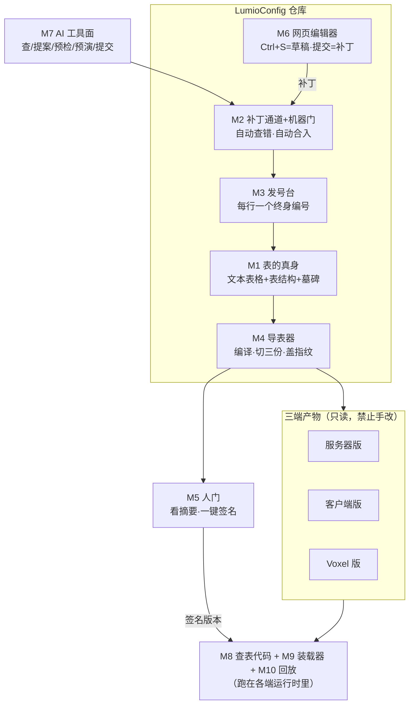
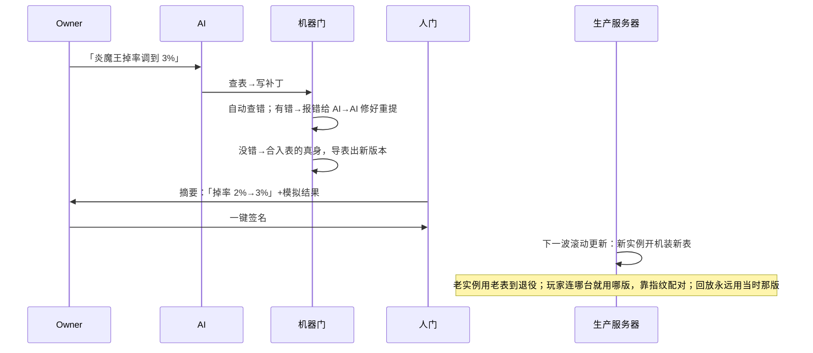
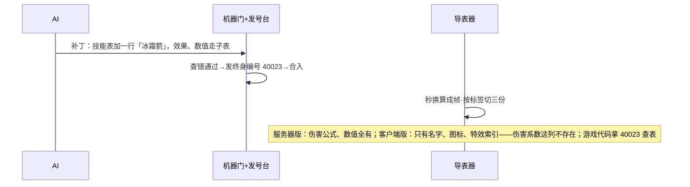

# LumioConfig 设计概要

> 2026-08-30 定稿，Owner 与引擎架构总监双方认账。怎么吵出来的、每一板的理由、和旧规矩（ADR）的对账，全在[裁决流水](../../reviews/2026-08-30-config-table-architecture-decisions.md)里，本文不背这些包袱——本文只回答五个问题：**这是什么、长什么样、每块干什么、按什么顺序做、什么不许做。**
> 底线核对：四条已定死的老规矩（ADR-007/010/033/034）一条没动；三条草案（ADR-041/047/048）一个字没改。

---

## 1. TLDR

**游戏里所有配置表，都存在一个叫 LumioConfig 的 Git 仓库里，是普通文本文件。AI 和人改表只有一条路：提「补丁」，机器自动查错、自动合入。点一下「导表」，就编译出服务器、客户端、Voxel 三份文件——每份只含自己该看的列，客户端文件里压根没有掉率这种机密。上线只有一个人类按钮：Owner 看一眼改动摘要，签名。服务器滚动更新时，新实例开机装上新表；老实例用老表用到退役。**

四条底线，将来砍任何功能都不能碰：

1. **表的真身是文本文件**。Excel 也好、网页编辑器也好，都只是看和改的窗口，不是真身。
2. **内容指纹和存储格式无关**。同一张表，数值没变，存成文本还是二进制，指纹必须一样。
3. **一台服务器一个版本**。开机是哪版就用到退役，永远不会一帧里一半新表一半旧表。
4. **AI 没有上线按钮**。AI 能查、能改、能预演，「推给玩家」永远是人签字。

## 2. 概要

**LumioConfig 是一个独立仓库，装三样东西：**

1. **表的真身**——每张表一个文本文件（长得像 Markdown 表格），加上表结构定义和「墓碑」（记录删掉的行）。
2. **编辑器**——本地网页，打开就能改，体验像飞书文档。
3. **导表器**——一键把表编译成三端产物，发到各个仓库。

**一次改动怎么走**（我们的日常是 80% AI 在推、20% 人通过 AI 修正）：

> AI 写补丁（人想改也是口述给 AI，AI 代写）→ 机器自动查错，有错打回 AI 自己修，没错自动合入 → 一键导表，产出三份文件+指纹 → Owner 看摘要（「炎魔王掉率 2%→3%」+模拟结果+本次新公开了哪些列）→ 签名 → 下一波滚动更新生效。开发环境不用签名，reload 一下立即生效。

**三端怎么读：** 每列标一个「发给谁」：`S` 服务器、`C` 客户端、`V` Voxel，随便组合（`CS`、`CSV`……），**不标默认只给服务器**。游戏代码不许自己解析文件，只能用导表器顺手生成的查表代码（Rust 和 C# 各一份）：一帧之内查表永远不卡（不下载、不读盘），下载解压只发生在进场景前的「备货」步骤。

## 3. 设计图

### 3.1 总图

### 3.2 主线：AI 改一格掉率，玩家什么时候看到

### 3.3 副线：加一个新技能，三端各拿各的

## 4. 功能模块（每块可以直接开需求单）

### M1 表的真身（权威源存储）

- **干什么**：存所有表。每张表一个文本文件，长得像 Markdown 表格；加表结构定义文件和墓碑文件。全部 Git 管理。
- **能干什么**：① 一个格子的四种状态分得清——没这列 / 填了空字符串 / 明确写「无」 / 没填等着吃默认值，写法各不相同；② 每行开头带终身编号；③ 有个格式化工具统一排版，人或 AI 写乱了它排齐，CI 强制。
- **不干什么**：不接受绕过补丁通道的直接改动；没有 Excel。
- **做完的标准**：格式化工具跑两遍结果一样；乱格式文件 CI 拒收；两个补丁改同一张表的不同行，Git 能自动合并。

### M2 补丁通道 + 机器门

- **干什么**：全系统唯一的写入口。收补丁（AI 和人同一条道），自动查错，全过就自动合入，不需要人看。
- **能干什么**：查四样——① 格式对不对（类型、引用的行存不存在、四态写法）；② 保密对不对（这列该不该给客户端、有没有把机密引出去）；③ 顺手生成人话摘要（「掉率 2%→3%」，给人门用）；④ 报错是结构化的：哪张表、哪行哪列、什么错、怎么修——**报错首先是写给 AI 看的**，AI 拿着能自己修好重提。合入自动留档：谁改的、改前改后指纹、为什么改（就是 Git 提交）。
- **不干什么**：不做人工审批（人只在人门出现）；不发编号（那是 M3）。
- **做完的标准**：坏补丁拿到能定位到行列的报错；好补丁没人管也能合进去；单个补丁查错秒级完成。

### M3 发号台

- **干什么**：新行合入时发终身编号；删行时登记墓碑。
- **能干什么**：每行三个身份——**名字**（`fireball`，人和 AI 说话用，可以改）、**终身编号**（`40023`，身份证号，永不换、永不给别人用，存档/网络/回放/GAS 全认它）、**座位号**（每次编译时的行号，只在运行时内部用，**禁止存档**）。补丁里只写名字不写编号——编号排队领，两个 AI 同时加行也不会抢号。
- **不干什么**：不管列——列名也有自己的稳定编号，归表结构定义管。
- **做完的标准**：并发提补丁不冲号；删过的编号永不再出现；改名后老存档照样能读。

### M4 导表器（一键导表）

- **干什么**：把表的真身编译成三端产物，发到各仓库。产物是生成物，只读，谁也不许手改。
- **能干什么**：① 把五层配置（引擎默认→平台→服务器→产品→环境）合并成最终生效值，每个值记着「来自哪层」；② 单位换算——策划写「2.5 秒」「5%」，编译成帧数、千分比整数；进战斗判定的数值列一律整数，防跨端算不齐；纯表现用的小数（粒子大小之类）定死唯一的二进制写法；③ 按 S/C/V 标签切三份，客户端引用了服务器机密直接编译报错；④ 盖三个指纹——**内容指纹**（数值没变就不变，换格式也不变）、**包裹指纹**（验文件传输没坏）、**底稿指纹**（审计：当时源上写的啥）；⑤ 打包成「发布清单→分端清单→表→块」四层结构。
- **不干什么**：导表≠上线（上线要人门签名）；第一期不做增量编译，全量。
- **做完的标准**：同样的源编译两次，字节一模一样；文本产物和将来的二进制产物内容指纹相同；客户端产物里物理上没有机密列。

### M5 人门（上线签名台）

- **干什么**：全链路唯一的人类按钮。给 Owner 看三样：人话摘要、模拟结果、**本次哪些列第一次对客户端公开**；看完一键签名，产出可发布版本。
- **不干什么**：AI 碰不到这个按钮；开发/测试环境没有这道门。
- **做完的标准**：没签名的版本生产环境拒绝装载；第一次公开的列必然出现在单子上。

### M6 网页编辑器

- **干什么**：本地网页，`lumio_config serve` 起一个只听 127.0.0.1 的 Host，浏览器打开就能看能改，体验对标飞书表格。读文本表格渲染成表；还能把一个技能的主表行+子表行拼成一张「技能卡」整体看（技能卡视图排在首版之后）。
- **能干什么**：① 完整的数据编辑手感——单格/区域编辑、从 Excel/飞书粘贴、拖拽填充、撤销重做、筛选排序、查找替换、枚举下拉、引用选择，四态（没这列/空字符串/明确写「无」/吃默认）各有样式、可切换、不坍缩；② `Ctrl+S` 只存本地草稿（`.lumio/drafts/`，浏览器或 Host 崩了能恢复），**「提交补丁」才走 M2**；③ 提交时不是覆盖文件，而是「跟打开时那版比，你改了哪几格」生成带基线指纹的逐格补丁，M2 做单元格级三方合并——所以你开着编辑器的半小时里 AI 合入的十个补丁不会被你抹掉，同一格都改了就结构化摆出「打开时/仓库现在/你的」三个值让你挑；④ 提交成功后是否自动 commit 到版本库、是否自动导表，是仓级设置项（版本库支持 Git / SVN / 无）；⑤ 单向导出 CSV/TSV 给人看，导出物不是源。
- **怎么做**：表格交互内核用 Univer OSS（Apache-2.0，禁 Pro 包），Host 用 Python 复用本仓已有的解析器/四态/指纹/补丁门，不写第二套语义；Univer 工作簿只是投影，行列位置永远不是身份，身份在 Host 的投影映射表里。首版本地单用户，多人协作只留 `DraftSessionProvider` 接口。落地方案与派活指引见 [`../../plans/2026-09-02-config-web-editor-landing.md`](../../plans/2026-09-02-config-web-editor-landing.md)。
- **不干什么**：它不是真身；没有上线按钮；不做 Excel 导入、不做公式/合并单元格/宏；列宽/冻结/筛选这些视图状态永不进补丁。
- **做完的标准**：无修改打开再保存得到空补丁；只做视图操作得到空补丁；编辑期间 AI 并行改不同格自动合并、改同一格结构化冲突不丢数据；保存出来的就是合法补丁；新行不伪造终身编号。

### M7 AI 工具面

- **干什么**：AI 操作配表的全部入口，一共五个动作：**查**（读表/读结构/读技能卡）、**提案**（写补丁）、**预检**（自己先跑一遍机器门）、**预演**（编译预览+模拟看影响）、**提交**（送进机器门）。
- **不干什么**：没有第六个动作。「上线」不在 AI 的字典里。
- **做完的标准**：AI 无人值守走完全流程；故意塞个类型错误，AI 能凭报错自己修好。

### M8 查表代码（Rust/C# 生成）

- **干什么**：导表器顺手生成的读表代码，Rust 一份 C# 一份。游戏代码只许用它，不许自己拆文件。
- **能干什么**：`TryGet(编号)` 一帧内查表——同步返回、绝不下载、绝不读盘；`Prepare(要用的表清单)` 进场景前把货备齐。好处：将来文本换二进制，只有这层代码换内芯，游戏代码一行不改。
- **不干什么**：不做反射式的万能访问（调试和 AI 有单独的查看接口）。
- **做完的标准**：Rust 和 C# 读同一份文件，查一万次结果一致；生成代码不把浏览器包体撑爆（阈值实测定）。

### M9 装载器（版本怎么生效）

- **干什么**：管产物怎么进运行时。**生产**：滚动更新——实例开机装一整套版本，必需的表备齐了才开门接客，用到退役不换；玩家连接时对指纹，连错版本拒绝并重连。**浏览器**：不用一次下完，进游戏下开局包，进副本前备副本包（都在同一版本内）。**开发**：reload——新版攒好后在两帧之间整套切换，立即生效，不用签名。
- **不干什么**：生产环境没有「运行中换表」（什么时候需要见 §6）。
- **做完的标准**：滚动窗口期新旧实例并存，握手全配对正确；reload 没有半帧新半帧旧；必需表没备齐的实例不接客。

### M10 回放与旧版保留

- **干什么**：回放文件里记着「当时用的哪版表」，回放时就装那版；旧版产物按保留政策存着，别让回放变 404。
- **做完的标准**：新版本上线后，拿旧回放还能逐帧复现。

## 5. TODO（按这个顺序开卡）

**阶段 0：先立规矩**（架构仓落 6 张 ADR，编号落笔时现查最高号）

| 卡 | 内容 | 对应模块 |
|---|---|---|
| 0-1 | 权威源与补丁通道（文本格式三纪律、双门） | M1/M2 |
| 0-2 | ID 命名空间与发号（扩展 ADR-007） | M3 |
| 0-3 | 内容指纹与数值规则（指纹构造、四态写法、排序、Unicode 归一化——这项今天没钉、此卡必须补上、浮点规则、双语言对照测试集） | M4 |
| 0-4 | 产物容器与三端切分（四层清单、S/C/V 标签、披露门禁、签名防回滚） | M4/M5 |
| 0-5 | 版本生命周期（实例绑定、开发 reload、备齐纪律、回放钉版） | M9/M10 |
| 0-6 | 工具面契约（补丁格式、报错格式、AI 五动作） | M2/M7 |

**阶段 1：垂直切片**（目标＝下面三条链全跑通）

1. 建 LumioConfig 仓 + M1 最小版（目录、格式化工具、两三张真表：技能/效果/掉落）。
2. M2 最小版（查错+结构化报错；人话摘要可后补）。
3. M3 发号台。
4. M4 最小版（文本产物+切三份+盖指纹；不压缩、不增量）。
5. M8 最小版（Rust/C# 的 TryGet）。
6. M9 开机装载 + 开发 reload。
7. **验收三条链**：① 加一张混合标签的新表→三端各读到该读的、读不到不该读的；② 改一行数值→reload 原子生效→旧回放照样能放；③ AI 五动作全流程提一个补丁（中途故意报一次错让它自修），全程没有上线权，Git 留痕完整。

**阶段 2：发布与工具**

8. M5 人门（签名、披露清单）+ M2 人话摘要 + 模拟预演。
9. M6 编辑器（Univer 投影 POC → Host 会话 → 编辑与草稿 → 语义补丁提交 → 三方合并冲突 → CSV 导出与产品化；分卡见落地方案）。
10. 产物自动分发到各实现仓。

**阶段 3：性能与二进制**

11. 四项实测（AI 跑、报告落仓）：百万行内存 / 浏览器冷启动 / 双语言同文件对查 / 生成代码包体。
12. 二进制三选一（FlatBuffers 加外置索引 / 自研格式基于 LumioBinV1 / SQLite 只限查询复杂的特殊表）→ 换内芯 → 验证游戏代码零改动。
13. 按实测结果再做：大表切片下载、双版本共享不变块、增量编译。

**停下来回图重议的信号（kill criteria）**：Rust/C# 查表或指纹对不上且要改指纹规则；文本产物在浏览器慢/大到不可用且三个二进制候选都救不回；并发提案发号顶不住；机器门查错慢到分钟级、AI 自修转不动。

## 6. 明确不做

| 不做 | 级别 | 什么情况回头 |
|---|---|---|
| 表里写逻辑（if、脚本列、蓝图式节点） | **红线** | 永不——逻辑归 C# 代码，表只放数据 |
| AI 直接上线 | **红线** | 永不——将来最多开「白名单数值+区间内+模拟通过→自动上线自动回滚」，且必须另立 ADR |
| 座位号（编译行号）存档 | **红线** | 永不——存档只认终身编号 |
| 手改导出产物 | **红线** | 永不（仓规既有） |
| Excel 当源或双向同步 | 砍 | 真出现 Excel 协作需求再说 |
| 生产运行中换表 | 砍 | 出现不能重启的长会话运营、或紧急热修需求 |
| AI 自主大改经济数值并直接发布 | 不做 | 无——出了事故没法从一万个自动改动里找凶手 |
| 运行时任意 SQL 查询 | 不做 | 线上真实查询需求攒够了再说 |
| 表结构里加 list/map 嵌套类型 | 推迟 | 「拆子表」这招挡不住真实需求时，走流程重开 ADR-033 |
| 照搬 Luban | 不采 | 无——我们没有 Excel、AI 直接写文本，它的强项段用不上 |

## 7. 黑话对照表

| 黑话 | 大白话 |
|---|---|
| 投影 / 小抄 | 同一张表按标签印出的端专属版本（服务器版/客户端版/Voxel 版） |
| Revision | 一套货——某次发布的全部产物+清单，整体一个版本号一个指纹 |
| 内容指纹 | 菜的味道——数值没变，换什么包装指纹都不变 |
| 包裹指纹 | 外卖封条——验文件在路上没被咬一口 |
| 底稿指纹 | 厨房小票——当时源上写的啥、哪个值是吃了默认 |
| 四态 | 格子的四种状态：没这列/空字符串/明确写「无」/没填等默认，写法必须分得清 |
| 拆子表 | 列表塞不进一个格子，就拆成子表多行，用编号连回来 |
| 墓碑 | 删掉的行进坟，编号陪葬永不复用，老存档才不会认错人 |
| 机器门 / 人门 | 合入自动审（机器）；上线人签字（唯一人类按钮） |
| 备货 | 进场景前把要用的表下载解压好；帧内查表只翻备好的货 |
| 滚动更新 | 服务器一批批换新版重启，新旧短暂并存，靠指纹配对连接 |
| 出处标签 | 这个生效值来自五层配置的哪一层（引擎默认/渠道/活动服……） |
| 草稿 | 编辑器里 Ctrl+S 存在本机 `.lumio/drafts/` 的未提交改动，不是补丁、不进 M2 |
| 基线指纹 | 打开编辑器那一刻该表的底稿指纹；提交时补丁带着它，机器门据此判断仓库有没有被别人改过 |
| 三方合并 | 拿「打开时的值 / 仓库现在的值 / 你的草稿」三个值逐格比：别人改了你没改就采别人的，你改了别人没改就采你的，都改了才算冲突 |
