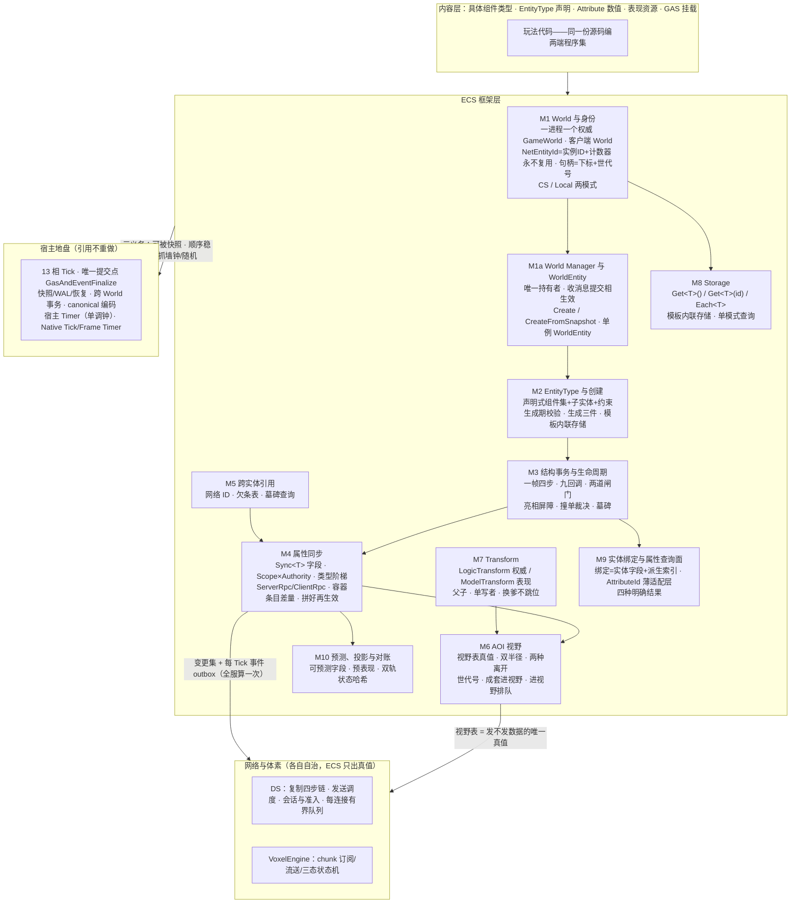
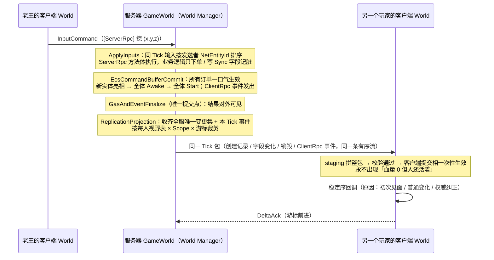
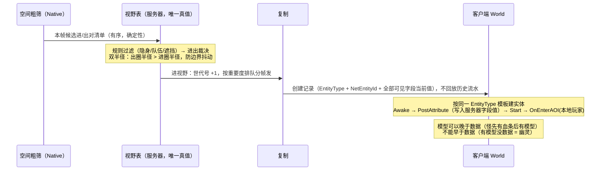

# Lumio ECS 设计概要

> 怎么吵出来的、每一板的理由、和外部调研的对账，全在[审计过账附录](../../reviews/2026-08-29-ecs-architecture-audit.md)与[接缝裁决流水](../../reviews/2026-09-01-seam-closure-decisions.md)里；World Manager、`Sync<T>` 字段与生成桥这一轮的结构定稿在 [ADR-058](../../decisions/ADR-058-ecs-world-manager-and-annotation-registry.md)。本文不背这些包袱——本文只回答五个问题：**这是什么、长什么样、每块干什么、按什么顺序做、什么不许做。** 代码怎么写看 §4.5 样板示例。
> 学名：**Active-Component ECS Hybrid**——对象组合、组件可带逻辑，ECS 机制（身份、存储、查询、结构事务、同步）做底座。

---

## 1. TLDR

**游戏世界里所有「东西」都是实体。服务器进程一份权威世界，由 World Manager 创建并管理；客户端一份世界，跑同一套 ECS、同一份源码。程序员把字段声明成 `Sync<T>`，这个字段就自动同步给该看见它的人——不写一行网络代码。改世界（生个怪、加个组件）不当场生效：一帧里所有改动先攒着，帧内固定一格统一结算，结算完新东西才「亮相」，别人才查得到它。**

四条底线，将来砍任何功能都不能碰：

1. **一帧只有一个提交点**。复制取样、快照切点、确认边界、体素提交全锚在它后面。丢了它，复制/快照/回放/预测四件事要各造一台机器。
2. **同样的输入必须算出同样的结果**。顺序排死、不许读墙上的钟、不许自己造随机数。丢了它，崩溃恢复后 AI 换个点数，线上 bug 永远复现不出来。
3. **不是 `Sync<T>` 的字段绝不上网**。掉率、仇恨表、服务器内部缓存，默认一个字节都不发。
4. **号码永不复用**。实体死了它的号就陪葬；再问这个号，答「他死了」，不答「查无此人」——对尸体可以放复活术，查无此人才是真错误。（这是**服务器**的答案；客户端手里没有的号一律答「不知道」，除非收到过它的销毁记录。）

---

## 2. 概要

### 这是什么

一个**自研 ECS 框架**，范围锁死在**五大件 + 实体两模式 + 对宿主三义务**，其他不管。五大件整体是最低标准，一件不可砍；任何裁剪必须重开架构会议。

**五大件**：① 一套代码双端跑；② 完整生命周期（结构事务是它的内脏）；③ 完整属性同步（引用规则是它的内脏）；④ AOI 视野；⑤ Transform 组件。

**实体两模式**：**CS 实体**（双端都有，默认，占网络身份）/ **Local 实体**（纯本端——斧头上的特效载体、UI 假人：无网络身份、不同步、不进视野表、不存档）。

**对宿主的三条义务**（不是三个机制，是三条推论，砍掉任何一条都会砸到某个大件）：

| 义务 | 怎么做到 | 砍了会怎样 |
|---|---|---|
| **可被快照** | 字段上的 `[Persist]` 即答案；恢复 = 从快照建新世界 | 服务器一重启，全服存档没了 |
| **顺序稳定** | 结算按（系统 ID + 相位 + 单号），遍历按创建序；同 Tick 上行按发送者 NetEntityId 排序；**查询只有一种模式**（按创建序，天然稳定） | 同一场战斗算两遍结果不同，预测纠正永远对不上 |
| **不抓墙钟不自建随机** | 时间用 Tick 号，随机从框架领，NetEntityId 用计数器不用 GUID；禁 `DateTime.Now`、禁自建 `Random` | 恢复后 AI 骰子换点数，线上 bug 无法复现 |

### 一帧怎么走

**记单 → 结算 → 亮相 → 发货。**

一帧内所有逻辑（移动、战斗、AI）改世界只「**下单**」——世界暂时不动。帧内固定一格「**结算**」：所有订单先归一化再一口气生效。生效后新实体「**亮相**」：别人才查得到它，它的钩子才跑。全部完成后这一帧的结果才「**发货**」——对快照和复制可见。

四步落在宿主 13 相的哪一格，见 M3。

### 世界怎么分

- **服务器**：一个进程一个 **World Manager** 一份权威 `GameWorld`；世界内部没有 Room 概念。多房间 = 多个服务器进程，由匹配服 / 宿主路由把连接送到哪个进程（Unreal 专用服务器方案）；一个连接同时只绑定一个 Game 实例。
- **客户端**：一份 `World`，由同一个 World Manager 类以客户端模式创建，经网络身份跟服务器那份对应。
- **Account Server**：自己一份低频 ECS World，装 `AccountEntity`。凭据材料不进普通组件。
- 服务器地图数据归体素（[`voxel.md`](voxel.md) M8）：流式加载与整图常驻（pin）都由体素侧声明，ECS 不假设任何一种。

### 谁拥有什么（三线分界）

- **框架层**拥有机制契约（身份、生命周期、同步、视野、Transform 的语义）与 World Manager、WorldEntity、`Sync<T>`、生成器；`LogicTransform` 和 `ModelTransform` 都是 Runtime 仓提供的 ECS 基础组件（[ADR-065](../../decisions/ADR-065-dual-transform-discussion.md) D29）。
- **内容层**拥有玩法组件类型、EntityType 声明、Attribute 数值、表现资源；玩法组件按 M4 的 partial 文件布局写在玩法程序集，一份源码编服务器 / 客户端两份程序集。使用 Runtime 基础组件不改变组件的源码归属。
- **实现仓**拥有布局与参数——双半径数值、脏位掩码位宽、池大小、量化精度**一律是实现仓自由度**，不进本文。

依赖单向：内容层 → 框架层 → 实现仓。`Storage` 只对结构事务暴露，对外全走句柄。

### 和宿主的分工

ECS 的结构事务是宿主跨 World 事务的**参与者**，不是协调者：同一 tick 内固定次序 `VoxelCommit` → `EcsCommandBufferCommit`，框架不自设协调逻辑。13 相 Tick 的相表、每相可写域、帧内读写规则与游戏系统的注册方式见 [`tick.md`](tick.md)；fail-stop、快照/日志/恢复、canonical 编码是宿主的地盘，ECS 引用不重做。

### 全框架规范词只有 13 个

新增词汇必须先回答「能不能不加」。

| 词 | 一句话定义 |
|---|---|
| **World** | 实体的容器与边界。服务器每进程一个（权威），客户端一个（同一套 ECS） |
| **World Manager** | 世界的唯一持有者与消息入口：建世界（新建 / 从快照）、创建 WorldEntity、收消息在提交相生效、记线程归属。一进程一个 |
| **WorldEntity** | 世界级单例实体：由游戏在 `EntityTypes/` 声明（`World = true`，恰好一个），存档 / Dump / Tick 配置等世界级字段与命令的落点；World Manager 建世界时创建 |
| **Entity** | 一个身份。网络身份不透明、永不复用；本地句柄只在本 World 有效 |
| **EntityType** | 实体类型：声明式 abstract class，可用 C# 继承（子类型组件集 = 基类 ∪ 自己），创建时按类型一次绑定整组组件；`world.TypeOf(id)` 取 |
| **Component** | 能力单元，可带数据与逻辑；同步字段用 `Sync<T>` 声明 |
| **System** | 批处理与跨实体规则的容器 |
| **Tick** | 固定步长逻辑帧，13 相推进，出错整帧作废 |
| **结构事务** | 创建/销毁/增删组件：业务逻辑只「下单」，帧内固定位置统一「上菜」，之后新实体才「亮相」 |
| **复制** | 服务器状态自动同步到客户端——`Sync<T>` 即同步 |
| **RPC** | 跨端动作：`[ServerRpc]` 客户端→服务器意图；`[ClientRpc]` 服务器→客户端一次性通知（事件） |
| **视野 (AOI)** | 服务器上「哪个玩家看得见哪个实体」的关系表；半径/遮挡/队伍是算出它的输入 |
| **表现 (Presentation)** | 客户端的模型/特效/音频资源，不进模拟、不进哈希 |

`Scene`、`Space`、`Room`、「兴趣」不是规范词。术语采 **AOI**，不采 ROI。

### 判断口诀

**服务器需要知道它吗？** 需要 → 实体；不需要（刀光特效、模型、音效）→ 不是实体，是表现资源，客户端 Start 后异步加载。

---

## 3. 设计图

### 3.1 总图



### 3.2 主线：老王挖一下方块，另一个玩家怎么看见



### 3.3 副线：一只怪走进你的视野



---

## 4. 功能模块（每块可以直接开需求单）

### M1 World 与身份

- **干什么**：装实体、划边界、发身份证。
- **能干什么**：① 服务器一个进程一份权威 `GameWorld`，由 World Manager 持有；客户端一份 `World`；各存各的，两边靠网络身份对应。② **网络身份 `NetEntityId`**：128 位 = 世界实例 ID（64 位，宿主建世界时给定）+ 世界内计数器（64 位）；由世界在提交相创建实体时发号；不随机、跨进程唯一、永不复用；实例 ID 与发号器的「已占到哪」随快照入档；只有 CS 实体持有。③ **网络 ID 认人，本地句柄定位**：本地句柄 = 下标 + 世代号，`World.Get(句柄)` 是数组直访；网络 ID → 本地句柄的查找结构（字典 / 分段稀疏索引 / 计数器直接当下标）是实现仓自由度，架构只要求「活体不多、历史创建很多」时内存不随历史创建量无界增长；世代号防「旧引用指到坑位复用后的新实体」。④ 实体两模式 CS / Local。⑤ **发号先占段再发**：发号器按块（如 1024 个）向存档预留号段，预留落盘后才从段内发号；快照存「已占到哪」而不是「下一个号」；崩溃恢复从已占段之后继续，段内没用完的号作废——没发出去的号没人持有，把它答成墓碑无害。
- **不干什么**：不跨 World 传裸对象引用（跨 World 只传网络 ID，经 World 解析）；Local 实体不占网络身份、不同步、不进视野表、不存档；世界内不设 Room 字段，一个连接同时只绑定一个 Game 实例；不由绑定、宿主或任何世界之外的代码发号。
- **做完的标准**：销毁再创建一万次，任何旧句柄都解析不到新实体；网络 ID 在全生命周期零复用（含跨进程——两个进程实例 ID 不同；含跨重启——从快照记录的已占段之后继续，崩溃前已发给客户端的号永不再发）；拿别的进程的句柄来解析，返回明确失败而不是错误实体。

### M1a World Manager 与 WorldEntity

- **干什么**：当世界的唯一 owner——建它、管它、给它喂消息、替它守线程；把世界级的事放到一个单例实体上。
- **能干什么**：

  ① **唯一持有者**：一进程一个 World Manager 一个 `GameWorld`。准入、属性查询、聊天 ingress、存档、复制都是它下面的服务，构造时注入 Manager；宿主只持一个 Manager 门面。

  ② **两个建世界入口同一条路**：`Create(注册表, 实例ID)` 新建；`CreateFromSnapshot(快照)` 恢复——装载生成注册表、创建 WorldEntity、装身份表与发号器，同一段代码只是来源不同。恢复只跑 `OnHydrate`；恢复出来的是新世界，旧世界销毁；未标 `[Persist]` 的字段取声明默认值。

  ③ **单例 WorldEntity**：类型由游戏在 `EntityTypes/WorldEntity.cs` 声明，写法与其他 EntityType 相同，只多一个 `World = true`（注册表里恰好一个，缺或多 = 生成报错）；引擎只提供世界级组件（`WorldSaveComponent` 等），游戏的世界级状态（对局阶段、比分）再 `[Has]` 挂上。建世界时由 Manager 按它创建，普通 CS 实体（有 NetEntityId、字段按声明同步）；存档 / Dump / Tick 配置是它组件上的字段；世界级命令 = 对 WorldEntity 的 `[ServerRpc]`（如 `WorldSaveComponent.Save`），存档系统在提交相消费，写文件走 outbox。两端按组件类型取单例（`Single<T>()`），不用固定编号；客户端不自建，它是第一条创建记录。世界存在 = WorldEntity 存在。

  ④ **收消息 → 提交相生效**：双端 Manager 都是「收消息、在自己提交相生效」的入口。服务器收 InputCommand（上行字段变更 / ServerRpc）；客户端先收欢迎消息（世界实例 ID + 自己的 NetEntityId，提交相绑 `World.Self`），再收「世界变化」——创建实体（EntityType + NetEntityId + 全部可见字段当前值）、字段变化、销毁实体三种记录，**同一条有序流，创建优先**，按 Tick 成包一次性生效。

  ⑤ **线程归属**：Manager 在 Start 时记下 owner thread，所有入口统一校验；网络线程只能 `Enqueue` 到 Manager 的 inbox。

  ⑥ **客户端模式**：同一个 Manager 类、同一个 `Create(GeneratedRegistry.Instance)`，只差不传实例 ID（生成注册表自带端别，不传模式参数）；同样 `Start(ownerThread)`，网络线程只 `Enqueue`，主线程每帧 `Tick()`。不发号、不存世界档、字段上行只按 `Authority.Owner`。

  ⑦ **开发期热重载**（仅开发构建，设计概要，不进 r4）：改方法体走 .NET Hot Reload；改字段 / `[Persist]` / Scope / EntityType 组件集 = 生成器重跑 → 快照 → 换程序集 → `CreateFromSnapshot`，进程不重启、连接不断；改 wire 契约 = 重新握手。

  ⑧ **多房间**（后置，设计概要）：多个服务器进程各一个 Manager；匹配服 / 宿主路由决定连接进哪个进程；世界代码零改。

  ⑨ **同进程双端**（单机 / 本地联调）：两个 Manager——服务器程序集一个、客户端程序集一个——中间用内存环回代替网络（`server.outbox → client.Enqueue`，同一行代码）。回调、同步、权限、校验与联网零差异；不共用一个 World（那要第三种编译配置，且 partial 方法两端体会撞）。

- **不干什么**：任何模块不得自建第二个世界，不得用空世界当线程牌子；不做静态 `World.Current`；生产构建不开热重载；Manager 不持有实体数据（只有可从世界重建的派生索引）；同进程双端不共用 World。
- **做完的标准**：生产源只有一条 CreateWorld 路径（结构断言）；`chat.input` 提交后属性查询读到本 Tick 写入的真实文本；`CreateFromSnapshot` 后同一 NetEntityId 可达且不变、新实体不与档内重号；从网络线程调用任何入口直接失败；开发构建改一个字段不重启进程、连接不断（热重载落地时验）。

### M2 EntityType 与创建

- **干什么**：声明「这类实体由哪些组件构成」，并按类型一次建好。
- **能干什么**：

  ① **声明式 abstract class**，不可实例化、无成员，玩法代码不经它读数据；继承就是 C# 继承：

  ```csharp
  [EntityType(Mode.CS)]
  [Has(typeof(IdentityComponent))]
  [Has(typeof(ChatComponent))]
  [Child("Weapon", typeof(WeaponEntity))]   // 出生自带的逻辑子实体（武器有耐久、宠物有 AI）——创建时一单全建
  public abstract class PlayerEntity { }

  public abstract class VipPlayerEntity : PlayerEntity { }   // 子类型：组件集 = 基类 ∪ 自己的 [Has]；TypeOf(id).Is<PlayerEntity>() 为 true

  [EntityType(Mode.CS, World = true)]         // 世界实体也是一个 EntityType，注册表里恰好一个
  [Has(typeof(WorldSaveComponent))]
  public abstract class WorldEntity { }
  ```

  声明组件集合、组件间依赖与互斥、出生自带的逻辑子实体、实体模式、继承关系；`world.TypeOf(id)` 返回类型句柄，`.Is<T>()` 含子类型（类型不编进 NetEntityId，世界本来存着每个实体的模板）。

  ② **生成期校验**：缺必需组件、依赖成环、类型阶梯外的同步字段、`World = true` 不是恰好一个、声明类非 abstract 或带成员——全部在生成命令里报错，不留到运行时。

  ③ **模板批量创建是一等公民 API**：生成器按每个 EntityType 产一个**内部模板类**——实体对象 + 它的组件对象一次性相邻分配、整块入池；`Get<T>()` 走生成的定位表直达、无字典（组件式写法 + 模板内联存储）。建 1000 只怪 = 按模板从池里取 1000 套、由生成的按类型克隆写入默认值（组件是 class，带引用与容器，不是一次内存拷贝——`Sync<T>` 里的所属组件引用要指向新实体自己的组件）+ 发 1000 个号，然后改个体差异，各跑自己的 Awake。模板类是内部物，玩法代码不引用它。

  ④ **一个生成命令产三件**：组件注册表 + 实体模板类 + 每字段可选钩子声明 + RPC 发送桩（`.g.cs`）、同步表、C-2 契约声明表（json）。挂 MSBuild 目标每次 build 自动跑（秒级、增量）；生成物入库、测试断言零 diff；世界只收生成的注册表。

- **不干什么**：不支持运行时拼装任意组件组合；表现资源（刀光、模型、音效）不是实体，不进 EntityType；不用 Roslyn 源生成器；不手写注册表、不反射破门注册。
- **做完的标准**：挂了移动组件没挂 Transform 的类型声明生成不过；依赖成环生成不过；批量建 1000 实体的耗时随数量线性增长，验收看三个数——每千实体创建耗时、每实体堆分配字节（池热后应为零）、GC 次数（应为零）——不按「是不是整块拷贝」验收；生成物零 diff，手写注册路径不存在。

### M3 结构事务与生命周期

- **干什么**：管实体和组件的生老病死，保证任何人拿不到「建了一半的怪」。
- **能干什么**：

  ① **一帧四步落在 13 相的确定位置**（本模块最硬的一条约束）：

  | 四步 | 落在哪一相 | 为什么只能是这一相 |
  |---|---|---|
  | 记单 | `ApplyInputs` / `ProcessorPlan` | 业务相只写自己的 CommandBuffer 与 `Sync` 字段脏位，不碰世界结构 |
  | 结算 + 亮相 + 全体 Awake + 全体 Start | **`EcsCommandBufferCommit`** | 13 相里**只有这一相的可写域是 `GameWorld`**。Awake 要写 Attribute 初值 = 写 GameWorld，所以它跑不到别的相去 |
  | 发货（对外可见） | `GasAndEventFinalize`（唯一提交点） | 提交点之后的相才是 `AfterCommit` 可见性 |
  | 取样打包 | `ReplicationProjection` | 提交点之后，可写域是 `ReplicationView`；新实体打成「创建记录」，与字段变化、销毁、ClientRpc 事件同一条有序流 |

  ② **同帧撞单裁决表**（冻结）：同帧加又删同一组件 = 抵消（钩子不跑）；创建又销毁 = 从没亮相、不占网络身份；同帧两次换爹 = 后单赢 + 查环拒绝；先后顺序按（系统 ID + 相位 + 单号）。

  ③ **亮相屏障**：没亮相的实体，查询查不到、组件读不到。

  ④ **九回调**（钩子长在 Component 上，两端跑同一套）：

  | 回调 | 时机 | 准做 | 禁做 |
  |---|---|---|---|
  | `Awake` | 亮相后、同批全体先跑完 | 初始化自己（Attribute 初值、内部缓存） | 创建/销毁实体、访问其他实体 |
  | `PostAttribute` | **客户端**：Awake 后、Start 前，框架把创建记录携带的服务器字段值写入之后 | 按服务器值重建派生缓存 | 任何副作用；服务器不触发 |
  | `Start` | 全体 Awake（客户端含 PostAttribute）后，按声明序 + 依赖序 | 连接他人、存引用、订阅 | 下结构单；指望别的实体 Start 已跑完 |
  | `OnEnable` / `OnDisable` | Enable 轴切换 | 清 tick 订阅等 | 与视野/网络无关，互不牵扯 |
  | `OnDestroy` | 销毁结算后 | 清非状态资源；读只读终态 | 下结构单（掉落由击杀系统同帧下单，不写在尸体上） |
  | `OnHydrate` | 快照恢复（`CreateFromSnapshot`） | 重建缓存（可重跑、纯） | 任何副作用（发奖励、播表现） |
  | `OnEnterAOI(viewer)` / `OnLeaveAOI(viewer, reason)` | 视野表变更；服务器 per-viewer，客户端 viewer = 本地玩家 | 按观察者做业务 | 当作全局状态用 |

  客户端建实体 = 收到「创建记录」→ 按同一 EntityType 模板建 → Awake（同一套代码）→ PostAttribute → Start；Awake 完整结束后客户端字段已与服务器一致。

  ⑤ **两道闸门跨实体生效**：同一帧一起亮相的所有新实体，所有组件先全部 Awake，再开始 Start——骑手的 Start 找马时，马的所有组件至少 Awake 完了。跨实体只保证 Awake 闸门；要等对方 Start 完，放自己第一次 tick。

  ⑥ **Start 顺序 = 声明顺序 + 可选依赖声明**；依赖成环创建时报错。Awake 顺序按声明序排死（Awake 只动自己，排死只为回放一致）。

  ⑦ **墓碑**：销毁后进墓碑，保留窗口后回收，号码永不复用。

- **不干什么**：钩子里一律不许创建/销毁实体、增删组件（出生自带的写进 EntityType；运行中途出现的附属物在 tick 业务逻辑里下单，晚一帧出现可接受）；钩子里不许写 `GasEvents` 域（那是提交点的可写域，写了会跨相违约）；**钩子里不许做不可回滚的动作**——发网络消息、写文件、播表现一律记 outbox，帧成功收尾后统一执行（钩子抛异常要整帧作废，已经发出去的收不回来）；不做字段级 undo（沿用整帧快照 + 日志）。
- **做完的标准**：同帧加又删同组件，钩子零次触发；同帧建又销毁，网络身份零消耗；用探针确认 Awake/Start 全部在 `EcsCommandBufferCommit` 相内完成，相外写 `GameWorld` 直接失败；客户端探针确认 Awake → PostAttribute → Start 顺序，Start 里读到的 `Sync` 字段已是服务器值；钩子抛异常时整帧作废并从上一帧快照重建，且不留半生效状态；快照恢复只跑 `OnHydrate`，同一份快照恢复两遍字节一致。

### M4 属性同步

- **干什么**：让服务器状态自动流到客户端——声明即同步，玩法代码不写网络。
- **能干什么**：

  ① **字段声明，四样东西，组件类是唯一真源**：

  | 声明 | 含义 | 默认 |
  |---|---|---|
  | `Sync<T> X = new(Scope, Authority, Notify)` | 同步字段：两端都有。`Scope` = 谁能收到，**封闭枚举五种**：`Room` 房间广播 / `Aoi` 视野内广播 / `Owner` 只给绑定者自己 / `Claim` 鉴权名单（凭 `claimBy` 指名的名单字段，如好友）/ `None` 不发给任何人、只为存档记账；`Authority` = 谁能写（`Server` / `Owner`）；`Notify` = 本端自己写要不要触发变化钩子（`Remote` 只收对端 / `All`） | `Authority.Server`、`Notify.Remote` |
  | `[Persist]` | 进快照与流水。**只能打在 `Sync<T>` / `SyncList` / `SyncDict` 上**（打在普通字段上 = 生成报错）：要存档但不上网的字段写 `Scope.None`；哪端编译哪端存 | 关 |
  | 文件后缀 `.Server.cs` / `.Client.cs` | 成员只在该端程序集存在；没有归属标注，后缀就是声明。只有一端才有的状态字段放这两种文件 | — |
  | 未标注的普通字段 | 本端本地值：不上网、不存档、恢复取声明默认值。可放共享文件（两端各算各的工作状态，如移动的转角缓冲——一处维护），也可放 `.Server.cs` / `.Client.cs`（只有一端有，另一端读不到） | — |

  容器用框架容器 `SyncList<T>` / `SyncDict<K,V>`。`Sync<T>` 是 struct，写 `.Value`、读隐式转换；setter 当场记脏进 ChangeSet。忘打 `[Persist]` 丢数据是使用者 bug，引擎不兜底。四种同步×存档组合都合法，全部用同一个 `Sync<T>` 声明、同一本脏账：同步+存档（背包）、只存档（AI 仇恨表：`[Persist] Sync<…>(Scope.None)`）、只同步（装备算出的移速终值，恢复时重算）、都不标（受击闪白：普通字段）。

  **一套源码编两份程序集**：一个组件类型按端拆 partial 文件、按组件聚合一个文件夹——`Components/<名>/X.cs`（共享：`Sync` 字段 + 共享逻辑）/ `X.Server.cs`（服务器私有字段、`[ServerRpc]` 处理体）/ `X.Client.cs`（客户端本地字段、表现钩子）/ `X.g.cs`（生成物，入库不手改）；`EntityTypes/` 一份声明。`*.Server.csproj` 排除 `**/*.Client.cs` 并定义 `LUMIO_SERVER`，Client 反之；逻辑块与敏感信息用 `#if LUMIO_SERVER` / `#if LUMIO_CLIENT` 物理剔除（防逆向）。lint：共享文件允许普通字段（两端都要算的工作状态，一处维护），但**共享文件里声明的普通字段若只在 `.Server.cs` 或只在 `.Client.cs` 里被赋值即报错**——那是放错了位置，另一端会多一个永远是默认值的死字段；每文件首行注释列兄弟文件。

  ② **类型阶梯**：标量（int/float/bool/枚举/向量）变了发新值；string 当标量整体重发，**长文本（聊天）不上网走 `Sync`，走 `[ClientRpc]`**（只存档的长文本用 `Sync<string>(Scope.None)`）；List/Dict 必须用 `SyncList<T>` / `SyncDict<K,V>`（**裸容器生成报错**），按条目差量；嵌套结构体整体当一个值，超两层生成警告；实体引用存网络 ID（`NetEntityId` 是一等标量，`Sync<NetEntityId>` 合法）；**阶梯外类型生成报错**。

  ③ **容器条目差量六条**：写时记账同帧折叠（加了又删 = 抵消）；帧末只发变更条目（没动的 95 格一个字节不发）；与标量同一事务生效 + 条目级回调；**初次/重进视野/重连发当前全量条目集，不回放历史流水**；没人看不打包（账照记——存档的流水读的也是这本账）；每容器声明尺寸上限。

  ④ **发送是帧末统一打包**，三道闸控量：只发变化字段 × 只发视野内 × 同帧多次改只发末次。**diff 一次、分发多次**：变更集全服每帧只算一份，每连接只有书签 + 有界的可见性 / 进度元数据，绝不每连接存世界副本或组件值副本。

  ⑤ **接收拼好再生效**：staging 拼整包 → 校验通过 → 客户端提交相一次性生效。`血量=0` 和 `状态=死亡` 同一权威帧产生，UI 回调绝不会看到「血量 0 但人还活着」。**变化钩子按字段生成**：每个 Sync 字段一对可选 partial 方法 `OnXChanging(old, new, reason)`（改前，只通知不否决）/ `OnXChanged(old, new, reason)`（改后），容器为 `in ListChange<T>` / `in DictChange<K,V>`（Op / Index 或 Key / Old / New / Reason），声明由生成器产在 `.g.cs`，不写 = 不监听。`reason` = **`Sync` 普通变化 / `Correction` 权威纠正**（默认 `Notify.Remote` 只收这两种，本端自己写不触发；`Notify.All` 时本端写也触发，`reason = Local`）；**初次见面**（创建记录 / 进视野全量）不走变化钩子，走 PostAttribute——所以进视野收到全量不会播受伤动画。整包先全部写入、再统一触发 Changed：同帧到的多个字段在任一钩子里都已是新值。跨 Tick 先后到的字段要「都到齐再做」，玩法在各自钩子里判就绪；WhenAll 式组合器后置（§6）。**可见性本身变化也是同步事件**：`Claim` 名单新加一个观察者 = 向他补发该字段当前值（走 PostAttribute 语义，不走变化钩子）；移除一个观察者 = 向他发字段失效记录，客户端把该字段置为「不可见」而不是留着旧值。

  ⑥ **写权限（参照 Unity Netcode 的 NetworkVariable 模型）**：默认只有服务器写。`Authority.Owner` 的字段，绑定到该实体的连接改了 `.Value` 就自动上行——不写消息代码；写别人实体的字段一律拒。上行字段变更与 `[ServerRpc]` 调用都是 InputCommand 信封（ADR-049）的种类，进服务器同一条有序输入流，`ApplyInputs` 相按发送者 NetEntityId 排序后应用；组件可选 `OnClientWrite(in SyncWrite w, ref bool accept)` 校验钩子，置 `accept = false` = 拒绝并把权威值推回（权威纠正）；不写 = 接受（带返回值的 partial 在 C# 里必须有实现，所以走 ref）。没有通用 SetField RPC。客户端应用服务器下行数据走 `Sync` 内部接口，不记脏、不回声；客户端预测写走可预测维的独立通道。

  ⑦ **RPC 与事件**：`[ServerRpc]` = 客户端→服务器的意图，方法体在服务器 `ApplyInputs` 相执行；`[ClientRpc(Scope)]` = 服务器→客户端的一次性通知，就是**事件**——在提交相发出、与字段变化同一 Tick 包下发、投影后服务器即丢（每 Tick outbox）。服务器不保留事件历史；可靠有序由每连接有界传输队列 + 游标（宿主）保证；重连发全量快照不回放；聊天窗口之类归 UI 层，事件到了就画，ECS 不留窗口字段。**字段 = 最后状态（可存可查可同步），事件 = 一次性通知（不存不查不回放）。**

  ⑧ **Attribute**：同步权威结果（当前账 `Scope.Aoi`；修订号 = 包级 revision，不另设字段），基础账只给绑定者自己（`Scope.Owner`，[ADR-064](../../decisions/ADR-064-gas-slice-contracts.md) 第 2 条），不同步计算过程；Modifier 内部表默认不同步（GAS 边界）；必须同帧到达的字段（血量 + 死亡态）声明成一致性组。

- **不干什么**：不做运行时反射式同步（编辑器反射除外）；不在用户类型上生成隐形成员（生成器只产表、内部模板类与可选 partial 钩子声明，入库可见、不写不生效）；不发明字节格式（信封与编码用已冻结的复制契约）；复制字段的值**不得依赖观察者**——因人而异的信息在登录准入时告知一次、存连接侧，「只给某些人看」用 `Scope` 控制发不发，绝不同一字段两副面孔。
- **做完的标准**：非 `Sync` 字段与 `Scope.None` 字段在抓包里零出现，而 `Scope.None` 字段改了在下一批流水里出现；改一个 100 格背包的第 5 格，线上字节只包含那一格；血量与死亡态在客户端同一次回调里到达，中间态零观测；同一实体同帧改三次，只发最后一次的值；客户端应用服务器数据后不产生任何上行；同 Tick 100 条上行按发送者 NetEntityId 排序，两轮逐位一致；连续 N Tick 事件后服务器常驻内存不随 Tick 增长。

### M5 跨实体引用

- **干什么**：让「目标 / 主人 / 爹」这类指向别的实体的字段永远指对人。
- **能干什么**：① **存身份证号**：组件里存网络 ID，不存对象引用（对象会被销毁、坑位会被池化复用，旧引用悄悄指到新怪且没有任何报错）；用时经 World 解析。② **欠条表**：引用目标还没进视野 → 框架记欠条「宠物欠一个主人，号码 1001」，到货自动接上并通知。业务三选一策略：等待 / 默认值 / 不关心。③ **墓碑（只在服务器成立）**：目标已死 → 服务器查询返回「**他死了**」而不是「查无此人」；墓碑按计数器推导（号已发出、不在活体），不存集合。**客户端不推导墓碑**：客户端只有三态——有副本 / 没副本且服务器没说（未知：可能没进视野、可能还没发到）/ 收到过「已终结」的销毁记录；没副本永远不等于死了。
- **不干什么**：不跨 World 传裸对象引用；不自动重定向到「替代实体」。
- **做完的标准**：宠物先于主人进视野时，主人到货那一刻宠物收到接上通知，且中间期间不读到错误的主人；对已销毁引用的查询返回墓碑态，与「号码从未存在」是两种可区分的结果；客户端对一个从未收到过销毁记录的号答「未知」而不是「死了」。

### M6 AOI 视野

- **干什么**：算出「哪个玩家看得见哪个实体」这张关系表——同步、RPC、客户端加载全由它驱动。
- **能干什么**：

  ① **三层各管各**：服务器视野表管「发不发数据」；客户端副本管「实体在不在」；表现管「模型加载没」。可共用距离信号、各自换挡；**模型可以晚于数据，不能早于数据**。

  ② **视野表是发数据的唯一真值**。客户端本地 AOI 只管「显示什么」，**绝不决定「收到什么数据」**——否则改半径就是透视挂。

  ③ **粗筛与真值分离**：空间粗筛（网格、双半径候选对）下沉 Native 内核，每帧交回**候选进/出对清单**；规则过滤（隐身、队伍、遮挡）、进出裁决、钩子留在 C#。清单形状 = `(viewer, target, enter|leave)` 三元组的有序数组，序按 `(viewer 创建序, target 创建序)` 排死（承「顺序稳定」义务），在 `NativeJobBarrier` 相收回。

  ④ **进/出圈双半径**：出圈半径必须大于进圈半径（防站在 30 米整的怪每帧进-出-进-出，每次进都发全量）；数值归实现仓。

  ⑤ **两种离开**：性能型（走远）可走缓冲防反复横跳；**安全型（隐身/进迷雾）立即从视野表删除、不走任何缓冲**——服务器多发一帧，透视挂就多看一帧。每条离开带原因。

  ⑥ **视野世代号**：同一玩家对同一实体每次重新进视野世代 +1；迟到的旧世代包直接丢弃。重连同理（新连接世代、全新握手）。

  ⑦ **成套进视野**：默认随 Transform 父子——发骑手前保证马已发；无挂接的跟随（宠物随主人）走显式声明例外通道。

  ⑧ **进视野排队**：传送落地 500 个实体不一帧全发；按重要度排队分帧，**关键实体有饥饿上限**。**本模块只定队列的键与顺序语义**（重要度类别由内容层声明、饥饿上限的存在性）；**预算、曲线、与另两处回流队列的统一纪律归 DS**。

- **不干什么**：不处理体素——AOI 只管 ECS 实体，体素订阅是另一本账；不做休眠/LOD 复制（V1 预留不实现）；V1 出视野即销毁客户端副本（`OnLeaveAOI` → `OnDestroy` 连发，销毁记录带原因 `left_aoi` / `terminated`，客户端据此区分「走了」和「死了」），不做「出视野缓存不销毁」（预留位：将来加上时 `OnLeaveAOI` 照常触发而 `OnDestroy` 不触发，内容层代码不用改）。
- **做完的标准**：让一个实体在进出圈半径之间来回横跳 1000 帧，进视野全量发送次数为个位数；隐身生效的那一帧，视野表里该条目立即消失（零缓冲帧）；重进视野收到的是当前全量条目集而不是历史流水回放；粗筛清单对同一输入两次运行逐字节相同。

### M7 Transform

- **详细设计入口**：[移动与双 Transform](movement.md)。本文保留 ECS 机制边界；具体 API、平台支撑、采样和平滑参数见该设计审阅稿，决策来源为 [ADR-065](../../decisions/ADR-065-dual-transform-discussion.md)。两个组件的代码均在 Runtime；Model 的客户端运行属性不表示组件定义归 Client 仓，也不要求已有角色额外创建 Local Entity。
- **干什么**：管位置。逻辑位置和表现位置是两个组件，分得干干净净。
- **能干什么**：① **LogicTransform**——逻辑坐标：服务器权威、同步、存档、固定步长推进。② **ModelTransform**——原角色客户端部分的本地表现坐标，不同步不存档，表现帧率自由（两个逻辑帧之间插值、跑动画曲线），不额外创建模型实体。③ 数据流**单向**：从完整逻辑结果取样后更新 Model，永不写回；权威应用与必要重放共同成功前不发布中间状态。④ **父子记账归 LogicTransform**（子侧父引用 + 框架派生的只读子列表）；解绑在结构事务结算时统一做、顺序排死。⑤ `SetParent` 带「随父销毁」选项，**默认不随**：父销毁子解绑、保留世界坐标站在原地，不瞬移回原点。⑥ **换爹不跳位**：框架自动重算局部坐标，世界位置不变；瞬移必须显式 `Teleport`，跳变标记随位姿保留并由表现消费。⑦ **网络同步局部坐标 + 父引用**：马跑、子局部位姿不变时子位置零增量；父不可见时按既有投影提供世界坐标兜底。
- **不干什么**：**任何逻辑判定（碰撞、射程、AOI）只准看 LogicTransform**。每实体当前唯一位姿控制者；竞争配置没有明确互斥时启动报错，运行期每次写入前检查当前控制者，越权拒绝并报错。同一控制者同 Tick 合法连续更新允许；物理接管服从已有 Tick 相契约，不新增相位或独立故障恢复机制。
- **做完的标准**：马跑一分钟，马背上的人产生的位置字节为零；`SetParent` 前后世界坐标零漂移；同帧两个系统写同一实体的 LogicTransform，启动即失败并指出是哪两个系统；父销毁后子留在原地而不是回到原点。

### M8 Storage

- **干什么**：把实体和组件真正存起来，同时不让布局泄漏到玩法代码里。
- **能干什么**：① **API 只有一种写法、永不泄漏布局**：组件内 `Get<T>()` 读自己、`Get<T>(netId)` 读别人、`world.Each<T>()` 系统遍历——不用知道对方是什么实体类型；`Sync<T>` 读隐式转换、写 `.Value`；句柄 = 下标 + 世代号。② **参考布局**：实体表（创建序）+ 生成的实体模板内联存储（实体对象 + 其组件对象相邻分配、整块入池，`Get<T>()` 走生成定位表无字典）+ 热数据 SoA 大数组（LogicTransform / Attribute）+ `Sync<T>` 为 struct 不额外分配。③ **查询只有一种模式**（按创建序，天然稳定）——顺序稳定义务的落点。④ **冻 API 不冻布局**：实现仓可换布局而不动内容层代码。
- **不干什么**：不做第二种查询模式；不提供第二种读法（不做「实体类持有组件成员」的公开门面）；不暴露 Storage 给结构事务以外的调用方；不承诺「任意组件对象图自动获得 DOD 性能」（性能承诺由 benchmark 关承载，不由名字承载）。
- **做完的标准**：换一次内部布局，内容层代码零改动且测试全绿；同一份世界连续遍历两次，顺序完全一致；`Get<T>` 走生成定位表 + 数组直访，用采样确认热路径无字典查找。

### M9 实体绑定与属性查询面

- **干什么**：把「这条连接是哪个实体」和「怎么读一个实体的属性」做成全框架共用的能力——不是聊天专用逻辑，也不是第二份表。
- **能干什么**：① **连接↔实体绑定 = 实体字段 + 派生索引**：`IdentityComponent` 上 `[Persist] Sync<string> Name`、`[Persist] Sync<string> AccountId = new(Scope.None)`（`.Server.cs`）、`Connected / ConnectionGeneration / DisconnectedAtTick`（后三者服务器专属，连接态不存档，重启即离线）；没有 `Kind` 字段，Player / Bot 由 EntityType 决定（`world.TypeOf(id)`）；World Manager 维护可从世界重建的 `accountId → NetEntityId` 索引；宿主只持连接 → NetEntityId 的会话表。顶号 = 查实体 `Connected`；断线过期 = `DisconnectedAtTick` + 内核定时。C-2 五元组由实体字段 + 宿主会话表拼出，其中 `roomId` 是宿主路由键（哪个 Game 实例），Runtime 接口按实例隐含。② **受控属性查询面**：玩法只用类型化读；C-2 的 `AttributeId` 查询是生成的薄适配层——字符串名 → 同一世界同一字段，无自有存储，供宿主探针 / 验收 / 工具——**不是 SQL、不是数据库 API、不允许直接访问 Storage、不支持任意属性名查找**。③ **两侧各有边界**：服务器权威读只在 World Manager 的 owner thread（**不许从网络线程伸手进 Storage**）；客户端读自己的 `World`，本地读不判权限——可见性在同步时按 `Scope` 裁，收不到的字段本地不存在。④ **结果带 revision/Tick**，四种结局（不存在 / 墓碑 / 未声明 / 不可见）由世界状态派生，消费方能识别读到的是不是过期数据；客户端侧没有「墓碑」结局——客户端答「未知」，除非收到过该号的 `terminated` 销毁记录。⑤ **`AccountId` 是持久业务身份，不自动作为公开客户端属性披露**。
- **不干什么**：不设独立绑定表、不在查询面里存值；不把 `AccountEntity` 作为对象引用带进 Game World（只带 `AccountId` 值）；不做任意表达式查询；不让客户端查到 `.Server.cs` 字段或 persist-only 字段。
- **做完的标准**：查一个已销毁的 `NetEntityId`，返回明确的「不存在/墓碑/过期」而不是解析到替代实体；查一个不可见实体，返回明确的「不可见」而不是空数据（两者可区分）；从网络线程调用服务器查询直接失败；客户端查 `.Server.cs` 字段返回未声明（该字段不在客户端程序集）；`chat.input` 提交后 `QueryAttribute(ChatComponent.lastMessageText)` 与类型化读同一个值。

### M10 预测、投影与对账

> 双 Transform 的归属边界见 [ADR-065](../../decisions/ADR-065-dual-transform-discussion.md) D26-D29 和 [移动设计](movement.md)：Model 留在接收权威同步的既有客户端实体，目标消费完整预测结果；“表现只读预测世界”不能解释为 Model 必须放进可替换的预测副本。下面引用 ADR-064 的整体克隆形态仍按其 Draft 状态理解；本轮不冻结完整恢复实现。

- **干什么**：让客户端能抢跑，同时保证抢错了能干净地被拉回来；并且提供双端是否算歪了的信号。
- **能干什么**：

  ① **预测归 GAS**（[`gas.md`](gas.md) M7）：客户端有「确认世界」（服务器说的）与「预测世界」（自己猜的），每包权威状态到达，预测世界从确认世界整体重建并重放未确认输入；抢跑的数永远覆盖不了确认的数。预测世界只含被预测的域——第一版 = ECS 实体（位置在内），**不含体素**。渲染平滑走 ModelTransform。**预测世界的具体形态**（[ADR-064](../../decisions/ADR-064-gas-slice-contracts.md) 第 8 条）：客户端一个 `WorldManager` 持确认世界 + 预测世界两个 `World`（§6「第二个世界」红线在客户端的唯一例外，服务器仍只有一个）；每包提交进确认世界后，预测世界 = 确认世界的 ECS 整体克隆（模板池按类型克隆）+ 按序重放 `sequence > appliedInputSequence` 的本地输入；预测世界里新建的实体拿本地临时号，不上网、不进哈希、随下一次重建作废；不可预测清单里的动作不执行、不产 outbox；表现层只读预测世界，UI 读确认世界。

  ② **预表现与预测实体（不做改号、不对号）**：客户端在预测世界里跑同一段代码，该建实体就建（预测的炸弹）、该播特效就挂 **Local 实体**；服务器确认的正式实体走**正常创建记录**进入确认世界（零特例）。通过 / 没通过不是一次判断，是预测世界重建的自然结果——通过时重建出的预测世界里站着的就是正式实体，画面不变；没通过时它随重建消失。表现层按稳定键（`fx_key` + 参数）而不是按句柄保持连续，所以不存在「把特效搬到正式实体」这一步。稳定键 = **表现键** (EntityType, `fx_key`, 稳定业务参数)，重建后按表现键集合做差：同键继续、键消失结束、新键开始——同格通过零闪断、改格换位、被拒消失（ADR-064 第 9 条）。

  ③ **重连与接管**：断线后服务器实体保留 **5 分钟**，房间照常模拟，实体带**显式 disconnected 状态**（`IdentityComponent.Connected = false`）且仍对房间可见；只有该账号的输入被拒。重连做全新握手 + 全量快照，**rebind 同一 `NetEntityId`**，只重建客户端 `World`，服务器不回滚不重建；客户端清空本地聊天窗口。窗口用宿主单调钟、**不跨进程重启**。超时销毁，再登录建新实体（账号身份不变，绑定从 A 换到 B）。同账号新的已认证准入 = **接管**：踢掉旧连接（带显式终止通知，客户端退到登录界面、不自动重连）并走同一条 rebind 路径。

  ④ **双轨状态哈希**：
  - **每帧轻量哈希**——只覆盖 `LogicTransform` + `Attribute` 当前值（SoA 连续内存，成本可控），在 `SnapshotHashMetrics` 相跑，作为双端漂移告警的信号源；
  - **按需全量快照哈希**——走恢复/排查路径，用于把漂移定位到具体实体。

  两者不是一件事：告警要的是「有没有歪」，定位要的是「歪在哪」。

  **对账哈希四元组**（ADR-064 第 10 条）：双端对账只在四个条件同时成立时比较——同一 tick（包的 `tick`）、同一可见集（该观察者视野表投影出的实体集）、同一字段集（同步域 `Sync` 字段，排除 `Scope.None` / 预测 / 表现）、确认世界对**该观察者的服务器投影**（不是服务器全世界）；预测误差另记仪表（重建前记预测世界与确认世界同 tick 的 `LogicTransform` 之差），只做诊断、不进哈希。

- **不干什么**：不做临时号改号协议、不给创建记录盖预测键 / 认领键（预测世界重建已覆盖）；不做字段级 undo；表现层的插值/动画不进模拟、不进哈希。
- **做完的标准**：客户端预测位置与服务器权威值分歧时，纠正后位置收敛且不出现回弹震荡；连按两下放弹，两颗预测炸弹在权威到达后无重复、无闪断，被拒的那颗随重建消失；断线 4 分 59 秒重连拿回同一 `NetEntityId`，5 分 01 秒重连拿到新实体且账号身份不变；接管场景下旧连接收到显式终止原因而不是裸断连；把一台机器的浮点结果人为改一位，每帧轻量哈希在下一帧就报漂移。

---

## 4.5 样板示例：用户名（以后所有 ECS 代码与讨论都以此为标准）

最小 Demo：建一个世界 → 世界上建一个 PlayerEntity → 实体有 Identity + Chat 两个组件 → Chat 取到自己实体的名字、发消息，消息 = 名字 + 内容 → 两端 log 验证；改名后下一句话的 log 就是新名字。一条最小、完整的链路：声明 → 建世界 → 创建 → 写 → 同步 → 读 → 存档 → 恢复。每段代码前一句「这段在干什么」，怎么读代码见末尾。代码与 LumioGameRuntime `modules/ecs/samples/username/` 逐文件一致。

**① 声明**——组件类是唯一真源；同步字段用 `Sync<T>`，服务器私有的放 `.Server.cs`，客户端本地的放 `.Client.cs`，文件后缀就是归属。

```csharp
// Components/Identity/IdentityComponent.cs —— 共享文件，两端都编：只放 Sync 字段、RPC 声明与共享逻辑
// 兄弟文件：IdentityComponent.Server.cs · IdentityComponent.Client.cs · IdentityComponent.g.cs
[EcsComponent]
public sealed partial class IdentityComponent : Component
{
    /// 用户名：房间内公开；owner 客户端可改（自动上行）；进快照。是 player 还是 bot 看 EntityType（world.TypeOf(id)），不另设字段
    [Persist] public Sync<string> Name = new(Scope.Room, Authority.Owner);

    /// 好友名单：只有我自己看得到（Scope.Owner）；它同时是下面 RealName 的「凭证名单」。元素是 AccountId 不是实体号——超时重登会换实体号，账号不换
    [Persist] public SyncList<string> Friends = new(Scope.Owner);

    /// 真名：只有在我的 Friends 里的观察者能收到（Scope.Claim + claimBy 指名同一组件上的名单字段）。
    /// 凭证 = 目标实体自己身上的名单，不另建凭证表；服务器打包时按名单裁，客户端收不到就是不存在（ADR-060 第 12 条）；
    /// 名单新加一人 = 向他补发当前值，移除 = 向他发失效（ADR-063）
    [Persist] public Sync<string> RealName = new(Scope.Claim, claimBy: nameof(Friends));
}

// Components/Identity/IdentityComponent.Server.cs —— 只进服务器程序集
public sealed partial class IdentityComponent
{
    [Persist] public Sync<string> AccountId = new(Scope.None);  // 服务器私有、存档、不发给任何人（Scope.None 只记账不打包）：客户端程序集里没有它
    public bool Connected; public ulong ConnectionGeneration; public ulong DisconnectedAtTick;   // 不存档，重启即离线

    /// 客户端改名上行到达（ApplyInputs 相，按发送者 NetEntityId 排序）：校验；返回 false = 拒绝并权威纠正
    partial void OnClientWrite(in SyncWrite w, ref bool accept) => accept = w.Is(Name) && w.Value<string>().Length is > 0 and <= 16;   // 带返回值的 partial 必须有实现，所以用 ref
}

// Components/Identity/IdentityComponent.Client.cs —— 只进客户端程序集
public sealed partial class IdentityComponent
{
    /// Awake 之后、Start 之前，框架已把创建记录里的服务器字段值写入——此时 Name 已可读
    partial void PostAttribute() => Console.WriteLine($"[client] entity arrived: name={Name.Value}");   // 赋给 string 走隐式转换；插值里显式 .Value

    /// 生成器为每个 Sync 字段产一对可选钩子 OnXChanging / OnXChanged（在 .g.cs 里声明，不写 = 不监听）。
    /// 默认只收对端来的变化：reason = Sync（别人改名到达）/ Correction（自己改名被拒、推回旧值）；
    /// 自己写 Name.Value 不触发；要收自己写的，字段声明加第三个参数 Notify.All（reason = Local）
    partial void OnNameChanged(string old, string @new, ChangeReason reason)
        => Console.WriteLine($"[client] name {old} -> {@new} ({reason})");
}

// Components/Chat/ChatComponent.cs —— 共享：只有两条 RPC 声明
[EcsComponent]
public sealed partial class ChatComponent : Component
{
    [ServerRpc] public partial void SendMessage(string text);                              // 客户端 → 服务器意图
    [ClientRpc(Scope.Room)] public partial void OnChatMessage(string line);   // 服务器 -> 房间内客户端事件；进入 C-1 WorldChange.rpcs 记录
}

// Components/Chat/ChatComponent.Server.cs —— 服务器私有状态与 ServerRpc 处理体
public sealed partial class ChatComponent
{
    [Persist] public Sync<string> LastMessageText = new(Scope.None);   // 服务器私有、存档、不发给任何人；客户端程序集里没有它
    [Persist] public Sync<ulong> LastMessageTick = new(Scope.None);

    public partial void SendMessage(string text)               // ApplyInputs 相执行
    {
        if (text.Length == 0) return;
        string name = Get<IdentityComponent>().Name;           // 同一实体上的另一个组件：Get<T>() 没参数 = 自己
        string line = $"{name}: {text}";                       // 名字 + 内容拼成一行
        if (Encoding.UTF8.GetByteCount(line) > 512) return;    // 按拼好的行、按 UTF-8 字节卡；ClientRpc 参数随 WorldChange.rpcs 交付
        Console.WriteLine($"[server] {name} says: {text}");
        LastMessageText.Value = text; LastMessageTick.Value = World.Tick;
        OnChatMessage(line);                                   // 提交相发出；messageId / 序号 / sender / tick 由框架盖章
    }
}

// Components/Chat/ChatComponent.Client.cs —— 客户端说话与事件到达
public sealed partial class ChatComponent
{
    public void Say(string text)                               // 先取自己实体的名字打 log，再调 ServerRpc（调用即发送）
    {
        string name = Get<IdentityComponent>().Name;
        Console.WriteLine($"[client] {name} says: {text}");
        SendMessage(text);
    }
    public partial void OnChatMessage(string line)             // 在发送者实体的 ChatComponent 上执行，line 已是「名字: 内容」；事件不存，窗口归 UI 层
        => Console.WriteLine($"[client] {line}");
}

// EntityTypes/PlayerEntity.cs —— 组件集声明，一份；abstract class，继承就是 C# 继承
[EntityType(Mode.CS)]
[Has(typeof(IdentityComponent))]
[Has(typeof(ChatComponent))]
public abstract class PlayerEntity { }                          // 子类型：public abstract class VipPlayerEntity : PlayerEntity { } 再加自己的 [Has]

// EntityTypes/WorldEntity.cs —— 世界实体也由游戏声明；World = true 恰好一个；引擎只提供 WorldSaveComponent 这类组件
[EntityType(Mode.CS, World = true)]
[Has(typeof(WorldSaveComponent))]
public abstract class WorldEntity { }
```

生成命令（build 自动跑）从上面产出 `IdentityComponent.g.cs` / `ChatComponent.g.cs`（注册行 + 每字段可选钩子声明 + RPC 发送桩：`[ServerRpc]` 在客户端、`[ClientRpc]` 在服务器都是没有用户实现的 partial 声明，桩体由生成器产在该端）、`PlayerEntity` / `WorldEntity` 模板类与父链表、同步表、`attribute-declarations.json`；生成物入库、零 diff。

**② 建世界**——两端同一个 `Create`，服务器多传实例 ID；WorldEntity 随世界诞生。

```csharp
// 服务器（Host/ServerBootstrap.Server.cs）
var manager = WorldManager.Create(GeneratedRegistry.Instance, instanceId: hostGivenInstanceId);   // 一进程一个；服务器发号
manager.Start(ownerThread: Thread.CurrentThread);       // 记线程归属；之后所有入口校验，网络线程只能 Enqueue
// 主线程每帧 manager.Tick()；manager.World 是唯一的 GameWorld，WorldEntity 已按 EntityTypes/WorldEntity.cs 建好

// 客户端（Host/ClientBootstrap.Client.cs）
var manager = WorldManager.Create(GeneratedRegistry.Instance);   // 同一个 Create，不传 instanceId；注册表自带端别
manager.Start(ownerThread: Thread.CurrentThread);
// 网络线程收到的每条消息只做一件事：manager.Enqueue(message)
//   1. 欢迎消息（世界实例 ID + 你自己的 NetEntityId）→ 提交相绑定 World.Self
//   2. 创建记录，第一条就是 WorldEntity（客户端不自建它）
//   3. 之后每 Tick 一包：创建 / 字段变化 / 销毁记录 + 本 Tick 的 ClientRpc 事件
// 同进程双端（单机 / 本地联调）：服务器 Manager 的 outbox 直接投到这里，同一行代码
```

**③ 创建**——准入通过后下单建 PlayerEntity；提交相发号、亮相、Awake、Start；客户端收「创建记录」用同一模板建。

```csharp
// 服务器：准入服务（Manager 的服务之一）在 ApplyInputs 相下单
var order = world.Commands.Create<PlayerEntity>();       // 模板拷贝；NetEntityId 在提交相由世界发（实例ID + 计数器）；声明类无成员，用泛型指类型
order.Get<IdentityComponent>().AccountId.Value = accountId;   // 出生初值
order.Get<IdentityComponent>().Connected = true;

// 客户端：World Manager 收到同一 Tick 包里的创建记录 → 按 PlayerEntity 模板建 → Awake → PostAttribute（写入服务器字段值，上面的 log 在这时打）→ Start
// 玩法代码不写任何东西，这是框架行为
```

**④ 写**——两种上行都不写消息代码。

```csharp
// owner 客户端改名：本地立刻生效并自动上行 → 服务器 OnClientWrite 校验 → 写入 → 记脏；被拒则推回旧值、本地回滚（OnNameChanged 收到 Correction）
world.Self.Get<IdentityComponent>().Name.Value = "ABCD";
// 客户端说话：Say 先取自己的名字打 log，再走 ServerRpc
world.Self.Get<ChatComponent>().Say("gg");
// 服务器内部系统写字段：直接赋值即记脏（自己写自己不触发变化钩子）
Get<IdentityComponent>().Name.Value = "系统改名";
```

**⑤ 同步**——帧末 `ReplicationProjection` 从 ChangeSet 取脏字段 × `Scope.Room` × 视野表 → 与本 Tick 的 `OnChatMessage` 事件同一个包下发；客户端提交相整包先全部写入、再统一触发 `OnXChanged`。玩法代码零行。改名后，房间里其他客户端的 log 是 `name <旧名> -> ABCD (Sync)`，下一句话的 log 就是新名字。

**⑥ 读**——一种写法，不用知道对方是什么实体；要知道类型时问 `TypeOf`。

```csharp
string other = world.Get<IdentityComponent>(otherId).Name;   // 读别人（Sync 读隐式转换）
string mine  = Get<IdentityComponent>().Name;                // 组件内读自己（跨组件也是它）
bool isPlayer = world.TypeOf(otherId).Is<PlayerEntity>();    // 按 id 取类型；子类型也算
foreach (var identity in world.Each<IdentityComponent>()) { /* 系统遍历 */ }
```

**⑦ 存档与恢复**——存档是对 WorldEntity 的 ServerRpc；恢复是从快照建新世界。

```csharp
world.Single<WorldSaveComponent>().Save("slot-1");      // 提交相由存档系统消费：[Persist] 字段 + 身份表 + 发号器 + WorldEntity + Tick → outbox 写文件
var restored = WorldManager.CreateFromSnapshot(snapshotBytes);   // 新世界；只跑 OnHydrate；Name / AccountId / LastMessageText 回来，Connected 为默认 false
```

**怎么读这段代码**：看到 `Sync<T>` = 会上网，`Scope` 说给谁，`Authority` 说谁能写，第三个参数 `Notify` 说本端自己写要不要收回调（默认不收），`Scope.Claim` 必带 `claimBy:` 指同一组件上的名单字段 = 只发给名单里的人；看到 `[Persist]` = 进快照与流水（只能打在 Sync 上；`Scope.None` = 只存档、不发给任何人）；文件名带 `.Server` / `.Client` = 只在那一端存在，没有归属标注；`[ServerRpc]` = 客户端喊服务器做事，`[ClientRpc]` = 服务器通知客户端一次（不存不回放，窗口归 UI 层；聊天事件的 line 由服务器拼成「名字: 内容」，C-1 不加字段）；`Commands.Create<PlayerEntity>()` = 按类型下单；`Get<T>()` 没参数是自己、有参数是别人；`World.Self` = 本连接绑定的实体（欢迎消息绑定）；`world.TypeOf(id).Is<T>()` = 按 id 判类型，子类型也算；`OnNameChanged(old, new, reason)` = 生成器给每个 Sync 字段产的可选钩子；没有任何标注的普通字段 = 本端临时值（可以在共享文件里，两端各算各的）。样例代码同步放在 LumioGameRuntime `modules/ecs/samples/username/`。

---

## 5. TODO（按这个顺序开卡）

> 交付按 **Living Architecture**（口径见 `.spec/knowledge/standards/repository-architecture.md`「变更顺序」）：
> 托管↔Native 二进制边界改 `engine/abi/native-abi.json`；**其余公共语义（玩法、绑定、账号、定时）各落一份独立的 `engine/wire/<name>-v1.json`——不得扩展 `hello-wire-v1.json`**，由 `node eng/verify-wire.mjs` 跑契约内嵌的正反例。开发态不跑 Baseline / Fixture 门 / 八仓镜像。ADR 编号落笔时现查最高号（编号无机器占号，会被并发抢）。
> M1a / M2 / M4 / M8 / M9 的结构已由 [ADR-058](../../decisions/ADR-058-ecs-world-manager-and-annotation-registry.md) 定稿，RM-00011 r4 的 R4-05 / R4-04 按其落地；阶段 0 各卡按 ADR-058 填实；身份发号、存档记账、共享字段、预测口径、可见性变化与客户端三态的修订在 [ADR-063](../../decisions/ADR-063-architecture-review-owner-rulings-identity-persist-prediction.md)。

**阶段 0：先立规矩**（架构仓落 ADR，与契约文件同批交付）

| 卡 | 内容 | 对应模块 |
|---|---|---|
| 0-1 | 生命周期与结构事务契约：九回调语义（含 PostAttribute）、两道闸门、钩子禁令、撞单裁决表、**四步 → 13 相映射表**（含「只有 `EcsCommandBufferCommit` 可写 `GameWorld`」这条约束的现行落点） | M3 |
| 0-2 | 字段声明规范：`Sync<T>(Scope, Authority, Notify)` 全集（含 `Scope.None`）× `[Persist]` 只配 Sync × 文件后缀归属 × 共享文件普通字段 lint × 每字段变化钩子（reason / 批语义）× 可预测 × 类型阶梯 × 一致性组 × 容器上限 × partial 文件布局与 lint | M4 |
| 0-3 | 组件/字段 ID 命名空间：永久编号与退役封存规则；同步字段 id 由名字派生 | M4 |
| 0-4 | 容器条目差量的线上编码：`SyncList`/`SyncDict` 差量在状态载荷内的布局（见 [`engine/wire/container-delta-v1.json`](../../../engine/wire/container-delta-v1.json) 与 [ADR-071](../../decisions/ADR-071-container-delta-in-state-payload.md)） | M4 |
| 0-5 | 视野关系契约：视野表键、世代号、双半径、安全/性能离开、成套进视野、排队接口、**粗筛清单形状与确定性判据** | M6 |
| 0-6 | 引用与欠条契约：网络引用解析状态机、欠条表、墓碑查询语义 | M5 |
| 0-7 | 双 Transform 契约：LogicTransform 网络表示、父子结构单、单写者 | M7 |
| 0-8 | 实体绑定与属性查询面契约：绑定 = 实体字段 + 派生索引、`AttributeId` 薄适配层、四种结果（存在/可见/权限/过期）的失败语义、roomId = 宿主路由键 | M9 |
| 0-9 | EntityType 声明契约：声明式 abstract class 与 C# 继承、`[Has]` / `[Child]`、`World = true`、`TypeOf` / `Is<T>`、依赖/互斥校验、CS/Local 模式、生成三件与零 diff | M2 |
| 0-10 | Storage 中立 API 契约：`Get<T>()` / `Get<T>(id)` / `Each<T>`、句柄、单模式查询、模板内联存储与批量创建（**布局不冻**） | M8 |
| 0-11 | World Manager 契约：`Create(registry, instanceId?)` / `CreateFromSnapshot` / inbox / OwnerThread / 客户端同一 Create + 欢迎消息绑 Self / 同进程双端环回；WorldEntity（游戏声明）与 `WorldSaveComponent`；快照内容 | M1a |

**阶段 1：垂直切片**（跑通 = 路线成立）

1. M1 + M1a + M2 + M8 最小版：World Manager 建世界 + WorldEntity + 模板拷贝创建 1000 实体。
2. M3：一帧四步跑在正确的相位上，九回调全通（客户端 Awake → PostAttribute → Start）。
3. M4：创建记录 → 属性增量 → 容器条目差量 → 血量+死亡同帧回调；Owner 字段上行 + ServerRpc / ClientRpc。
4. M6：视野边界反复抖动不炸（双半径）+ 进视野排队。
5. M7：马驮人（父子 + 成套视野）。
6. M9 + M10：绑定即实体字段、断线 5 分钟重连 rebind、接管。
7. 崩溃恢复（`CreateFromSnapshot`，宿主配合）+ 双端同段逻辑同结果（轻量哈希对账）。

**阶段 2：规模与工具**

8. 休眠/LOD 复制、全链路 trace 工具（规模测试前补）。
9. 容器深层差量（条目级差量带宽实测超标才做）。
10. 副本离开视野缓存（重进视野全量成本实测超标才做）。
11. 开发期世界热重载、多进程多房间（设计概要已在 M1a）。

**阶段 3：性能定型**

12. 过 benchmark 关，拿数据回图**冻 Storage 布局**（该关挡布局冻结，不挡本设计）。

**停下来回图重议的信号（kill criteria）**：

1. 模板拷贝创建路径过不了性能关且无实现层修复方向 → **热路径下沉 native / 纯 DOD lane，API 不动**（冻 API 不冻布局正是为此留的门）。
2. 「组件带逻辑 + 一套代码双端跑」导致双端结果收敛不了（顺序义务做不到）→ **逻辑收拢进 System、组件退化为数据 + 局部方法**。
3. 目标并发下带宽/CPU 超预算数量级 → **降同步粒度、砍视野特性（排队/成套降级），不动架构**。
4. 双端哈希频繁不一致且单次定位超一天 → 升级对账工具（每帧轻量哈希的覆盖面加宽）。
5. 战斗手感实测「粘滞」→ 把更多技能设为 GAS「逻辑预测」档、扩大预测世界的域，不做改号协议。

---

## 6. 明确不做

| 不做 | 级别 | 什么情况回头 |
|---|---|---|
| 运行时反射式同步 | **红线** | 永不——编辑器反射除外，运行时一律走生成代码 |
| 第二个世界 / 空世界当线程牌子 | **红线** | 永不——一进程一个 World Manager 一个 GameWorld（客户端同一个 Manager 持「确认 + 预测」两个 World 是 ADR-063 第 7 条 / ADR-064 第 8 条定的唯一例外，服务器无例外） |
| 手写组件注册表 / 反射破门注册 | **红线** | 永不——注册表只由生成命令产出 |
| 组件之外存每实体状态 | **红线** | 永不——模块只留可从世界重建的派生缓存 |
| 服务器保留事件历史 | **红线** | 永不——事件是每 Tick outbox，重连发全量快照 |
| 通用 SetField RPC | **红线** | 永不——上行只有 Owner 字段自动上行与 `[ServerRpc]` |
| 字段级 undo | **红线** | 永不——服务器整帧作废 + 日志、客户端预测世界重建是仅有的两种回滚 |
| 客户端推导墓碑 | **红线** | 永不——客户端只有三态：有副本 / 未知 / 收到过已终结；没副本 ≠ 死了 |
| `[Persist]` 打在普通字段上 | **红线** | 永不——存档字段一律 Sync，不上网写 `Scope.None`，记账只有一本 |
| 跨 World 裸对象引用 | **红线** | 永不——跨 World 只传网络 ID |
| 钩子里下结构单 | **红线** | 永不——出生自带写进 EntityType，中途出现的在业务逻辑里下单 |
| 网络线程直接访问 Storage | **红线** | 永不——权威读只在 World Manager owner thread |
| 客户端 AOI 决定收哪些数据 | **红线** | 永不——那等于把透视挂做成功能 |
| 长文本走 `Sync` 字段 | **红线** | 永不——聊天走 `[ClientRpc]` |
| 生产构建开启世界热重载 | **红线** | 永不——dev-only 开关不进生产 |
| Roslyn 源生成器 | 不做 | 生成走 CLI + MSBuild 目标；IDE 每键触发与生成物不可见是否决理由 |
| 第二种读法（实体类持有组件成员的公开门面） | 不做 | 一种写法优先；若将来要糖，作为生成的只读门面另议 |
| 第二种查询模式（除创建序外） | 砍 | 单模式性能过不了 benchmark 关且证明是查询模式的锅 |
| 联网的预测实体 + 临时号改号 / 创建记录盖预测键 | 不做 | 预测世界重建已覆盖预测建实体，通过 / 没通过是重建的自然结果 |
| 出视野缓存副本不销毁 | 推迟 | 重进视野全量流量实测超标 |
| 容器深层差量 | 推迟 | 条目级差量带宽实测超标 |
| 休眠 / LOD 复制 | 推迟 | 规模测试前 |
| 全链路 trace 工具 | 推迟 | 规模测试前 |
| 同进程多房间 | 推迟 | 多房间 = 多进程；同进程多 Manager 只在实测多进程成本超标时重议 |
| 多字段 WhenAll 式组合器（A 和 B 都到了才做） | 推迟 | 需求成立、可实现但复杂度高（续体在提交相调度、跨 Tick 中间态）；现阶段同 Tick 靠整包批语义与一致性组、创建靠 PostAttribute、跨 Tick 玩法在钩子里判就绪 |
| 组件目录治理（谁能加组件类型） | 不做 | 团队规模到了再说，属治理不属框架 |

---

## 7. 黑话对照表

| 黑话 | 大白话 |
|---|---|
| 结构事务 | 生怪/删怪/加组件这类改结构的动作，攒到帧内固定一格统一办 |
| 下单 / 结算 / 亮相 / 发货 | 一帧四步：先记账 → 一口气生效 → 新东西开始被查到 → 结果对外可见 |
| 亮相屏障 | 没走完结算的实体，谁都查不到——拿不到「建了一半的怪」 |
| 提交点 | 一帧里唯一那个「从此刻起结果算数」的时刻 |
| 撞单 | 同一帧里对同一个东西下了互相矛盾的单（加了又删） |
| 墓碑 | 死掉的实体留个碑，问它答「他死了」而不是「查无此人」 |
| 欠条 | 引用的目标还没到，先记一笔，到货自动接上并通知 |
| 视野表 | 服务器上「谁看得见谁」的那张表，是发不发数据的唯一依据 |
| 双半径 | 进圈半径小、出圈半径大，防止站在边界上每帧进进出出 |
| 世代号 | 同一个东西第几次重新进你的视野；防迟到的旧包污染新副本 |
| 成套进视野 | 发骑手之前先保证马已经发过去了 |
| 标脏 | `Sync<T>` 的 setter 记的「改过」记号，帧末只发标了脏的 |
| 游标 | 每个连接的书签：他收到哪儿了 |
| 拼好再生效 | 一整包数据先在旁边拼完整、校验过，再一次性装进世界 |
| 权威纠正 | 服务器说「你猜错了，实际是这个值」 |
| 预表现 | 按下按键立刻放个纯本地特效，正式实体随后正常到达 |
| World Manager | 世界的管家：一进程一个，建世界、喂消息、守线程，谁要世界都找它 |
| WorldEntity | 世界自己那个实体，由游戏声明：存档、Dump、Tick 配置都挂在它身上，给它发命令就是给世界发命令 |
| 客户端 World | 客户端那份世界——同一套 ECS、同一份源码，收服务器的创建 / 变化 / 销毁记录 |
| 创建记录 | 服务器告诉客户端「建一个这种实体，号码是这个，字段现在是这些」的那条消息 |
| PostAttribute | 客户端建实体时，Awake 之后、Start 之前，框架把服务器的字段值一次性写进去的那一刻 |
| Sync 字段 | `Sync<T>`：打了它就会上网；`Scope` 说给谁看，`Authority` 说谁能写 |
| Owner 字段 | `Authority.Owner` 的 Sync 字段：自己的客户端改了自动上行，服务器可以驳回 |
| ServerRpc / ClientRpc | 客户端喊服务器做一件事 / 服务器通知客户端一次（事件，不存不回放） |
| 一套源码两份程序集 | 同一个组件类拆 `.cs` / `.Server.cs` / `.Client.cs` 三个文件，服务器和客户端各编自己那份 |
| 生成三件 | 一句命令从组件源码产出：注册表 + 模板类、同步表、契约声明表 |
| 世界热重载 | 开发期改了字段：快照 → 换程序集 → 从快照建新世界，进程不重启 |
| 多房间 | 多个服务器进程，各一个世界；匹配服决定你进哪个进程。世界里没有 Room |
| CS 实体 / Local 实体 | 双端都有、占号的 / 纯本端、不上网不存档的 |
| 同进程双端 | 单机或本地联调：服务器和客户端两个 Manager 跑在一个进程里，中间用内存环回代替网线，代码一行不改 |
| TypeOf | 拿着 id 问世界「这是哪种实体」，子类型也认祖宗 |
| 变化钩子 | 生成器给每个 Sync 字段配的 `OnXChanged(old, new, reason)`：默认只有对端改了才响，自己改自己不响 |
| 接管 | 同一个账号又登进来了：踢掉旧连接（旧客户端退到登录界面），新连接接上同一个实体 |
| 轻量哈希 / 全量哈希 | 每帧算一小撮字段看有没有歪 / 需要时算全部，用来定位歪在哪 |
## ADR-060 R5-01 contract projection

The World Manager is the sole packet owner. C-1 uses Welcome, WorldChange, InputCommand, ConnectionSuperseded, and Error; WorldChange carries creates, field changes, destroys, and ClientRpc records in one ordered stream. NetEntityId and connection references are 128-bit values. C-2 admission returns accepted or a rejection only; Welcome delivers the assigned id and generation. Derived entityType comes from World.TypeOf and tombstoned is derived from the reserved-through watermark for the NetEntityId instance and live set.
| 确认世界 / 预测世界 | 客户端的两份世界：服务器说的 / 自己猜的；每包到了预测世界从确认世界重建再重放没确认的输入 |
| Scope.None | 不发给任何人的 Sync 字段：只为存档记账，写法与上网字段一样 |
| 占段发号 | 发号器先在盘上占一批号再发；崩了从占到的下一个号开始，客户端见过的号永不再发 |
