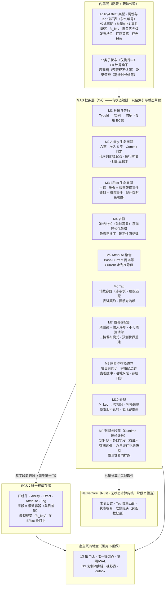
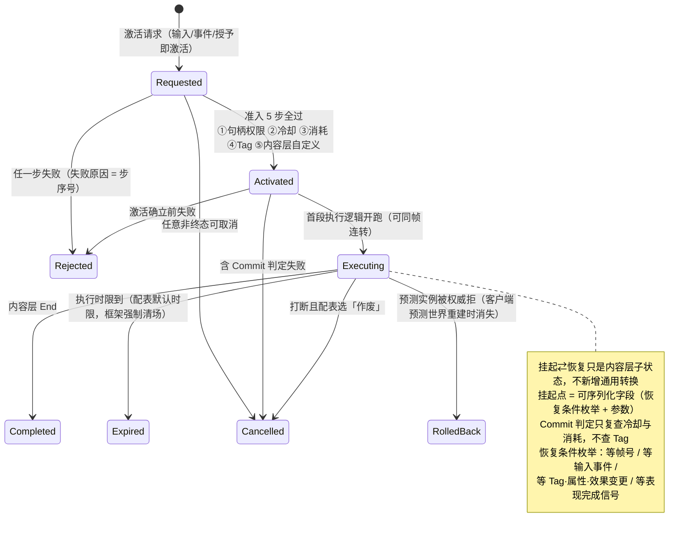
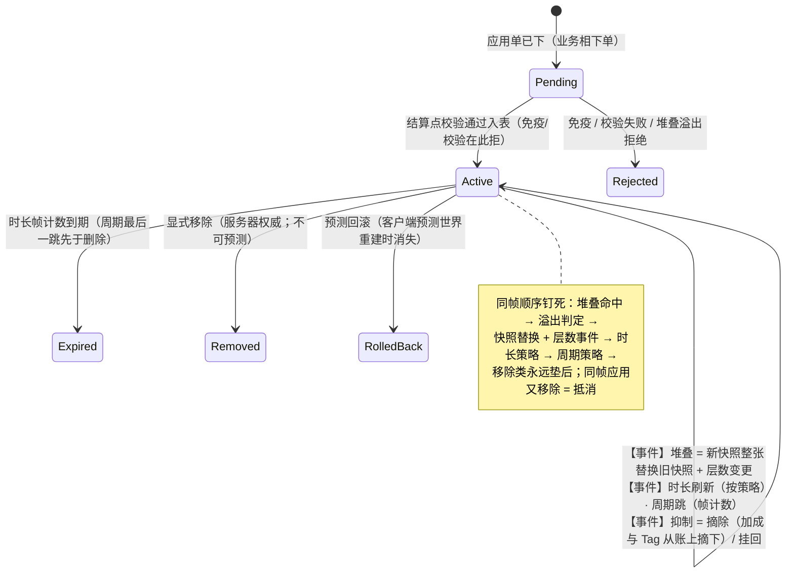
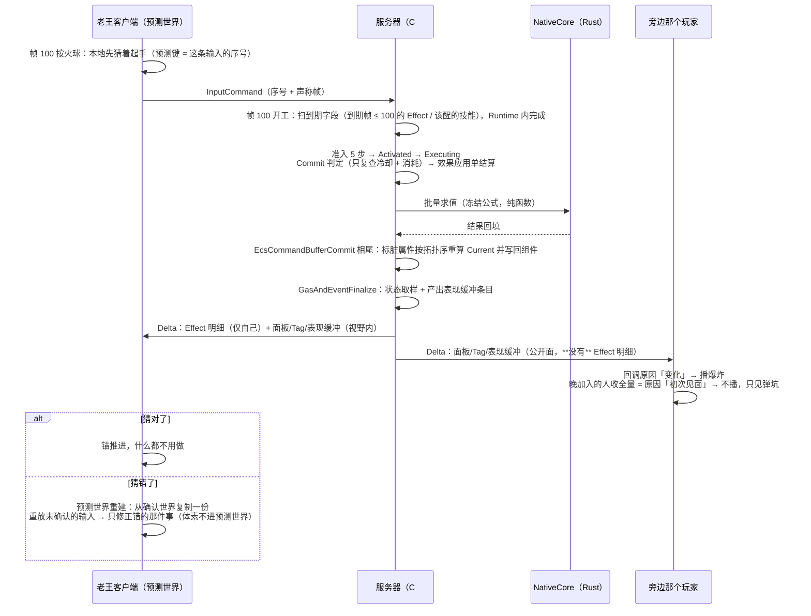

# Lumio GAS 设计概要

> 怎么吵出来的、每一板的理由、和 UE 源码的对账，全在[裁决流水](../../reviews/2026-08-30-gas-architecture-decisions.md)与[接缝裁决流水](../../reviews/2026-09-01-seam-closure-decisions.md)里，本文不背这些包袱——本文只回答五个问题：**这是什么、长什么样、每块干什么、按什么顺序做、什么不许做。**
> 配套：[ECS 设计概要](ecs.md)（唯一权威存储）、[DS 设计概要](ds-server.md)、[存档设计概要](save-load.md)、[配表设计概要](config-table.md)。

---

## 1. TLDR

**GAS 是会计，不是仓库。**

**技能和 buff 的所有状态都住在 ECS 里，GAS 一份都不另存。「这个人现在攻击力多少」不是存出来的，是按一条冻结的公式从他身上那些 buff 条目当场算出来的。算的时候用的是纯函数——同样的输入永远同样的输出，不看表、不掷骰子、不读全局变量。**

老王打怪一句话主轴：按键即起手（客户端先猜着放）→ 服务器帧内准入五查、效果结算、账本重算 → 唯一提交点取样 → 帧末按视野和可见范围打包下发 → 客户端拼好生效、按「原因」播表现；猜错了预测世界从确认世界重建再重放，掉线了全量快照重建——**全程 GAS 没有一行自己的同步、存档、RPC 代码**。

四条底线，将来砍任何功能都不能碰：

1. **状态住 ECS，GAS 不留第二份真相**。GAS 手里只有索引和当帧就丢的草稿。
2. **账本即条目**。「攻击力 +50」这条加成不是一个独立对象，它就是那个 buff 条目本身的推导视图——删了 buff，加成自动没了，不需要「记得去撤销」。
3. **求值是纯函数**：冻结公式 + 编译期定死的算账顺序 + 用帧数不用秒。
4. **时间一律用帧数**。策划配「持续 8 秒」，管线换算成帧；框架里没有任何一处读墙上的钟。

护住这四条，预测、重连、存档、哈希全是推论；丢了它们，每条都要单独造一台机器。

---

## 2. 概要

### 这是什么

一个**自研 Gameplay Ability 框架**——管技能（Ability）、效果（Effect）、属性（Attribute）、标签（Tag）和表现。

### 三层身份，不是三个 ID 系统

| 层 | 是什么 | 例子 |
|---|---|---|
| **TypeId** | 配表里的永久编号，「火球术」这个**种类** | `40023` |
| **实例** | ECS 里的一行，「老王身上这个正在读条的火球」 | Ability 组件里的一条 |
| **句柄** | 拿着这一行的把手，**直接复用 ECS 的下标 + 世代号** | 不另造身份系统 |

### 语言分界：算的归 Rust，记的归 C#

不按「框架 / 内容」切，按「**无状态计算 / 有状态编排与真值**」切。

大白话：**Rust 当计算器，C# 当账房，账本（ECS）在账房手里。**

- **Rust（NativeCore）**：求值公式、Tag 位集匹配、状态哈希、堆叠裁决——全是纯函数批量处理；按 ADR-064 属**阶段 2**（切片先 C# 一份实现，过不了性能关才下沉）。**帧调度器不在这里**（见 M9）。
- **一条硬边界（Owner 2026-09-05 暂定）**：凡是进预测世界的东西，必须能在浏览器里跑；今天满足的只有 Runtime C#。Native 定时内核（`lumio-timer`）只管宿主节拍：服务器推帧、Bot 节奏、断线保留窗，不进预测世界。
- **C#（GAS 框架层）**：八态/六态机、准入判定、账本编排、可见范围声明——有状态，但**只留索引和瞬态草稿，没有第二份状态真相**。八态 / 六态机的**迁移语义**（冒泡、优先级、退出 / 进入顺序）不在 C# 手写，由 `lumio-hfsm` 提供（浏览器经 WASM），C# 只持 Snapshot、算 Guard、执行 Action（[ADR-069](../../decisions/ADR-069-nativecore-audit-rulings.md) 第 1 条；接入卡待开）。

### 挂在 ECS 上的四个组件

`AbilityComponent` / `EffectComponent` / `AttributeComponent` / `TagComponent`。字段一律用 ECS 的框架容器（条目差量是一等公民）。**没有 FxComponent**——表现载荷（长什么样）挂在 Effect 条目上。四组件的字段声明表在 [ADR-064](../../decisions/ADR-064-gas-slice-contracts.md) 第 2 条：技能 / 效果条目是 `SyncList`（`Scope.Owner`，终态即出表、瞬时的同帧折叠成零字节）；属性由玩法**一处声明**（`Attribute 血量 = new(初值: 6)`），生成器展开成「基础账 `[Persist] Sync<long>(Scope.Owner)`（只给绑定者自己——预测世界要用；旁人永远收不到）+ 当前账 `Sync<long>(Scope.Aoi)`」两个字段；表现缓冲**不是字段**，是 `EffectComponent` 上引擎生成的 `[ClientRpc(Scope.Aoi)] OnFx` 记录。

**移动也是一个 Ability**：玩家按方向键 = 放「移动技能」，技能向当前移动控制者提交意图，控制者结合碰撞解算后受控更新 `LogicTransform`。`LogicTransform` 与 `ModelTransform` 都是 Runtime 仓的 ECS 基础组件；服务器只推进逻辑，客户端在原角色上以完整逻辑结果驱动 Model 的插值与纠偏（[ADR-065](../../decisions/ADR-065-dual-transform-discussion.md) D07 / D26 / D29，[移动设计](movement.md)）。移动的预测与对账继续归本文 M7，不另建预测机制。

### 一帧里 GAS 在哪几格干活

| 干什么 | 落在哪一相 | 为什么 |
|---|---|---|
| 下应用单（业务逻辑） | `ApplyInputs` / `ProcessorPlan` | 只下单，不动世界 |
| 效果结算、账本重算、**把 Current 写回组件** | **`EcsCommandBufferCommit`** | 写 Attribute 组件字段 = 写 `GameWorld` 域，13 相里只有这一相能写 |
| 状态取样、**产出表现缓冲条目** | `GasAndEventFinalize`（唯一提交点） | 这一相的可写域是 `GasEvents` |

---

## 3. 设计图

### 3.1 总图

### 3.2 Ability 八态

### 3.3 Effect 六态（堆叠 / 时长刷新 / 抑制全是 Active 内的事件）

### 3.4 主线：老王放个火球

---

## 4. 功能模块（每块可以直接开需求单）

### M1 身份与句柄

- **干什么**：回答「这是哪个技能的哪一次施放」。
- **能干什么**：三层身份——TypeId（配表永久编号）→ 实例（ECS 行）→ 句柄（**直接复用 ECS 的下标 + 世代号**）。「应用快照」（施放当时捕获的那组数值）是实例的字段组，不是独立概念。
- **不干什么**：不造 GAS 自己的身份系统；不用进程级全局计数器发句柄（那是 UE 的坑：换个世界就串号）。
- **做完的标准**：技能实例销毁后旧句柄一律解析失败；两个 Room 里同名技能的句柄互不串；身份三层在日志里可以从 TypeId 一路查到具体实例。

### M2 Ability 生命周期

- **干什么**：管一个技能从「想放」到「放完了」的全过程。
- **能干什么**：① **八态机**（见 §3.2）。② **准入 5 步定序**：句柄权限 → 冷却 → 消耗 → Tag → 内容层自定义；**顺序就是失败提示的优先级**（告诉玩家「在冷却中」比「你被沉默了」更有用时，靠这个顺序决定）。③ **Commit 判定步**：只复查冷却 + 消耗，**不查 Tag**；失败走 Cancelled——`Rejected` 只属于准入段。④ **挂起点 = 可序列化字段**（恢复条件枚举 + 参数），四种恢复条件：等帧号 / 等输入事件 / 等 Tag·属性·效果变更 / 等表现完成信号。所以读条读到一半服务器重启，恢复后能接着读。⑤ **执行时限**：配表给默认时限，超时框架强制 `Expired` 清场（防内容层忘了 End 导致技能永远挂着）。⑥ **打断三积木**：打断事件 / 挂起 / 恢复 三个 API；作废还是挂起由配表选。⑦ **Interrupt/Block 顺序**：先 Block 后 Cancel，激活计数在其后自增。⑧ **激活只有一种写法**（ADR-064 第 3 条）：技能类型 = 玩法声明的类 `[AbilityType(TypeId, Prediction = 档位, 消耗 = nameof(属性))] class 放弹技能 : AbilityType { struct 输入; 可以激活吗(in 输入); 执行(in 输入) }`，注册表随「生成三件」产出；入口 `Get<AbilityComponent>().Activate<放弹技能>(in 输入)`——客户端调用即上行（生成的 ServerRpc，信封带 `sequence`），服务器 `ApplyInputs` 相准入五步 → Activated → Executing → `执行` 同帧连转，返回或 `End()` 即 Completed。准入 ③ 消耗 = `消耗` 指名属性的基础账扣减（放弹 = 手上炸弹数 -1；基础账 `Scope.Owner`，所以预测世界也算得出），Commit 复查后才真扣；④ Tag 在没有 Tag 表时用空表通过。
- **不干什么**：**没有 Task 类家族，没有 PredictionWindow 概念**（这两个 UE 概念被双双消灭）；打断栈不进框架（内容层自理，触发条件见 §6）；持续条件不做独立机制，降为配表字段 + 统一的重评机制。
- **做完的标准**：五步准入每一步失败都能拿到对应的步序号；读条中途存档重启，恢复后从原进度继续；内容层忘记 End 的技能在配表时限到点后被强制清场；同一帧内 Block 和 Cancel 的相对顺序稳定可复现。

### M3 Effect 生命周期

- **干什么**：管 buff / debuff 从挂上到掉落，包括叠层、刷新、被压制。
- **能干什么**：① **六态机**（见 §3.3）。② **堆叠 = 新快照整张替换旧快照 + 层数变更事件**（不做增量合并）。③ **抑制 = 摘除事件**：加成和 Tag 从账上摘下来，条目还在但不生效；解除时挂回。**不新增状态**。④ **时长与周期一律帧计数**：策划配秒，管线换帧（换算率 = 世界的 tick 频率，见 [`tick.md`](tick.md)）；周期 × 抑制期间要不要补跳，是配表上的策略位。⑤ **同帧顺序钉死**：堆叠命中 → 溢出判定 → 快照替换 + 层数事件 → 时长策略 → 周期策略 → **移除类永远垫后**；同帧应用又移除 = 抵消。⑥ **瞬时效果**（ADR-064 第 4 条）：业务相 `Effects.Apply<伤害>(目标, in 参数, 来源)` 只下单；`EcsCommandBufferCommit` 相尾按单序**在结算中的基础账上**结算——校验（目标不存在 / 基础账已 ≤ 0 / 免疫 → Rejected）→ Active → Modifier **直接改基础账**（`血量基础 -= 2`，下一张单读到的就是改后的值）→ 同帧 Expired 出表；持续效果的 Modifier 只进当前账；全部单结算完当前账才按拓扑序重算一次（当前账不参与结算期判定）。**击杀 = 跨零，生死看基础账**：让基础账从 > 0 变 ≤ 0 的那张单是击杀单、来源即击杀者，`OnFx` 带跨零标记；对基础账已 ≤ 0 目标的后续单一律 Rejected（同帧两道火只记一次击杀靠这个）。能被瞬时效果直接改的属性（血量）不得再挂持续修饰（护盾另开属性），所以它基础 = 当前恒成立。死亡态 = 血量基础 ≤ 0（客户端等价读当前账），不另设字段；死亡后的结构动作（销毁 / 掉落 / 重生）由玩法的死亡系统**下一帧**业务相下单——钩子里不下结构单是 [`ecs.md`](ecs.md) §6 红线。
- **不干什么**：不做「注册式撤销」（帧快照 + 提交点替代——不需要记得去撤销什么）；Modifier 账本没有独立存在，因此永远不上网。
- **做完的标准**：同一个 buff 同帧叠三层再被移除，最终结果与顺序表一致且可复现；抑制期间属性面板正确排除该加成、解除后立刻恢复且数值精确相等；把周期设为 3 帧的效果跑 100 帧，跳动次数精确等于预期。

### M4 求值

- **干什么**：把「基础攻击力 100、装备 +20、buff +10%、大招覆盖成 999」算成一个数。
- **能干什么**：① **冻结公式**：`(Base + Σ加法) × (1 + Σ百分比)` + 覆盖。② **百分比加性聚合**：+10% 和 +10% 等于 +20%，不是 +21%。③ **覆盖用配表显式优先级，同级后写赢**；禁止任何隐式重排。④ **V1 三个操作符、单通道**，扩展只做增量。⑤ **重算唯一时机**：`EcsCommandBufferCommit` 相尾，按静态拓扑序批量一次。公式的输入靠声明，编译期算出拓扑序，**成环直接报错**。⑥ **确定性四纪律**：禁墙钟；禁全局变量（求值上下文显式传参）；求和定序；随机从框架领号。**战斗公式禁用超越函数**（要曲线就进曲线表）。⑦ **数值一律整数**（ADR-064 第 5 条）：属性值与修饰量 `long`，百分比用千分比整数，`当前 = (基础 + Σ加法) × (1000 + Σ千分比) / 1000` 向零取整；加法项与千分比项按（应用序, 条目下标）定序求和；不用浮点、不用 34 位十进制。
- **不干什么**：不做动态求解器（运行时改依赖关系）；不做公式虚拟机（不发版热更公式）；不认识 Meta Attribute（那是内容层的模式，框架不管）。
- **做完的标准**：同一组输入在两台机器上算出逐位相同的结果；公式声明成环时编译失败并指出环路；一帧内属性重算次数为 1（用计数器断言）；把加法和百分比的应用顺序对调，测试立刻失败（说明顺序真的被锁住了）。

### M5 Attribute 聚合

- **干什么**：管属性的两本账，保证「当前值」永远是算出来的而不是存出来的。
- **能干什么**：① **Base 账**：可以被瞬间改（升级 +5 力量），落盘。② **Current 账**：限时效果经账本影响它，**永为推导值、永不落盘**。③ 标脏 → 提交点前按静态拓扑序批量重算。④ **声明一处、生成两字段**（ADR-064 第 2 条）：玩法在 `AttributeComponent` 的 partial 里写 `Attribute 血量 = new(初值: 6)`，生成器展开为 `[Persist] Sync<long> 血量基础 = new(Scope.Owner)`（只给绑定者自己——预测世界要跑同一段准入与扣减；无绑定者的实体零字节）与 `Sync<long> 血量当前 = new(Scope.Aoi)`；「修订号」= 包级 revision，不另设每属性修订字段。瞬时效果改基础账，持续效果进当前账。
- **不干什么**：不落盘 Current（存源头不存推导）；不把计算过程同步出去（只同步结果）。
- **做完的标准**：把存档里的 Current 字段人为改掉，读档后它被重算覆盖回正确值；掉线重连后属性面板与服务器权威值精确相等；Base 改动与 buff 到期同帧发生时，Current 只重算一次且结果正确。

### M6 Tag

- **干什么**：用标签表达「他现在处于什么状态」——沉默中、免疫控制、属火系。
- **能干什么**：① **计数容器，不是布尔**（两个技能都给了「沉默」，解除一个不该直接解沉默）。② **层级匹配**（`Debuff.Control.Stun` 能被 `Debuff.Control` 匹配到）。③ **Tag 表进契约冻结**，握手时对哈希，**对不上硬失败**（不做兼容降级——标签错位会让技能判定静默出错，比连不上更可怕）。④ 位集匹配下沉 Rust。
- **不干什么**：不做运行时任意新增标签；不做标签表的版本兼容窗口；压缩方案归实现仓。
- **做完的标准**：两个来源的同名 Tag，移除一个后状态仍然生效；层级查询命中所有子标签；客户端用旧 Tag 表连接被明确拒绝且原因可读。

### M7 预测与投影

> 移动接入补充：[ADR-065](../../decisions/ADR-065-dual-transform-discussion.md) 与 [移动设计](movement.md) 要求位姿及必要运动状态按同一基准恢复，权威应用与必要重放共同成功后才发布 Model 目标。Model 组件本身留在原客户端角色；本节对预测 World 的描述不把纯表现状态纳入逻辑克隆，也不把已有角色按非唯一表现参数合并。

- **干什么**：让客户端按下按键就有反应，猜错了能干净回滚。
- **能干什么**：① **预测键 = 输入序号**（每条 `InputCommand` 带本连接单调 +1 的 `sequence`；ADR-064 第 7 条把原「帧号」措辞收敛到这里）。不发小票、不建确认表——确认或拒绝随权威帧状态自然到达；包里只多一个数「本观察者的输入已处理到第几号」（C-1″ `appliedInputSequence`，接受或拒绝都推进，ADR-063），客户端据此知道哪些输入还没确认。② **窗口 = 提交点作用域**；回滚 = 客户端「确认世界 + 预测世界」：每包权威状态到达，预测世界从确认世界整体重建 + 确定性重放未确认输入，不做字段级撤销、不对号、不盖预测键。**预测世界只含被预测的域，退多少由预测了多少决定**——第一版 = ECS 实体（位置在内），**体素不进预测世界**、不拍快照；技能进入「逻辑预测」档时同一套重建自然覆盖它。**服务器永不回退**。预测世界的具体形态（客户端一个 `WorldManager` 持确认 + 预测两个 `World`、整体克隆 + 重放、本地临时号、表现层只读预测世界）与表现连续性（表现键做差：同格通过零闪断 / 改格换位 / 被拒消失）在 [ADR-064](../../decisions/ADR-064-gas-slice-contracts.md) 第 8 / 9 条。③ **不可预测清单（冻结）**：Effect 移除、周期跳动、出模拟域的动作（走 outbox）。④ **可预测面**：激活、挂起推进、属性、Tag、表现。⑤ **三档发布模式**（配表声明档位，不是三套机制）：纯权威 / 表现先行（挂 Local 实体做光效）/ 逻辑预测；档位写在技能类型的 `[AbilityType(Prediction = …)]` 上（ADR-064 第 3 条）。
- **不干什么**：不做 UE 那种预测键的定向序列化（预测值根本不上网，没有「只回源客户端」的问题）；内容层**不需要写防重入代码**——重入义务由框架的预测世界重建 + 重放吸收了。
- **做完的标准**：预测被拒时预测世界重建后只有错的那件事被修正，其余状态零抖动；把网络延迟人为拉到 300ms，三档发布模式的体感差异可观测；不可预测清单里的动作在客户端从不提前发生。

### M8 同步与存档边界

- **干什么**：决定什么上网、给谁看、什么落盘——**并且 GAS 自己一行同步代码都不写**。
- **能干什么**：

  ① **零自有同步**：写 ECS 字段即记账，这是唯一的门。

  ② **字段级同步边界**：

  | 数据 | 给谁 |
  |---|---|
  | Attribute 当前账（修订号 = 包级 revision，不另设字段） | 视野内全体 |
  | Attribute 基础账 | 只给绑定者自己（`[Persist] Sync<long>(Scope.Owner)`，预测世界要用）；旁人永远收不到；无绑定者的实体零字节 |
  | Modifier 账本 | 永不上网（它没有独立存在） |
  | Effect 明细 | **仅自己** |
  | 面板 / Tag / 表现缓冲 | 视野内全体 |

  ③ **表现缓冲**：瞬时表现（爆炸、闪光）走「表现缓冲」——`帧号 + fx_key + 参数` 的条目，N 帧自清。它**产出在 `GasAndEventFinalize` 相、属 `GasEvents` 域**，随 `WorldChange` 下发——网线形态 = `EffectComponent` 上引擎生成的 `[ClientRpc(Scope.Aoi)] OnFx(fx_key, 参数)` 记录，走 C-1″ `rpcs`，不加第五种记录（ADR-064 第 2 条）；**它不是 ECS 组件字段**。与它区分开的是 Effect 条目上的 `fx_key` **静态载荷**（这个效果长什么样，属配表内容，住 ECS）——**载荷住 Effect，触发走 GasEvents**。

  ④ **哈希双域**：服务器快照哈希盖全量权威；双端对账哈希只盖同步域；**客户端预测值不进哈希**；**表现缓冲不进哈希、不存档**。对账哈希的比较条件（同 tick / 同可见集 / 同字段集 / 该观察者的服务器投影，四个同时成立才比）见 ADR-064 第 10 条与 [`ecs.md`](ecs.md) M10 ④。

  ⑤ **存档口诀**：**存源头不存推导，存凭证不存面板**。装备加的属性不落盘（存穿戴栏，读档重新应用）。限时 buff 三档：下线即清 / 下线暂停（存剩余帧）/ 离线倒计时（**登录管线用墙钟修剪，墙钟不进模拟**）。

- **不干什么**：GAS 不发 RPC、不写文件、不自己发网络消息；不落盘任何推导值；表现缓冲不进快照。
- **做完的标准**：抓包确认第三方客户端收不到任何 Effect 明细；把表现缓冲塞满后 N 帧自动清空且不影响哈希；带装备存档读回后属性精确一致；离线 8 小时的倒计时 buff 在登录后剩余帧正确，且模拟过程中零墙钟读取。

### M9 到期与唤醒（Runtime · 按帧计数）

- **干什么**：管「谁该在第几帧醒过来」——到期的 buff、该恢复的技能、该跳的周期。
- **在哪**：**Runtime C#**，不在 NativeCore。理由只有一条：预测世界在浏览器里也要跑这段逻辑，浏览器没有 Native 库；服务器与网页跑同一份 C#，才是一份实现。（Owner 2026-09-05 暂定，改 2026-08-30 裁决板 11a「落 NativeCore」；记录在 ADR-064 修订记录。）
- **能干什么**：① **到期帧是权威字段**，存在 Effect 条目 / 技能挂起点上（炸弹引信 `FuseEndTick` 是同一写法的玩法版）。② **排期索引是派生缓存**，不进快照——恢复 / 重建预测世界时从权威条目扫一遍重建。③ **每帧一次批量取件**：业务相前取出「到期帧 ≤ 当前帧」的全部条目，按 (到期帧, 实体, 条目) 稳定排序，不做逐个回调。④ **计帧不计秒**（策划配秒、管线换帧）。
- **不干什么**：**只登记数据，不登记闭包**（闭包不可序列化、不可重建，是恢复的死穴）；不做多时间域（V1 只有帧）；不调用 Native 定时内核——那个只管宿主节拍。
- **做完的标准**：崩溃恢复 / 预测世界重建后排期索引从权威条目完整重建，到期时刻与之前一致；一万个到期条目的取件是一次批量遍历而不是一万次回调；排期索引在快照里体积为零；同一份条目在服务器与浏览器取出的清单逐字节相同。

### M10 表现

- **干什么**：把「服务器说发生了什么」变成屏幕上的光效声音。
- **能干什么**：① 服务端只存数据（`fx_key` + 参数），客户端按 `fx_key` 建控制器。② **补播策略**：靠回调原因区分——原因是「变化」就播，原因是「初次见面」就不播（晚加入的人不该看到十秒前的爆炸，只该看到弹坑）。③ **预表现不认领**：预表现挂 Local 实体，服务器确认的正式实体正常进入确认世界；预测世界重建后正式实体站在原位，表现控制器按 `fx_key` + 参数这个稳定键保持连续——没有「搬特效」「对上号」这一步。稳定键的正式名字是**表现键** = (EntityType, `fx_key`, 稳定业务参数)；每次预测世界重建后表现层对重建前后的表现键集合做差：同键继续、键消失结束、新键开始——同格通过零闪断、改格换位、被拒消失三种情况在 ADR-064 第 9 条；一次性**预测**表现（预测世界里挂的 Local 实体 / 本地 fx 触发，不是 `OnFx`——预测世界不跑第 10 相）按（输入序号, `fx_key`）去重，重放不重播；`OnFx` 本来只到达一次。
- **不干什么**：**没有 FxComponent**；表现不进模拟、不进哈希、不存档；不做认领、不盖预测键（预测世界重建已覆盖）。
- **做完的标准**：晚加入的观察者看不到已经结束的爆炸；预表现与正式实体切换时无双份特效、无闪断；把表现层整个关掉，模拟结果与哈希完全不变。

---

## 5. TODO（按这个顺序开卡）

> 交付按 **Living Architecture**（口径见 `.spec/knowledge/standards/repository-architecture.md`「变更顺序」）：
> 托管↔Native 二进制边界改 `engine/abi/native-abi.json`；**其余公共语义（玩法、绑定、账号、定时）各落一份独立的 `engine/wire/<name>-v1.json`——不得扩展 `hello-wire-v1.json`**，由 `node eng/verify-wire.mjs` 跑契约内嵌的正反例。开发态不跑 Baseline / Fixture 门 / 八仓镜像。ADR 编号落笔时现查最高号（编号无机器占号，会被并发抢）。

**阶段 0：先立规矩**

| 卡 | 内容 | 对应模块 |
|---|---|---|
| 0-1 | Ability 生命周期契约：准入 5 步、Commit 判定、挂起点 + 恢复条件枚举、执行时限、打断三积木、Rejected/Cancelled 分工、Interrupt/Block 顺序 | M2 |
| 0-2 | 求值契约：冻结公式、三操作符、覆盖显式优先级、静态拓扑序、数值规范（禁超越函数 / 定序求和 / 随机领号）、帧计数时长 | M4 / M5 |
| 0-3 | 组件与字段契约：四组件、字段同步/存档/可见范围逐字段表、**表现缓冲的域归属与生命周期**、哈希双域、存档三档、词汇表登记 | M8 |
| 0-4 | Tag 表握手契约：表进契约、握手哈希、错位硬失败 | M6 |
| 0-5 | Effect 堆叠与抑制契约：同帧序、快照替换事件载荷、抑制摘除事件 + 同步位、周期 × 抑制策略位 | M3 |
| 0-6 | 到期与唤醒契约（Runtime 域）：到期帧字段位置、批量取件排序、派生索引重建义务 | M9 |
| 0-7 | 预测面契约：不可预测清单、三档发布模式声明、预测键 = 输入序号的映射 | M7 |

> 0-1 / 0-2 / 0-3 / 0-7 已由 ADR-064 一张合成落地（切片口径：八态准入、整数求值、四组件 `Sync` 声明表、预测键 = 输入序号）；0-4 Tag 握手 / 0-5 堆叠与抑制 / 0-6 到期与唤醒不在炸弹人切片（瞬时效果无到期），另立；0-6 归 Runtime 域（2026-09-05 暂定）。

**阶段 1：垂直切片**（跑通 = 路线成立）

**炸弹人战斗切片就是 GAS 的垂直切片**（[`bomber-slice.md`](bomber-slice.md)，Owner 2026-09-05 / ADR-064 第 1 条）：放弹技能激活（准入 5 步，③ 消耗 = 手上炸弹数）→ Commit 判定 → 建炸弹实体 → 引信到点爆炸系统下瞬时伤害 Effect 单 → 提交相结算改基础账、拓扑序重算当前账一次 → 击杀 = 跨零 → `OnFx` 表现缓冲 → 跨端复制（自己收明细、旁人只收当前账与 `OnFx`）→ 客户端预测世界重建重放（同格 / 改格 / 被拒三种情况表现键连续）→ 双端对账哈希四元组通过。堆叠、Tag 联动、挂起存档、断线 buff 重建留给下一切片。

**阶段 2：性能与扩展**

- 求值批下沉 Rust 内核（接口已留门）。
- 聚合缓存增量化（实现仓自由度，语义不变）。

**停下来回图重议的信号（kill criteria）**：

1. C# 聚合重算热路径过不了性能关 → 求值批下沉 Rust 内核，**API 不动**。
2. 客户端预测世界重建重放的帧预算超标 → 收窄「逻辑预测」档的技能数量、用表现先行档兜底，**不改回滚模型**。
3. 「账本即条目」的重算成本在海量实体下超标 → 聚合缓存增量化，**语义不变**。
4. 挂起点恢复条件枚举写不出某个真实技能 → 增量扩枚举，**不回退到闭包**。
5. M9 到期与唤醒的批量取件在 C# 里过不了性能关 → 只把排期索引维护下沉 Rust，并把同一份 Rust 编成 WASM 供浏览器，**到期帧字段与取件接口不变**，不得出现 C# / Rust 两套并存自选。

**回图触发条件总表**：跨技能恢复链需求 + 内容层出现第二份重复实现 → 打断栈进框架；第一个复杂条件组合需求 → 触发图 + 查询语言；策划要不发版热更公式 → 公式虚拟机；运行时改依赖关系需求 → 动态求解器。

---

## 6. 明确不做

| 不做 | 级别 | 什么情况回头 |
|---|---|---|
| GAS 自己存一份状态 | **红线** | 永不——状态住 ECS，GAS 只留索引和当帧草稿 |
| GAS 自己发同步 / RPC / 写文件 | **红线** | 永不——写 ECS 字段即记账是唯一的门 |
| 读墙上的钟 | **红线** | 永不——全用帧数；登录管线修剪离线时长是唯一例外，且不进模拟 |
| 全局变量做求值上下文 | **红线** | 永不——显式传参 |
| 战斗公式用超越函数 | **红线** | 永不——要曲线就进曲线表 |
| 落盘推导值（Current、面板） | **红线** | 永不——存源头不存推导 |
| 表现进模拟 / 进哈希 / 进存档 | **红线** | 永不 |
| 进程级全局计数器发句柄 | **红线** | 永不——复用 ECS 句柄 + World 隔离 |
| 注册式撤销（delegate 注销） | **红线** | 永不——帧快照 + 提交点替代 |
| Task 类家族 | 砍 | 永不——已被挂起点 + 恢复条件枚举取代 |
| PredictionWindow 概念 | 砍 | 永不——窗口就是提交点作用域 |
| FxComponent | 砍 | 永不——表现载荷在 Effect 条目上 |
| 打断栈进框架 | 推迟 | 出现跨技能恢复链需求 **且** 内容层已有第二份重复实现 |
| 触发图 / 条件查询语言 | 推迟 | 第一个复杂条件组合需求 |
| 公式虚拟机（热更公式） | 推迟 | 策划要求不发版改公式 |
| 动态求解器（运行时改依赖） | 推迟 | 出现运行时改依赖关系的需求 |
| 多时间域（帧之外） | 推迟 | 出现真实需求 |
| Meta Attribute 进框架词表 | 不做 | 无——那是内容层模式，框架不必认识 |

---

## 7. 黑话对照表

| 黑话 | 大白话 |
|---|---|
| Ability | 技能 |
| Effect | 效果 / buff / debuff |
| Attribute | 属性（攻击力、血量上限这些） |
| Tag | 状态标签（沉默中、免疫控制、火系） |
| 账本即条目 | 「攻击力 +50」不是一个独立对象，它就是那个 buff 本身；buff 没了加成自动没了 |
| Base / Current | 基础值（存的）/ 当前值（算的，永不落盘） |
| 应用快照 | 施放那一刻捕获的一组数值，之后施法者属性再变也不影响这次 |
| 准入 5 步 | 放技能前的五道检查，顺序就是「该报哪个错」的优先级 |
| Commit 判定 | 真扣冷却和蓝之前的最后一次复查 |
| 挂起点 | 技能读条读到一半停下来的那个位置，能存能读 |
| 摘除式抑制 | 压制一个 buff = 把它的加成从账上摘下来，条目还挂着 |
| 堆叠快照替换 | 叠层时整张新快照换掉旧的，不做增量合并 |
| 覆盖 | 「无视一切，这个值就是 999」，按配表优先级排 |
| 拓扑序 | 编译期算好的算账顺序：先算完 A 才能算 B |
| 预测键 = 输入序号 | 不发小票，用「这是第几次按键」当凭据（旧写法「帧号」已收敛） |
| 预测世界重建 | 猜错了就把预测世界扔掉，从确认世界复制一份，把服务器还没处理的输入重放一遍；对了什么都不用做 |
| 三档发布模式 | 老实等服务器 / 先放个本地光效 / 整个逻辑都先猜 |
| 表现缓冲 | 「第 100 帧这儿炸了一下」的一次性通知，N 帧后自动清掉 |
| fx_key | 特效的名字，服务器只发名字，客户端自己去建 |
| 排期本 | 「谁在第几帧醒」的登记册；崩了能从权威数据重建 |
| 批量取件 | 每帧一次问「这帧有谁到期」，不做一万次回调 |
| 哈希双域 | 服务器自己对全量算一份，双端对账只对同步的那部分算 |
