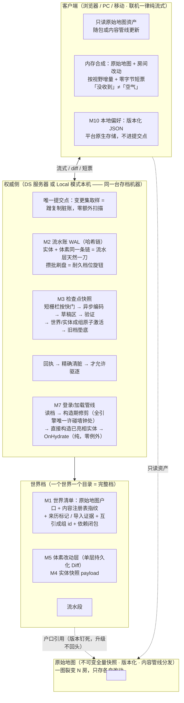
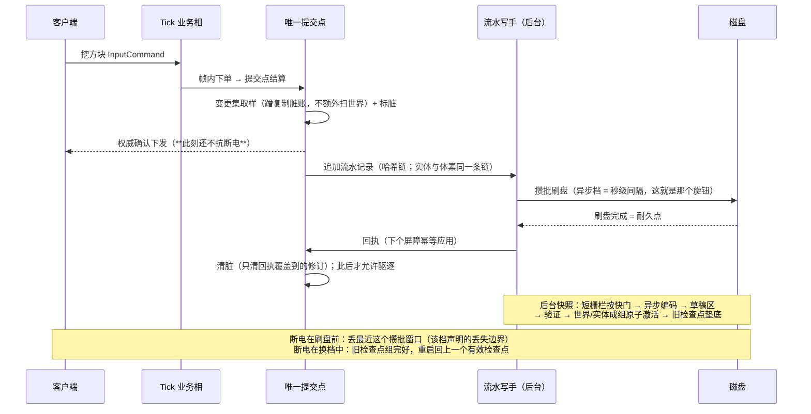
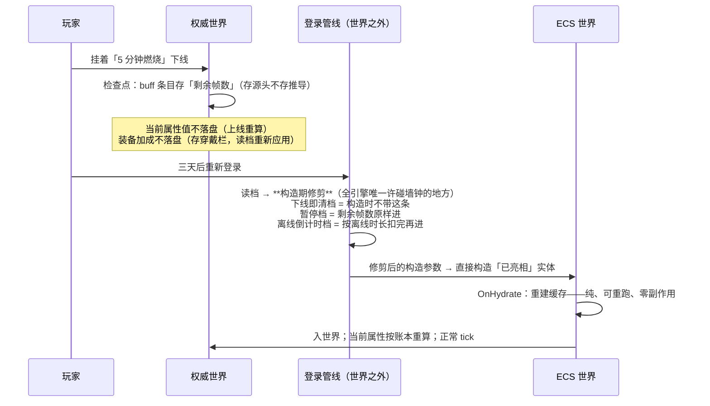

# Lumio 存档设计概要

> 怎么吵出来的、每一板的理由、和外部调研的对账，全在[裁决流水](../../reviews/2026-08-30-save-load-architecture-decisions.md)与[接缝裁决流水](../../reviews/2026-09-01-seam-closure-decisions.md)里，本文不背这些包袱——本文只回答五个问题：**这是什么、长什么样、每块干什么、按什么顺序做、什么不许做。**
> 配套：[ECS 设计概要](ecs.md)（字段上的存档标记是唯一取舍依据）、[DS 设计概要](ds-server.md)、[GAS 设计概要](gas.md)、[配表设计概要](config-table.md)。

---

## 1. TLDR

**存档不是第二份状态真相，是权威状态在某个切点上拍下来的照片。**

老王挖方块一句话主轴：提交点生效（全服都看得见了）→ 顺手蹭复制系统已经记好的脏账写一行流水（零额外扫描）→ 攒一批一起刷盘 → 磁盘说「写进去了」才清脏 → 后台快照短暂停一下按个快门、慢慢洗照片、洗好了成组一次性换档。

**没有「保存按钮」。** 权威侧按自己的节奏自动落盘；玩家本地那点设置（音量、按键）是另一套，改了就存。

三条公理 + 一条不可妥协核心：

1. **存档跟角色走，不跟机器走**。谁是权威，完整存档就在谁那儿；投影端永远只有缓存。一份能力多平台，平台差异**只允许出现在两处**：存储介质适配器、耐久档位。
2. **多平台支持 ≠ 多平台同保证**。每个宿主开档前必须白纸黑字声明自己的耐久档位和丢失边界，**不声明不许开档**。
3. **丢失窗口可以交易，档的完整性不可交易**。性能不够就把「可能丢几秒」这个旋钮往性能侧拧；但**落盘的档永远是完整可打开的**——草稿区写 → 验证 → 原子交接 → 旧档垫底，全在后台，零 tick 成本。

**不可妥协核心**：唯一提交点取样 + 世界与实体一刀切成组换档 + 落盘的档永远完整可开。将来砍功能先护它，其余全是旋钮。

---

## 2. 概要

### 三个类别，各走各的

| 类别 | 是什么 | 存在哪 | 谁管 |
|---|---|---|---|
| **① 场景 / 体素** | 房间里的方块被挖成什么样了 | 世界档的改动层 | 权威侧 |
| **② 动态实体与游戏事件** | 人、怪、箱子、身上的 buff | 世界档的实体快照 + 流水 | 权威侧 |
| **③ 玩家本地偏好** | 音量、按键、UI 布局 | 各平台原生存储 | 客户端自己 |

**①② 同一个切点、同一个修订向量、成组原子换档**；③ 完全独立，不进提交点、不进快照、不进哈希。

### 一图裂变 N 房

**原始地图**是不可变的全量快照资产（版本化、内容管线分发、只读）。开一个房间不复制一份地图，只记「我基于哪张图的哪个版本」+ **这个房间自己改了什么**。

大白话：一百个房间用同一张地图，磁盘上只有一张地图 + 一百份「改动清单」。

原始地图版本**开房即钉死，升级不回头**改已有房间；老房搬新图要显式工具（预留）。

### 平台矩阵

| 平台 / 形态 | 世界数据 | 本地偏好 | 默认耐久档 |
|---|---|---|---|
| DS 服务器 | 权威档（检查点 + 流水） | — | **异步档**（丢秒级，运行时可切） |
| PC Local 模式 | 权威档，同一台机器 + 文件适配器 | 本地文件 | **仅快照档**（丢到上个快照点） |
| 移动 Local 模式 | 机制同 PC；内存/启动预算待实测，V1 不承诺档期 | 本地文件 | 仅快照档 |
| PC / 移动联机 | **纯流式不落盘** + 只读原始地图资产 | 本地文件 | —（权威在服务器） |
| 浏览器 | **无 Local 模式、不做本地存档**；联机纯流式；原始地图走网络加载 | IndexedDB | — |

### 存什么不存什么：两句口诀

- **存源头不存推导**：存「你穿着这件装备」，不存「你因此攻击力 +20」——读档重新算。
- **存凭证不存面板**：存 buff 条目和剩余帧数，不存属性面板上那个数字。

---

## 3. 设计图

### 3.1 总图

### 3.2 主线：挖一个方块 → 断电后它还是被挖掉的

### 3.3 副线：挂着 buff 下线，三天后回来

---

## 4. 功能模块（每块可以直接开需求单）

### M1 世界档与原始地图

- **干什么**：定义「一个存档是什么」——一个世界一个目录，拷走整个目录就是完整备份。
- **能干什么**：① **世界清单**记：原始地图户口（base id / 版本 / 哈希）、内容注册表指纹、来历标记、导入证据、互引成组 id、依赖闭包。② **一图裂变 N 房**：原始地图是不可变全量快照（格式复用规范快照，**零新格式**）；房间档 = 户口 + 单层改动层 + 流水。③ **原始地图版本开房即钉死，升级不回头**改已有房间。④ **依赖闭包缺失拒开档**（宁可打不开，不要打开一个不完整的世界）。
- **不干什么**：**没有存档槽、没有回档功能**（备份 = 用户把整个目录拷走）；存档名这类元数据归宿主清单，不进规范字节；老房搬新图不自动做（显式工具，预留）。
- **做完的标准**：把整个世界目录拷到另一台机器能直接打开且内容一致；故意删掉依赖闭包里的一项，开档被明确拒绝并指出缺什么；一百个房间共用一张地图时，磁盘上原始地图只有一份。

### M2 流水账 WAL

- **干什么**：把「刚刚发生了什么」立刻追加到磁盘，让崩溃后能补回来。
- **能干什么**：① 提交点（[`tick.md`](tick.md) 第 10 相）之后追加流水记录，**哈希链**串起来。② **实体和体素同一条链**——流水层天然就是一刀，不需要额外的协调机制。③ **变更集取样蹭复制系统已有的脏账**，不额外扫世界（零新增遍历）；这本账只有一本——要存档的字段一律 `Sync<T>`，不上网的写 `Scope.None`，没人看也照记（[ADR-063](../../decisions/ADR-063-architecture-review-owner-rulings-identity-persist-prediction.md) 第 6 条）。④ **攒批刷盘**：攒多久刷一次 = 耐久档位这个旋钮。⑤ 磁盘回执回来后**精确清脏**（只清回执覆盖到的修订），此后才允许驱逐。
- **不干什么**：**恢复日志禁止对业务开放当数据源**（想翻旧账是另一件事，见 §6）；不做同步逐条刷盘（那是完整档才有的选项，V1 不默认）。
- **做完的标准**：拔电测试 100 次，每次重启后世界状态要么是拔电瞬间的，要么恰好回退该档声明的丢失窗口，**没有第三种结果**；哈希链断裂能被检出并拒绝加载；写路径开销占 tick 预算的比例可测且在阈值内。

### M3 检查点快照

- **干什么**：定期给整个世界拍张完整照片，让恢复不必从头重放全部流水。
- **能干什么**：① **短栅栏按快门**：极短暂停拿到一致的切点，然后立刻放行。② **异步编码**：洗照片在后台，不占 tick。③ **草稿区 → 验证 → 原子交接**：先写到草稿位置，验证通过才换档，**旧档一直垫底**。④ **世界与实体成组原子激活**：一边失败 = 整组作废回旧组。
- **不干什么**：不在 tick 里做编码；不在验证通过前删旧档；换档瞬间磁盘上短暂存在两份，**这是安全动作不是回档功能**。
- **做完的标准**：在换档过程中任意时刻杀进程，重启后总能打开一个完整的档（要么新的要么旧的，不会是半个）；短栅栏时长可测且在预算内；快照编码期间 tick 耗时无可观测尖峰。

### M4 实体快照 payload

- **干什么**：把世界里的人、怪、箱子、身上的 buff 序列化下来。
- **能干什么**：① canonical 实体列表：类型指纹 + 组件字段组 + **引用一律存网络 ID**（不存对象引用）。② 支持 Full / Partial 两种范围。③ **哪些字段进档完全由 ECS 字段上的存档标记决定**——本模块不做第二套取舍规则。④ 恢复 = 直接构造「已亮相」的实体 + 只跑 `OnHydrate`。
- **不干什么**：不落盘任何推导值（当前属性、面板数字）；不自己发明字段取舍规则；恢复时不重放生命周期副作用（`OnHydrate` 纯度零例外）。
- **做完的标准**：同一世界连续存两次，字节完全相同；把存档里的推导字段人为改错，读档后被重算覆盖；恢复过程中零副作用（不发奖励、不播表现，用探针断言）。

### M5 体素改动层

- **干什么**：只记这个房间相对原始地图改了哪些方块。
- **能干什么**：① 房间档 = **单层**持久化 Diff（不做多层叠加）。② 按视野增量派发给客户端；**没改动的块发零字节短票**。③ 每块 diff 全服一份，可缓存。
- **不干什么**：**原始地图永不当权威**；不在客户端落盘世界数据变体、不做变体同步机器；改 chunk 尺寸或坐标语义**永远算大改**，没有例外。
- **做完的标准**：客户端收到短票后能明确区分「这块没改动」和「这块还没收到」（**「没收到」≠「空气」**）；一百个客户端看同一块 diff 时服务器只算一份；房间改动层大小随实际改动量增长而不随地图大小增长。

### M6 耐久档位

- **干什么**：让每个宿主明确回答「你最多能丢几秒」，并且这个答案是可以在运行时改的旋钮。
- **能干什么**：① **三档 + 各自的丢失边界白纸黑字**：

  | 档 | 丢失边界 | 默认用在 |
  |---|---|---|
  | 完整档 | 不丢（组提交） | V1 不默认 |
  | **异步档** | 丢最近一个攒批窗口（秒级） | DS 服务器 |
  | **仅快照档** | 丢到上一个快照点 | Local 模式 |

  ② **正常退出必落盘**（丢失边界只对异常退出生效）。③ **运行时可切**。

- **不干什么**：**不声明档位不许开档**；不允许某个平台悄悄降档；不把丢失边界写成「大概」。
- **做完的标准**：三档各跑一次拔电测试，实际丢失量与声明边界一致；缺少档位声明时开档被拒；运行时从异步档切到完整档，切换点之后的数据按新档保证。

### M7 登录/加载管线与构造期修剪

- **干什么**：把「三天没上线，燃烧 buff 该剩多少」这种需要真实时间的事，全部关进一个门里办完。
- **能干什么**：① **构造期修剪 = 全引擎唯一允许读墙钟的窗口**，位置在「读档之后、入世界之前」。② **只出构造参数，不写档**（幂等：跑两遍结果一样）。③ **仅权威侧**。④ 修剪完的参数直接构造「已亮相」实体，然后只跑 `OnHydrate`。⑤ GAS 的限时 buff 三档（下线即清 / 下线暂停 / 离线倒计时）是内容层在这个门里的**拼法**，不是框架概念。
- **不干什么**：模拟过程中**任何地方不许读墙钟**；修剪不写档；不在这里做副作用（发离线奖励是业务，走正常 tick）。
- **做完的标准**：同一份存档在不同时刻读两次，除了与离线时长相关的字段外结果完全一致；对同一份存档跑两遍修剪，输出参数逐字节相同；用探针确认模拟相内零墙钟调用。

### M8 版本迁移

- **干什么**：游戏更新了、组件加了字段，老存档还能不能开。
- **能干什么**：① **机器按类型指纹判**，只有两种情况算「小改」可以自动处理：**加字段填默认值**、**删字段丢弃并记账**。② **其余一切都算大改**：拒绝直接开档，走转档工具（草稿区 → 验证 → 原子切换 → 旧档保留）。③ **读时兼容永不写回旧档**；**写档永远只写当前版本**。④ 体素继承同样两条路；改 chunk 尺寸或坐标语义永远是大改。
- **不干什么**：不做「尽力而为」的模糊迁移；不在读档路径里静默改写旧档；不给大改留自动通道。
- **做完的标准**：加一个带默认值的字段后老存档直接可开且新字段为默认值；改一个字段类型后开档被明确拒绝并提示用转档工具；转档工具跑完后旧档仍然存在且可回退。

### M9 跨域一刀切与恢复顺序

- **干什么**：保证体素和实体永远是同一时刻的照片，不会出现「钻石进包了但方块还在」。
- **能干什么**：① ①② **同一个逻辑切点、同一个修订向量**。② 体素快照与实体快照**互引成组，成组原子激活**——一边失败整组作废回旧组。③ **恢复固定顺序**：注册表 → 世界 → 实体 → 玩家落位。④ **实体引用的方块还没就位 = 挂起等待，不当空气**。
- **不干什么**：不允许两边各自换档；不允许恢复顺序由实现自选；不把「缺块」降级成「空块」。
- **做完的标准**：构造一个「实体引用的 chunk 尚未加载」的恢复场景，观察到挂起等待而不是掉进虚空；在成组激活中途注入失败，整组回退且旧组完好；恢复顺序在日志里可验证。

### M10 本地偏好

- **干什么**：存玩家自己机器上的音量、按键、UI 布局。
- **能干什么**：① 版本化 JSON，缺字段填默认值。② 各平台用原生存储（PC/移动是本地文件，浏览器是 IndexedDB）。③ 改动即存，独立生命周期，**没有保存按钮也不需要**。
- **不干什么**：**四个不要**——不进提交点、不进快照、不进确定性哈希、不做转档工具。与配表里的「Config」（策划调优表）**永久分家**，两者不是一回事。不做云同步（触发条件：产品提「换设备带设置」，届时走账号服务）。
- **做完的标准**：删掉偏好文件后游戏用默认值正常启动；偏好文件的任何改动对世界哈希零影响；老版本偏好文件在新版本里缺失字段被默认值填上而不是报错。

---

## 5. TODO（按这个顺序开卡）

> 交付按 **Living Architecture**（口径见 `.spec/knowledge/standards/repository-architecture.md`「变更顺序」）：
> 托管↔Native 二进制边界改 `engine/abi/native-abi.json`；**其余公共语义（玩法、绑定、账号、定时）各落一份独立的 `engine/wire/<name>-v1.json`——不得扩展 `hello-wire-v1.json`**，由 `node eng/verify-wire.mjs` 跑契约内嵌的正反例。开发态不跑 Baseline / Fixture 门 / 八仓镜像。ADR 编号落笔时现查最高号（编号无机器占号，会被并发抢）。

**阶段 0：先立规矩**

| 卡 | 内容 | 对应模块 |
|---|---|---|
| 0-1 | 实体快照 payload 与恢复契约：canonical 实体列表、Full/Partial、**构造期修剪契约点**、`OnHydrate` 纯度、互引成组字段 | M4 / M7 / M9 |
| 0-2 | 世界清单契约：户口、指纹、来历、导入证据、依赖闭包、备份闭包——契约已落：[`persistence-container-v1`](../../../engine/wire/persistence-container-v1.json)（容器层，ADR-070） | M1 |
| 0-3 | 耐久档位 profile：三档语义 + 各自丢失边界 + 默认档 + 正常退出必落盘 + 运行时可切——契约已落：[`persistence-container-v1`](../../../engine/wire/persistence-container-v1.json)（容器层，ADR-070） | M6 |
| 0-4 | 体素改动层与派发契约：单层持久化 Diff、按视野增量、零字节短票（与 DS 的体素 chunk 状态机卡合并） | M5 |
| 0-5 | 版本迁移契约：类型指纹、两条小改路径、大改拒开 + 转档工具、读时兼容永不写回 | M8 |

**阶段 1：垂直切片**（跑通 = 路线成立）

1. M2 + M6：挖方块 → 流水落盘 → 拔电 → 重启后方块还是被挖掉的，丢失量与声明档位一致。
2. M3 + M9：后台快照跑通，换档中途杀进程仍能打开完整档。
3. M4 + M7：挂着 buff 下线 → 三天后登录 → 三种限时档各走一次，剩余帧正确。
4. **组件级切片**：先只验证单个组件的最后状态字段存档/恢复往返（整房间进程重启恢复是持久化主线的事，不在这一轮）。
5. M5：客户端内存合成 + 短票；「没改动」与「还没收到」可区分。
6. M8：加字段小改自动过；改类型大改被拒。
7. M1：整目录拷走能开；依赖闭包缺失拒开。

**阶段 2：工具与扩展**

8. 转档工具、老房搬新图工具。
9. MC 导入（离线工具产出普通原始地图，不碰存档骨架）。
10. 磁盘只读缓存（客户端侧，实测首屏/带宽超标才做）。

**停下来回图重议的信号（kill criteria）**：

1. 存档写路径开销超过 tick 预算的既定百分比 → **降耐久档，动旋钮不动架构**。
2. 快照短栅栏时长在大世界下不可接受 → 收窄快照范围（分片快照），不改一刀切语义。
3. 单层改动层在长期运营房间下膨胀到不可接受 → 定期与原始地图合并出新 base，**不改多层叠加**。
4. 移动端内存/启动预算实测过不了 → 该平台不承诺 Local 模式档期，不降低其他平台保证。

**回图触发条件总表**：产品提「换设备带设置」→ 本地偏好走账号服务云同步；实测首屏/带宽超标 → 客户端磁盘只读缓存；MC 导入工具立项 → 来历标记与导入证据的具体决策；业务提「翻旧账」需求 → 独立旁路服务立项（**不碰存档骨架**）。

---

## 6. 明确不做

| 不做 | 级别 | 什么情况回头 |
|---|---|---|
| 存档当第二份状态真相 | **红线** | 永不——它是权威状态在切点上的投影 |
| 落盘推导值（当前属性、面板） | **红线** | 永不——存源头不存推导 |
| 模拟过程中读墙钟 | **红线** | 永不——唯一例外是构造期修剪，且在世界之外 |
| 恢复日志给业务当数据源 | **红线** | 永不——想翻旧账另立独立旁路服务 |
| 落盘一个不完整的档 | **红线** | 永不——草稿区 → 验证 → 原子交接 → 旧档垫底 |
| 体素与实体各自换档 | **红线** | 永不——成组原子激活 |
| 原始地图当权威 | **红线** | 永不 |
| 把「缺块」当「空气」 | **红线** | 永不——挂起等待 |
| 浏览器本地存档 / Local 模式 | **红线** | 永不——网页玩家的一切在服务器 |
| 存档槽 / 回档功能 | 砍 | 永不——一个世界一份档，备份 = 拷目录 |
| 事件历史原语（框架级） | 砍 | 业务提「翻旧账」需求时另立旁路服务，不进存档骨架 |
| 保存按钮 | 砍 | 永不——权威侧自动落盘 |
| 多层改动层叠加 | 砍 | 单层膨胀到不可接受时改为「合并出新 base」，仍不做多层 |
| 完整档作为默认 | 砍 | 出现「一秒都不能丢」的业务要求 |
| 老房搬新图 | 推迟 | 显式工具，运营需求出现时做 |
| 客户端磁盘只读缓存 | 推迟 | 实测首屏 / 带宽超标 |
| 本地偏好云同步 | 推迟 | 产品提「换设备带设置」，届时走账号服务 |
| MC 导入 | 推迟 | 工具立项（离线产出普通原始地图，不碰骨架） |
| 移动端 Local 模式档期承诺 | 推迟 | 内存 / 启动预算实测出来 |

---

## 7. 黑话对照表

| 黑话 | 大白话 |
|---|---|
| 切点 | 拍照片的那一瞬间——全世界必须是同一瞬间 |
| 投影 | 存档是权威状态的照片，不是另一份真相 |
| 流水账（WAL） | 「刚刚发生了什么」的追加日志，先写它再慢慢拍照片 |
| 攒批刷盘 | 攒几条一起写磁盘，攒多久就是那个性能旋钮 |
| 耐久点 | 磁盘确认写进去了的那一刻，此前都不抗断电 |
| 清脏 | 磁盘回执回来后，把「还没落盘」的标记摘掉 |
| 短栅栏 | 拍照那一下的极短暂停，之后立刻放行 |
| 草稿区 → 原子交接 | 新档先写在旁边，验证过了才一次性换过去，旧档一直垫着 |
| 成组原子激活 | 体素和实体要换一起换，一边失败整组作废 |
| 户口 | 这个房间基于哪张原始地图的哪个版本 |
| 一图裂变 N 房 | 一百个房间共用一张地图，各存各的改动 |
| 改动层 | 这个房间相对原始地图改了哪些方块 |
| 零字节短票 | 「这块没改动」也是一张票——「没收到」和「空气」是两回事 |
| 依赖闭包 | 打开这个档需要的全部东西，缺一样就拒绝打开 |
| 构造期修剪 | 读档之后入世界之前，唯一允许看真实时间的那道门 |
| 存源头不存推导 | 存「你穿着这件装备」，不存「你因此攻击力 +20」 |
| 存凭证不存面板 | 存 buff 条目和剩余帧数，不存面板上那个数字 |
| 小改 / 大改 | 加字段填默认、删字段丢弃 = 小改自动过；其余全是大改，要转档工具 |
| 读时兼容永不写回 | 能读老档，但绝不偷偷把老档改写成新格式 |
| 耐久三档 | 不丢 / 丢最近几秒 / 丢到上个快照点——开档前必须选一个并写明 |
| 本地偏好 | 玩家自己机器上的音量按键设置——跟策划配表完全是两回事 |
