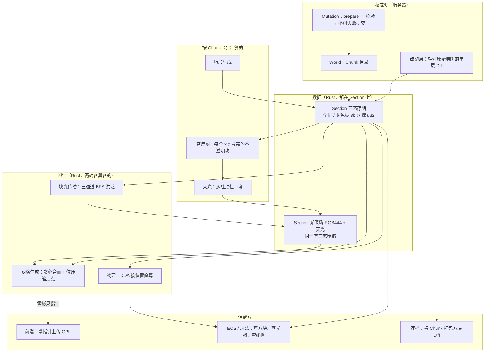
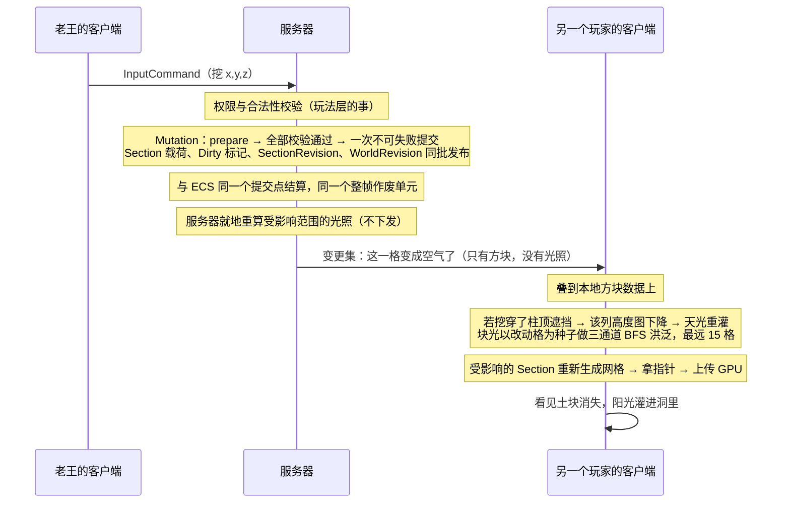
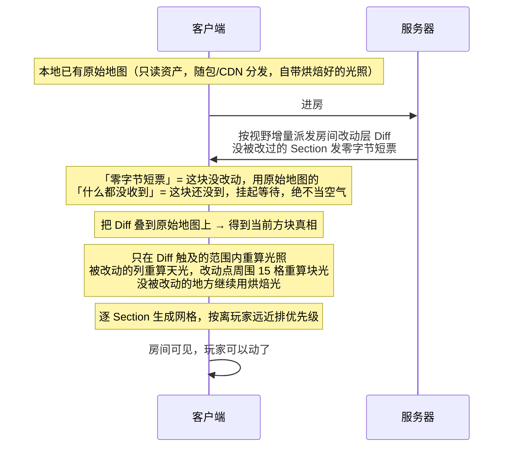

# Lumio 体素设计概要

> 本文只回答五个问题：**这是什么、长什么样、每块干什么、按什么顺序做、什么不许做**。
> 配套：世界与实体见 [`ecs.md`](ecs.md)，落盘与恢复见 [`save-load.md`](save-load.md)，同步与带宽见 [`ds-server.md`](ds-server.md)，仓库边界见 [`architecture.md`](architecture.md)。
> **公共契约真值**：分层命名、规范键、BlockId 位段、载荷信封与编码、派发与回执的机器可校验定义在 [`engine/wire/voxel-world-v1.json`](../../../engine/wire/voxel-world-v1.json)（裁决在 [ADR-062](../../decisions/ADR-062-voxel-world-public-contract.md)），校验入口 `node eng/verify-wire.mjs`。本文与它冲突时以契约为准。网格交付「不倒退、允许落后」与同帧多批合一由 [ADR-063](../../decisions/ADR-063-architecture-review-owner-rulings-identity-persist-prediction.md) 裁决。

---

## 1. TLDR

**世界切成 16×16×16 的小方盒叫 Section，数据都在它身上——每格记两件事：这是什么方块、这里有多亮。同一根竖柱上的 16 个 Section 叫一个 Chunk，Chunk 自己不存数据，它是存档打包的单位，也是天光、高度图、地形生成这类「从上往下算」的单位。同步按 Section 走，存档按 Chunk 走。方块是权威数据，光照是从方块算出来的、永不落盘永不上网。玩家改动只记「相对原始地图改了哪几格」。渲染要的三角形在 Rust 里就地生成，一个指针递出去直接上传显卡，全程不拷贝。**

**六条底线，将来砍任何功能都不能碰：**

| # | 底线 | 为什么 |
|---|------|--------|
| 1 | **一格只有一个真相** | 方块是权威，光照是派生。任何时候光照与方块对不上，错的一定是光照，重算即可 |
| 2 | **缺块永远不等于空气** | 「这块还没收到」和「这块是空的」必须能区分。把缺块当空气会让玩家掉进地里 |
| 3 | **Section 尺寸与坐标语义永不变更** | 一旦改动，全部存档必须转档。这是最贵的一条，写死在这里 |
| 4 | **体素与实体同一个提交点、同一个整帧作废单元** | 不允许出现「钻石进包了但方块还在」 |
| 5 | **改动量决定成本，地图大小不决定成本** | 存档大小、同步字节、光照重算范围，全部随实际改动量增长，不随地图变大而变大 |
| 6 | **存档不启动引擎也能读懂** | 拿到一个存档文件，人和 AI Agent 用一条命令就能查出任意一格是什么。查不动的数据等于查不了的 bug |

---

## 2. 概要

### 这是什么

体素系统负责**世界长什么样、玩家怎么改它、改完怎么让所有人看到**。它管三样：方块数据的存与取、光照的计算、渲染用网格的生成。它不管玩法规则、不管连接与会话、不管实体的生命周期——那些归 ECS 与 Host。

### 世界怎么分

三层，每层各有各的活，不重叠：

```
World  →  Chunk (16 个 Section 竖着摞起来 = 16×256×16)  →  Section (16×16×16 = 4096 格)  →  Block (1×1×1)
```

| 层 | 尺寸 | 有数据吗 | 它是什么的单位 |
|---|---|---|---|
| **Block** | 1×1×1 | 是（32 位 BlockId） | 世界最小单位，不可再分。一切改造最终都落成某一格的修改 |
| **Section** | 16×16×16 = 4096 格 | **是——方块与光照都存在这** | **最小同步单位**、驻留（加载/卸载）单位、版本锚点、网格生成与光照传播的任务单位 |
| **Chunk** | 1×16×1 个 Section = 16×256×16 | **否——它不存数据** | **存档打包单位**、**按列计算单位**（天光、高度图、地形生成）、流式批量请求单位 |
| **World** | 所有 Chunk | 否 | 世界本身 |

**世界高度 256 格，正好等于一个 Chunk 的高度**，所以：

- **Chunk 用两个坐标** `(x, z)` 定位——世界在垂直方向上只有一层 Chunk。
- **Section 用三个坐标** `(x, y, z)`，其中 y 是它在所属 Chunk 里的层号，**取值 0~15，正好 4 bit**。
- 三个轴各自 signed 32 位，**负坐标是一等公民**。

**世界里只有 Section 这一个数据单元**，没有比它更小的传输或存储单元——一个 Section 的方块数据永远是一条载荷，不拆分；传输层怎么分片是传输层自己的事。

**为什么同步和存档要用不同的单位**：同步要细——玩家动一下只该发动的那一小块，Section 的 4096 格是合适的粒度；存档要粗——一根柱子上的 16 个 Section 共享地形结构、天光分布和压缩字典，打成一个记录比拆成 16 个划算，而且天光本来就得从柱顶往下算。

### 一格里有什么

砍到只剩两路，**没有第三路**：

| 路 | 内容 | 宽度 | 权威性 |
|---|------|------|--------|
| **方块** | BlockId | 32 bit | **权威**——落盘、上网、参与事务 |
| **光照** | 块光 RGB + 天光 | 16 bit | **派生**——不落盘、不上网，两端各自算 |

带业务数据的方块（箱子的库存、告示牌的文字、熔炉的进度）**也不占第二路数据**：格子里照常写它自己的方块类型，业务数据挂在一个 ECS 实体上，体素侧只多一条**稀疏引用**（`格内偏移 → 实体号`）——稀疏表只有需要的格子才有条目，不是逐格一个字段。多格物件（床、门楼、雕像）是同一套机制的用法：占住的格子写「被实体占用」的方块类型，同样挂一条稀疏引用。细则见 [M6a](#m6a-方块与实体的绑定)。

### 材质类：方块的大类型

材质类是方块的**大类行为分类**，回答的是「这东西在网格、渲染、碰撞、透光上怎么表现」，**不是贴图**。金属和木头是同一个类，只是贴图不同；水是另一个类，因为它在网格结构上根本表现不了。

**关键性质：材质类不占任何每格字节。** 它是 **BlockType 的配表属性**，运行时是一张 `BlockType → 材质类` 的表；又因为 Section 用调色板编码，**每个 Section 只需按调色板项解析至多 256 次，不是逐格 4096 次**。

v1 只有两个类，四个轴由**同一张表**声明（不得在网格器、渲染器、物理、光照里各写一份分支）：

| | **Solid**（普通方块） | **Liquid**（水） |
|---|---|---|
| **网格** | 满格，或由 BlockState 定形（楼梯、半砖）；相邻 Solid 之间隐藏面剔除；贪心合面在同类同贴图内进行 | 顶面按液面高度下沉；水↔水不画、水↔Solid 不画、**水↔空气必须画**；不参与 Solid 的合面 |
| **渲染通道** | 不透明，写深度 | 半透明，排序后画 |
| **碰撞** | 实心，挡路 | 不挡路（能被查询命中，但穿得过去；浮力与游泳归玩法） |
| **透光** | 全阻 | 透光但每格额外衰减，水下越深越暗 |

液面高度写在 **BlockState 的 4 位字段**里（0~15 级），不新开一路数据。

**新增材质类的唯一判据**：这个差异能不能只靠贴图表达？**能，就不是新类。** 只有在网格、渲染通道、碰撞、透光四项里至少一项无法用现有类表达时，才允许开新类。树叶和草是后续候选，届时同样过这道判据。

### BlockType 解析域

BlockType admission 先判定解析域，再决定是否查目录。`0` 是 air、`1` 是 error block、`2` 是 ECS occupancy placeholder、`3` 是 structure placeholder；这四个值是 typed built-in sentinel，不查官方目录，也不走普通材质类 / 行为模板解析。`4–255` 是系统预留，**不可解析**。全局官方段 `256–8388607` 只有在 `blockCatalog` 已登记该行时才进入普通解析；房间局部段 `8388608–16777215` 只有在随存档映射表已登记该行时才进入普通解析。任何被接纳但不属于上述可解析域的类型，统一返回 `unregistered_block_type`；存档映射缺失在存档完整性校验上下文仍返回 `room_local_type_without_mapping`。

目录行校验是结构优先：六个必需字段（`blockType`、`name`、`materialClass`、`behaviorTemplate`、`assetRef`、`stateLayout`）只要缺失、null 或空字符串，先报 `block_catalog_row_incomplete`；结构完整后，非空但未声明的 `materialClass` 才报 `unknown_material_class`。因此不能用一个未知 token 掩盖同一行的结构缺失。

### 官方素材库与玩家素材库

**素材是外观，BlockType 是编号，行为模板是官方定的那几种玩法。** 三者分开，玩家只能碰前两样。

| | 官方素材库 | 玩家素材库 |
|---|---|---|
| **装什么** | 官方出的贴图、模型、声音，以及**行为模板**（满格 Solid、楼梯、半砖、门、Liquid…） | 玩家自己做的贴图、模型、声音 |
| **怎么分发** | 随包 / CDN，全局固定 | 随房间存档走 |
| **占哪段编号** | 全局段（作用域位 = 0），跨房间恒定 | 房间局部段（作用域位 = 1），编号只在本房间有效 |
| **能定义新行为吗** | 能——官方加一个行为模板等于改网格器 / 物理 / 光照的代码 | **不能**，只能挑一个官方模板再挂自己的素材 |
| **玩法代码怎么用** | 可以写常量 | 只能查表，不许硬编码 |
| **跨房间** | 天然一致 | 导入时重编号，走与转档同一条路 |

**为什么玩家不能定义行为**：行为是「怎么合面、挡不挡路、透不透光」，改它要同时动网格器、物理、光照三处代码——**那是代码，不是数据**。贴图、模型、声音才是数据。玩家素材是外部内容，尺寸限制与审核归平台面，不进体素契约。

**为什么玩家编号是房间局部的**：编号全局唯一意味着要有人集中铸号、永不回收，一百万玩家各造二十块就是两千万个号，24 位当场装不下；局部化之后每个房间自己一套，映射表跟着存档走，**存档反而更自描述**（底线 6 更稳）。

**代价是 0 字节**：玩家方块和官方方块在 Section 里都是同一个 32 位 BlockId，共用同一张调色板，逐格成本一模一样。房间局部映射表按 2000 条、每条约 50 字节算，整个存档多 100 KB。

### 语言分界：算的归 Rust，记的归托管层

| 在哪 | 干什么 |
|---|---|
| **Rust（Native）** | 方块数据的存取与压缩、光照传播、网格生成与顶点压缩、DDA 物理检测。全是贴身遍历 4096 格数组的活，搬过边界比算还贵 |
| **托管 / 前端** | 拿指针上传 GPU、材质与渲染提交、玩法逻辑、UI |

跨边界只传两种东西：**小的结构化命令**（挖哪一格、放什么方块）和**大的只读字节缓冲的指针**（网格）。整块 Section 数据永远不跨边界。

### 产品前提：跑在浏览器

**Lumio 的客户端是一个浏览器页面，体素的 Rust 代码编译成 WASM 在页面里跑。** 这条前提决定了所有预算数字的量级，也决定了 M4 的第三条纪律（WASM 线性内存增长会让宿主对 Rust 堆的视图失效）不是可选项而是必须项。

**驻留预算按宿主角色各自声明，服务器与浏览器客户端不共用一个数字。** 契约字段是 `residency.pinnedRegions.budget.residentSectionBudget`，**量纲是 Section 数**（由宿主角色显式声明、不得缺省、不得被平台悄悄下调，见 ADR-062 修订记录）。专用服务器侧声明 `residentSectionBudget = 65536`，即 4096 个 Chunk（4096 × 16 = 65536 个 Section，约 64×64 根柱子的区域）；浏览器客户端不适用——把服务器的数字照搬到页面上会直接撑爆可用内存（下面那笔浏览器内存账只有 2704 个 Section，差 24 倍）。

> 旧文案写作 `maxResidentChunks = 4096`，量纲是 Chunk。ADR-062 把 16³ 数据单元由 `Block` 改名为 `Section`，并明令「任何消费方不得用 Chunk 指代 16³ 数据单元」——这句话本身说明当时存在误用，该数字当年指哪个单位已不可考，两种读法相差 16 倍。Owner 2026-09-06 裁决按 Chunk 数读，即 65536 个 Section。

**内存账（浏览器视距 6 个 Chunk 半径 = 13×13 = 169 根柱子，每柱 16 个 Section，共 2704 个 Section）**：

先看**不压缩**会是多少——每格方块 4 字节、光照 2 字节，一个 Section 就是 16 KB + 8 KB，2704 个 Section 合计 **66 MB**。浏览器里这个数字直接出局。所以 Section 存储必须压，压完是这样：

| 项 | 展开的 Section 数 | 每 Section | 小计 |
|---|---|---|---|
| **方块格数据** | 约 340——每柱只有地表那 2 层是调色板态，其余 14 层是全同态（上面整块空气、下面整块石头） | 4 KB（每格 1 字节索引） | **约 1.39 MB** |
| **调色板本身** | 同上 340 张 | 典型 40 项 × 4 字节 = 160 字节（上限 256 项 = 1 KB） | **约 54 KB** |
| **光照** | 约 200——地下全黑与露天满天光都压成全同，展开面比方块更窄 | 8 KB（每格 2 字节） | **约 1.6 MB** |
| **合计** | | | **约 3.0 MB** |

视距放到 8 个 Chunk 半径，柱数从 169 涨到 289（×1.7），体素数据约 **5 MB**。

**真正的内存大头是网格顶点缓冲，不是体素数据。** 原因是两者的增长上限不同：体素数据有硬顶——一个 Section 无论多复杂，调色板态封顶 4 KB、退到裸数组也才 16 KB，与建得多花哨无关；顶点缓冲没有硬顶——建筑越碎、贴图越杂，贪心合面越合不动，顶点数就越涨。**所以性能与内存的优化顺序是先盯网格、再盯体素数据**，kill criteria 第 1 条（网格生成耗时）比第 3 条（方块数据超预算）更可能先触发。

### 判断口诀

- 问「这东西要不要落盘」→ **它能从方块算出来吗？能就不落盘。**
- 问「这东西该是方块还是实体」→ **它有自己的生命周期或能被交互吗？有就是实体。**
- 问「这个状态放 BlockState 还是新开一个方块类型」→ **它是同一个东西的不同摆法吗？是就放状态，否则新开类型。**
- 问「这要不要新开一个材质类」→ **这个差异能只靠贴图表达吗？能就不开。**
- 问「这件事该按 Section 还是按 Chunk 做」→ **它要从上往下扫吗？要就按 Chunk；只关心局部就按 Section。**
- 问「这段代码放 Rust 还是托管层」→ **它要逐格遍历吗？要就放 Rust。**
- 问「这个存储格式改动行不行」→ **不启动引擎能不能读懂它？不能就不行。**
- 问「这个预算数字给谁用」→ **服务器和浏览器客户端各自声明，永不共用一个数字。**
- 问「这条业务数据（库存、文字、进度）放哪」→ **挂 ECS 实体，体素侧只留一条稀疏引用；它一个字节都不进体素载荷。**
- 问「玩家想要一个新方块」→ **挑一个官方行为模板挂上自己的素材，拿一个房间局部编号；玩家永远不定义新行为。**
- 问「这次改动该发全量还是增量」→ **对方没有这个 Section 就发全量，有了就发变了哪几格；base 对不上一律退回全量重发。**
- 问「射线打进一块还没加载完的地方该返回什么」→ **返回「答不了」，并说清是哪个 Section；当空气会掉下去，当墙会被卡住。**
- 问「玩法要读一片方块怎么给」→ **给 BlockId 数组 + 每段的版本号 + 缺块标注；缺块段绝不填空气，超预算整条拒绝。**
- 问「哪个轴是竖直的」→ **y，而且世界 y 是无符号 0~255。没有第二种约定，也没有开关。**
- 问「格内偏移怎么算」→ **`(y&15)*256 + (z&15)*16 + (x&15)`。只有这一个算式，猜错就是静默改错格子。**
- 问「这片地图我要它一直在，不能出现『还没到』」→ **声明区域 pin，等就绪信号；装不下当场失败，不给你「尽量」。**
- 问「这一帧我刚下的地形单，同帧后面的系统能读到吗」→ **不能。业务读地形只读帧初；帧内改动在你自己的工作集里，帧末一次提交（[`tick.md`](tick.md)）。**

---

## 3. 设计图

### 3.1 总图



### 3.2 主线：老王挖一格土，另一个玩家怎么看见



### 3.3 副线：玩家第一次进这个房间



---

## 4. 功能模块（每块可以直接开需求单）

### M1 世界分层与方块编码

- **干什么**：定义世界怎么切、一个方块怎么表示。
- **能干什么**：① **Section 固定 16×16×16 = 4096 格**；**Chunk = 竖着摞的 16 个 Section**；**世界高 256 格，正好一个 Chunk 高**。② 坐标换算全是位运算：`>> 4` 得 Section 索引、`& 15` 得格内三轴；Section 的 y 层号 0~15 正好 4 bit。**格内偏移只有一个算式，写死不留推导空间**：`cellOffset = (worldY & 15) * 256 + (worldZ & 15) * 16 + (worldX & 15)`，取值 0~4095；反解 `y = (off >> 8) & 15`、`z = (off >> 4) & 15`、`x = off & 15`。**y 外层、z 中层、x 内层**，与批量读的铺开序完全相同，**全文不存在第二种序**——只写「按固定序合成」时两端各推一次就可能取到不同 stride，结果是**静默的错位读写**：错的格子被改了，没有任何校验会报错。③ **Chunk 用 `(x, z)` 两个坐标，Section 用 `(x, y, z)` 三个坐标**。**y 是竖直轴**，世界 y 是**无符号 0~255**（`sectionY = worldY >> 4`、`cellY = worldY & 15`）；x 与 z 是水平轴，各自 signed 32 位，负坐标一等公民。**不接受 y-up / z-up 的可配置项**——轴向是冻结语义，按「z 竖直」去理解会一路漂到渲染和物理才暴露。④ **BlockId 是一个 32 位值**：`BlockId = BlockType << 8 | BlockState`——高 **24 bit 是 BlockType**（方块种类，如「橡木楼梯」），低 **8 bit 是 BlockState**（同一种方块的不同摆法，如朝向、开合、液面高度）。**BlockId 一律按无符号 32 位处理**：房间局部方块的作用域位会落到 BlockId 的最高位，用有符号 int32 存会变成负数。⑤ BlockState 用**动态位段**分配：每种形状声明自己要几个字段各占几位（朝向 2 位、开合 1 位、合页 1 位），框架维护偏移表，读写走存取函数。
⑥ **材质类是 BlockType 的配表属性**（一列），不占状态位、不占逐格数据，**也不编码进 ID 分段**——否则新增一个类就要重排 ID。
⑦ **BlockType 的最高位（bit 23）是作用域位，整张段表只靠它和一个 256 分界**：作用域位 = 0 是**全局官方段**（跨房间恒定，玩法代码可以写常量），其中 `0` 空气 / `1` 错误块 / `2` 被 ECS 实体占用 / `3` 结构占位块 / `4–255` 系统预留，**256 起是官方素材库方块**，连号稠密；作用域位 = 1 是**房间局部段**（玩家素材库），房间内从 0 起连号，实际 BlockType = 作用域位 | 局部号，映射表随存档走。**256 不是新魔数**——它就是调色板的那个上限，全文只此一个数字。
⑧ **两段各一张稠密表，查表是一次数组下标**：全局表按 BlockType 直接下标，房间局部表按去掉作用域位后的局部号下标。稠密是性能的来源——编号散布就只能上哈希，每次解析调色板项都多一次哈希加一次随机访存。
- **不干什么**：**玩法层禁止对 BlockId 直接做位运算**——BlockType 与 BlockId 不得混用，一律走转换函数；作用域位也只准经判定函数读，不许在玩法里手写掩码。**玩家不得定义新的方块行为**，只能挑官方行为模板挂素材。**房间局部编号不得当成全局编号用**：跨房间搬运必须显式导入并重编号。**不暴露 BlockState 单独使用**：要带状态就用完整 BlockId。**Section 尺寸与坐标语义永不变更**，改它等于全量转档。**Chunk 不持有数据、不持有独立版本**——版本锚在 Section 上，Chunk 只是容器。
- **做完的标准**：给定任意世界坐标能在常数时间内定位到 Chunk、Section 与格内偏移；新增一个官方方块只需在配表加一行、BlockType 加 1，无需任何 ID 重映射；对 BlockId 做位运算的代码在编译期或 lint 期被拦下；拿一个房间局部编号去查全局表被明确拒绝，而不是解析到另一个方块；把一个带玩家自定义方块的存档搬到别的房间，导入时全部重编号且渲染结果一致。

### M1a 官方方块目录

- **干什么**：给全局段（作用域位 = 0）的方块一张实际的登记表——段表定了「哪一段是什么」，这张表定「第几号具体是什么」。
- **能干什么**：① **每行六个字段**：`blockType`（编号）、`name`（稳定标识串如 `lumio.stone`）、`materialClass`（材质类）、`behaviorTemplate`（行为模板）、`assetRef`（素材引用）、`stateLayout`（BlockState 动态位段声明）。①a **行为模板有自己的登记表，v1 是穷尽的**：只有 **`FullCube`**（满格，不用任何状态位）和 **`Liquid`**（顶面按液面高度下沉，占 4 位状态）两项，**没有「等等」**。楼梯、半砖、门是后续候选，**在真正实现之前不得出现在目录里**——引用未登记的模板即拒绝加载。**行为模板和材质类是两个轴**：材质类管「在网格 / 渲染通道 / 碰撞 / 透光上怎么表现」，行为模板管「摆出什么形状、状态位怎么解释」。楼梯和石头是同一个材质类、不同的行为模板。新增模板要动网格器，**是代码变更不是配表变更**，判据同材质类：这个形状能不能用现有模板加贴图表达？能，就不是新模板。② **连号稠密分配**，从 256 起，**不留空洞**——配表按 `blockType` 直接下标，有空洞就只能退回哈希表，每次解析调色板项多一次哈希加一次随机访存。③ **铸号规程**：官方内容层加一行、取当前最大编号 +1、六个字段填齐；**实现仓不得自行铸号**。④ **加载时逐行校验**：编号连续、`name` 全局唯一；结构不完整先报 `block_catalog_row_incomplete`，完整行的非空未知 `materialClass` 报 `unknown_material_class`，行为模板必须已声明。
- **不干什么**：**编号与 `name` 永不回收、永不改写、永不重排**——存档引用它们，重排等于全量转档，复用 `name` 会让旧档解出错误的方块。**0~255 不在本表登记**：那是系统保留段，语义由段表固定。**房间局部段不进本表**：玩家素材走随存档的映射表。
- **做完的标准**：目录最大编号是 4095 时登记新方块得到 4096 且六字段齐全；把某一行的编号改成 5000 造出空洞，加载配表被拒；复用一个已下线方块的 `name`，加载被拒；新增一行不触发任何既有编号的重映射。

### M2 Section 存储三态

- **干什么**：让一个 Section 只花它实际需要的内存——**这不是锦上添花，是浏览器能不能跑的分水岭**：不压缩要 44 MB 方块数据，压完 1.35 MB，差 32 倍。做得到是因为绝大多数 Section 极其无聊：地下深处 4096 格全是石头，天上 4096 格全是空气，就算玩家搭的房子也就几十种方块，**永远不会有 4096 种不同的方块**。
- **能干什么**：① **三态，按 Section 实际方块种类数自动升降级**：**全同**（整块一个值，如整块空气、整块石头，约 0 字节）→ **调色板**（≤256 种，每格 1 字节索引 + 一张最多 256 项的清单，4 KB）→ **裸数组**（>256 种，每格完整 32 位，16 KB）。② **256 的门槛按「玩家能搭出来的房子」定**：木头、玻璃、四个朝向的楼梯、门、台阶加起来几十种是常态，阈值取低了会让普通建筑掉进裸数组。③ 空 Section 与全同 Section **压成一个值，几乎不占内存**。④ 升降级对读写透明，调用方看到的永远是「读某一格」。⑤ **调色板槽平时不回收，撞到 256 上限时才压一次**：挖掉某种方块的最后一块之后那一项就成了死项，但**不为它维护任何常驻结构**（引用计数要 512 字节/Section、每条写路径都得加减、漏一处就是静默损坏，买到的只是省一次微秒级扫描，不值）。真到写不进第 257 种时才走这条路：扫一次 4096 格标出哪些槽还活着（一个 256 位的位图 = 32 字节，栈上就够）→ **有死槽就直接覆盖它，4096 字节的格数据一个字节都不用改** → 全都还活着才退到裸数组。⑥ **落盘与派发时按实际用到的重编，死项永远不进存档、不上网**——序列化本来就要遍历一遍，顺手就压掉了。
- **不干什么**：**只有一个调色板位宽（8 bit），不做位宽自适应**——超过 256 种直接退到裸数组，不设中间档。更窄的位宽不做：真正省内存的场景（地下大片同种方块）已经被「全同」态覆盖了。**不在这一层做通用压缩**（zstd 之类），压缩属于落盘与传输，不属于内存表示。
- **做完的标准**：一个整块石头的 Section 占用不随 4096 这个数字增长；在同一个 Section 里反复放置又挖掉 300 种不同方块，最终仍是调色板态而不是裸数组；任何时刻抓一份存档或一个派发包，里面的调色板都没有死项；地表典型 Section 与玩家建筑 Section 的方块数据都在 4 KB 量级，**不会因为搭得复杂就掉进裸数组**；升降级过程中并发读永远看到自洽的一整块数据。

### M3 光照

- **干什么**：算出每一格有多亮、什么颜色，并且不为此付存储和带宽的钱。
- **能干什么**：① **每格 16 bit**：块光 **RGB 各 4 位**（0~15 十六级）+ **天光 4 位**。② 光照场**套用与方块完全相同的三态压缩**——地下整块全黑是一个值，开阔地整块全天光也是一个值，只有地表那一层和光源周围才需要展开。③ **天光按 Chunk（列）算**：先维护每列的**高度图**（每个 `x,z` 最高的不透明方块），柱顶到高度图之间直接是满值，往下逐格衰减——这是三层分法里 Chunk 作为计算单位的主要理由。③a **透光按材质类查表**：Solid 全阻，Liquid 透光但每格额外衰减。④ **块光用三通道 BFS 洪泛**：R/G/B 各自独立洪泛，每传一格衰减 1，最远 15 格。⑤ **增量更新**：改一格只以它为种子重算；若改动升降了该列的高度图，则该列天光重灌。⑥ **原始地图的光照预先烘焙好、随地图资产一起分发**，客户端首次进房直接用，不必冷算全图。
- **不干什么**：**光照永不落盘、永不上网**（预烘焙的原始地图除外——那份对应的方块不可变，不存在漂移）。房间改动层里**只有方块，没有光照**。**不做漫反射反弹 / 光场迭代收敛**：那需要反复迭代到稳定，开销是洪泛的数倍。
- **做完的标准**：拆掉洞顶一格，阳光灌入的范围与亮度在服务器和客户端上**逐格一致**；光照重算耗时随改动格数增长，与地图大小无关；关掉光照存储后存档体积与网络字节数**一字节不变**。

### M4 网格生成与零拷贝交付

- **干什么**：把方块和光照变成显卡能画的三角形，并且不为此拷贝内存。
- **能干什么**：① **以 Section 为单位生成**，隐藏面剔除 + **贪心合面**（同材质共面的方块合成一个大四边形——一面 16×16 的石墙从 1024 个顶点降到 4 个）。②a **合面只在同一材质类内进行**，跨类合并会让渲染通道出错；Liquid 的顶面按液面高度下沉，只对空气生成面。② **位压缩顶点格式**：位置、法线、AO、贴图索引、光照打包进一个紧凑结构，目标 8 字节/顶点量级。③ **零拷贝交付**：网格生成在 Rust 侧分配的缓冲里，跨边界只递出 `{handle, ptr, len, stride}`，消费方直接把这段内存喂给图形 API。
- **不干什么**：**不做渲染提交、不管材质与着色器**——那是消费方的事。**不把 Section 数据搬过边界让外面算网格**。
- **做完的标准（零拷贝的三条纪律，缺一条即 use-after-free）**：
  1. **释放契约**——消费方上传完 GPU 必须归还 handle，Rust 才回收；重复释放报稳定错误码，不是未定义行为。
  2. **不倒退、允许受控落后**——缓冲携带生成它的 SectionRevision；只允许上传比当前已显示版本**更新**的网格（revision 单调），旧于已显示版本的丢弃。Section 在生成期间又被改了，这份网格**照常上传**并立刻追赶最新 revision，不作废——否则持续破坏地形时地形变化快过网格生成，就一直没有新网格可画（饿死），画面停在更老的版本。显示滞后有预算（最多落后多少个 revision，数值归实现仓），超预算记告警。句柄有效性只由第 1 条释放契约决定，与新鲜度无关。
  3. **线性内存搬迁**——WASM 下宿主对 Rust 堆的视图会在内存增长时失效；拿到指针到上传之间不得再触发分配，或每次上传前重取视图。

### M5 房间改动层与同步

- **干什么**：只记这个房间相对原始地图改了哪些方块，并把它发给该看见的人。
- **能干什么**：① 房间档 = **单层持久化 Diff**，不做多层叠加；**按 Chunk 打包成存档记录**——一根柱子上的 16 个 Section 共享地形结构与压缩字典，合起来存比拆开存划算。② **按 Section 派发，首次全量、之后增量**：粒度是 Section，但一条 Section 载荷有四种编码——**Uniform / Palette / Raw 是全量**（收到即整体替换，用于首次送达与重同步），**Delta 是增量**（收到即按条目打补丁，每条 = 格内偏移 + 新 BlockId = 6 字节）。接收方只有一个分发点，按编码取值分支。**Delta 必须带 `baseSectionRevision`，对不上就拒收并要一次全量重发，不许静默打补丁**——错位打补丁和把缺块当空气是同一类错误。**反过来，三种全量编码一律不得携带 `baseSectionRevision`**：全量是整体替换，没有基线可对；携带即 `base_revision_on_full_encoding`，整条载荷拒收，既不许按 Delta 解释，也不许忽略该字段照常接收。首次送达不得用 Delta：接收方没有可打补丁的基线。③ 没改动的 Section 发**零字节短票**。④ 每块 diff 全服只算一份，可缓存。⑤ 体素大件占用**独立的带宽配额**，不挤占实体的实时更新。
- **不干什么**：**原始地图永不当权威**；不在客户端落盘世界数据的变体。**「没收到」永远不等于「空气」**——缺块挂起等待。**Chunk 不参与同步**——它只是存档与计算的容器，不是同步单位。
- **做完的标准**：客户端能明确区分「这块没改动」和「这块还没收到」；一百个客户端看同一块 diff 时服务器只算一份；房间改动层的大小随实际改动量增长，**不随地图大小增长**；**挖一格产生的下行字节是几十字节量级而不是几 KB**（全量一条约 4.3 KB，单格增量约 36 字节）；把一条 base 对不上的 Delta 喂给客户端，它拒收并请求全量重发，本地数据一个字节不变；把一条带 `baseSectionRevision` 的 Uniform 载荷喂给它，整条被拒（`base_revision_on_full_encoding`），不是「忽略那个字段照收」。

### M6 权威写入与事务

- **干什么**：保证一次修改要么整个生效要么整个没发生，且与实体世界同一个刀口。
- **能干什么**：① 写入分两段：**prepare 阶段做全部可能失败的校验**，**提交阶段一次性不可失败地发布**——Section 载荷、Dirty 标记、SectionRevision、WorldRevision 同一批发布。①a **写入条目是结构化字段，不是字符串 map**：`sectionKey` + 格内偏移（0~4095）+ 新 `BlockId` + **`expectedSectionRevision`**——最后这个是调用方读到的那个版本号，对不上说明你是基于过期数据写的，**整批拒绝**。字符串键值 map 让字段名、类型与边界全都不可机器校验，不许用。①b **一批写入要么全生效要么全不生效**，上限 65536 条；同一批内对同一格的多次写入按提交序生效、最后一条为准。**原子性和尺寸上限是两件事、两个错误码**：只有一部分条目生效是 `write_batch_partially_applied`（原子性被破坏），条目数超过 65536 是 `write_batch_too_large`（整批拒绝，不许截断后收前 65536 条）——两个码不得互相顶替。①c **同一 tick 内多个业务批次合成一批**：业务相各系统读的都是帧初的 Section（`expectedSectionRevision` = 帧初 revision），下的单在 `VoxelCommit` 前合成一批、一次提交；同一格多批写入按系统序生效、最后一条为准；帧内不提供「读到本帧已下单改动」的读法，需要连锁的玩法在自己的帧内工作集里算（规则见 [`tick.md`](tick.md)）。② 提交按事务 ID **幂等**：重复提交返回同一份回执，不重复生效。③ 体素提交与 ECS 提交是**同一个提交点、同一个整帧作废单元**（服务器侧；客户端预测世界不含体素）。
- **不干什么**：**第一个可见写入之后不得再有可失败的校验**——此后失败即整个世界进入故障态，不是可重试错误。**不自行协调跨域事务**：体素是参与者，不是协调者。
- **做完的标准**：注入「提交中途失败」的故障，世界要么是提交前的样子要么是提交后的样子，没有第三种；同一事务重放 100 次，世界状态与回执均不变；提一批 65537 条的写入，整批以 `write_batch_too_large` 被拒而不是收下前 65536 条。

### M6a 方块与实体的绑定

- **干什么**：让箱子、告示牌、熔炉这类**既占一格、又带业务数据**的方块，把两半绑成一个东西——方块那半在体素里，业务数据那半在 ECS 实体里，同生同死。
- **能干什么**：① **两半分工**：格子里写**真方块类型**（箱子就是箱子，朝向、单双箱关系写在 BlockState 里，照常参与隐藏面剔除、碰撞与选模型）；业务数据（库存、名字、锁、战利品表与种子）挂在一个 ECS 实体上，用的是 ECS 已有的组件、结构事务、墓碑与快照，**不为它新开第三套存储**。② **稀疏引用表**：每个 Section 挂一张 `格内偏移 → 实体号` 的稀疏表，只有需要的格子才有条目；**表里只有实体号，没有任何业务字段**。③ **一致性不变量**（在同一个提交点内成立）：方块是「需要实体的类型」**当且仅当**该格引用指向一个活实体、且实体类型与方块类型匹配；方块被删或换成别的类型，同一事务内删除或替换引用与实体；不需要实体的方块类型，该格不得残留引用。④ **三种损坏都显式报错，不许静默继续**：**有方块没实体** → 报存档一致性错误，按产品规则建默认空实体或把该 Chunk 标为损坏；**有实体没方块** → 判为孤儿，记诊断后隔离或删除，**不得在别的坐标复活**；**方块类型与实体类型不匹配** → 判为数据损坏或迁移失败，不许强转继续。⑤ **搬起 / 放下是原子转换，业务数据全程只有一份**：搬起 = 同一事务内「读走实体 → 清掉方块与引用 → 生成一个可移动实体」；放下 = 同一事务内「校验目标格 → 写方块 → 建引用 → 销毁可移动实体」；中途失败整体回滚。⑥ **多格物件是同一套机制的一种用法**：双开箱不是一个「大箱子对象」，而是相邻两格各一个方块、各一个实体，打开时由玩法层拼成一个逻辑视图；砸掉一半，另一半自动退回单格形态。
- **不干什么**：**业务数据永不随体素派发**——改动层、Section 载荷、落盘回执里只有方块，不携带库存、名字、锁、战利品的任何字节；这些走 ECS 的同步与视野，只发给有权限的人，否则未探索的战利品会被提前读出来。**引用表不得退化成逐格数据**：它是稀疏表，只有需要的格子有条目，逐格 dense 数据永远只有方块一路。**不做容器规则、战利品生成、权限与距离校验**——那些归玩法层与 ECS，体素只管方块那半与引用的完整性。**不允许实体绕开引用表私自认领一个坐标**，否则出现第二份真相。
- **做完的标准**：放一个箱子再读档，方块与实体同时在；把存档里的实体记录删掉再开档，得到明确的一致性错误，而不是一个能打开的空箱子。砸掉箱子，同一事务里方块变空气、引用消失、实体销毁、掉落物生成；注入提交中途失败，世界要么全是砸之前、要么全是砸之后。搬起再放下 1000 次物品总数守恒；在搬起与放下之间拔电，恢复后库存恰好存在一份。抓包确认：没打开箱子的客户端收到该 Section 的改动层后，包里**零字节库存数据**。把一条实体记录的坐标改到一个石头格上开档，得到孤儿诊断，且该实体不在石头那一格被激活。

### M7 物理检测

- **干什么**：回答「这条射线打到哪个方块」「这个盒子会不会撞上地形」。
- **能干什么**：① 体素是密铺的规则立方体，**位置可以直接算出来**——用 **DDA 沿射线逐格步进**，不建空间划分树。② **命中的最小单位是 Block**：回答的是「哪一格、格里是什么 BlockId」，不返回比一格更细的东西。③ **三种检测，由体素侧统一提供，消费方不得自己再实现一套地形检测**：**射线检测**（起点 + 方向 + 最大距离 → 命中格坐标、BlockId、交点、面法线、距离）、**重叠检测**（形状与位姿 → 相交的格列表；结果写进**调用方提供的缓冲**，体素侧不分配、不返回要释放的句柄，装不下就报 truncated 和实际总数）、**扫掠检测**（形状 + 本帧位移 → 会不会撞、可行进比例 0~1、碰撞点、面法线）。④ **每种检测都有三种结局，必须可区分**：**Hit**（命中）、**Miss**（确定没命中）、**Unresolved**（路径上有 Section 还没就位，答不了，返回是哪个 Section 键）。⑤ **查询带材质类过滤器**：角色移动只要 Solid，视线只要 Solid（水透过），判断「在不在水里」只要 Liquid——**阻挡与否只能查材质类表，物理实现里不许自带一份碰撞分支**。⑥ **两端必须同结果**：同一份世界、同一组输入，服务器和客户端算出同一个答案，预测与对账建立在这条上。⑦ 非体素物体（角色、NPC、掉落物）单独注册进检测世界，与地形一起参与查询，命中结果能区分撞的是方块还是注册物体。⑧ **语义在公共契约，函数签名在 ABI**：查询与返回的语义、缺块下的行为、过滤规则由 `voxel-world-v1.json` 定；具体 C 签名与结构布局属 `engine/abi/native-abi.json`。
- **不干什么**：**只做检测，不做运动积分**——怎么响应碰撞结果由玩法决定。**查询只读，一格都不许改**：写入必须走 prepare/commit 的权威路径。**Unresolved 不许折叠成 Miss 或 Hit**——当成 Miss 玩家会踩空掉进地里，当成 Hit 角色会被卡在一堵不存在的空气墙上；它是正常结局不是错误，怎么处理（挂起 / 保守 / 请求加载）由调用方决定。**不为地形建 AABB 树或八叉树**：密铺规则体的空间索引就是坐标本身。**v1 不做批量查询接口**：一个角色一帧约 3~10 次扫掠加若干射线，十个本地实体约 100 次，按跨边界一次 1 微秒估最坏 100 微秒，占一帧不到 1%；实测成了热点再回头。
- **做完的标准**：一条穿过 100 格的射线，在小世界和大世界里耗时相当——**耗时随经过的格数增长，与世界总方块数无关**；角色贴着墙走不会穿模也不会被卡住；射线穿过一片水打到水底石头，过滤器只要 Solid 时水不产生命中；把一个 Pending 的 Section 放进射线路径，得到 **Unresolved 并带上那个 Section 键**，既不穿过去也不挡住；给重叠检测一个只装得下 256 条的缓冲去罩 1000 个方块，返回 truncated 与实际总数 1000，而不是静默只给 256；服务器与客户端对同一条射线得到逐位相同的结果。

### M7a 玩法侧批量读

- **干什么**：让玩法能问「这一片/ 这一列现在是什么方块」，并且问完知道自己读到的是哪个版本。
- **能干什么**：① **三种请求**：**单格**（一个世界坐标；**它也是一段，`presence` 是必答字段**——缺块时**不给 `BlockId` 字段**，不是给 0、不是给空气）、**矩形**（两个坐标围成的轴对齐范围，按 y 外层 / z 中层 / x 内层的**固定序**铺开）、**列**（一个 `(x, z)` 加 y 范围，自下而上）。列请求单列成形，因为地形高度、落点、掉落判定本来就是按列问的。② **结果必带 `sectionRevision`**——没有它就没法判断读到的是不是过期数据，也拼不出写入要用的 `expectedSectionRevision`。③ **缺块四态和派发面共用一套**，不另立：结果按 Section 分段标注 Ready / Unchanged / Pending / Unavailable，**部分 Ready 部分 Pending 是正常结局**。④ **预算是声明出来的数字**：单次最多 262144 格（= 64 个 Section，一个 4×4×4 Section 的立方），超了**整条拒绝**。⑤ 结果写进**调用方提供的缓冲**，体素侧不分配、不给要释放的句柄。⑥ 顺序排死：同一请求两次运行逐字节相同。
- **不干什么**：**Pending / Unavailable 覆盖的格子不许填空气、不许填 0、不许省略**——玩法会以为那里是空的。**单格读不因为只读一格就省略 `presence`**：调用方必须先看 `presence` 再看 `BlockId`，`BlockId` 字段缺失是合法结局不是错误。**不静默截断**：超预算就拒绝整条，不悄悄只返回前 262144 格。**读不改世界、不触发加载副作用**，要加载走流式请求。**不是订阅**：持续观察一片区域走改动层派发，别用轮询读代替。
- **做完的标准**：请求一个 16×16×16 的范围，返回的数组顺序两次运行逐字节相同；请求横跨一个 Pending 的 Section，那一段被标成 Pending 而不是空气，且玩法能区分它和真空气；提一个 100 万格的请求，被整条拒绝而不是返回 262144 格；读到的 revision 拿去做写入的 `expectedSectionRevision`，中间没人改过就写得进、有人改过就整批被拒。

### M8 流式加载与驻留

- **干什么**：让世界比内存大。
- **能干什么**：① **驻留与卸载按 Section**，**请求按 Chunk 批量**——一次要一整根柱子，省 16 次往返。② 按玩家位置调度，**离玩家近的优先**。③ **驻留预算是显式声明的数字**，不是「尽量」：契约字段叫 `residentSectionBudget`，**量纲是 Section 数**（不是格数、不是字节数），由**宿主角色各自声明**——不给缺省值（没声明按 0 算，任何 pin 都超预算），平台也不许在运行时悄悄下调它。③a **区域常驻（pin）**：不是所有世界都要流式——小地图就该整张常驻。pin 声明一组 Section，**就绪之后落在里面的批量读与物理查询永不返回「还没到」**，调用方可以在同一 tick 内拿到确定答案，不必挂起（爆炸结算这类同 tick 必须算完的事，挂不起）。pin 有明确的**就绪信号**：就绪前返回「还没到」是合法的，玩法必须等信号才进场。**预算是硬的**——pin 覆盖的 Section 总数超过 `residentSectionBudget` 就**当场声明失败**（`residency_pin_exceeds_budget`），不许静默降级成「尽量常驻」，也不许只满足一部分。pin 内的 Section **干净也不许卸载**（比脏页栅栏更强），也不参与按玩家位置的流式调度。算账：一张 61×61 格、2 格高的小地图只覆盖 `ceil(61/16)² × 1 = 4×4×1 = 16` 个 Section，调色板态约 **64 KB**——这种量级全图常驻是白给的。④ 卸载脏 Section 前必须拿到落盘回执覆盖，回执按修订精确清脏。⑤ 同一位置同一类型的待办任务**后来的替换先来的**（连挖两下，只需要最后那次的网格）。
- **不干什么**：**不按时间或最近最少使用淘汰脏块**——那是在静默丢弃已提交的权威写入。**不允许平台悄悄降低驻留预算**——`residentSectionBudget` 要变只能由宿主角色重新声明。**pin 不做「尽力而为」**：装不下就报错，不许悄悄少常驻几块——那会让「同 tick 内一定有答案」这个承诺变成偶尔成立。
- **做完的标准**：走一圈回到原地，内存占用回到同一水平且世界内容一致；拔电测试后已确认落盘的改动全部还在；把一张小地图整体 pin 住并等到就绪，随后在同一 tick 内反复读写全图，**一次「还没到」都不出现**；声明 `residentSectionBudget = 256`，再提一个覆盖 400 个 Section 的 pin，**当场失败**而不是部分常驻；对 pin 内一个干净的 Section 发起卸载，被拒。

### M9 存档与恢复

- **干什么**：保证体素和实体永远是同一时刻的照片。
- **能干什么**：① 体素快照与实体快照**互引成组、成组原子激活**——一边失败整组作废回旧组。② 同一个逻辑切点、同一个修订向量。③ 恢复顺序固定：注册表 → 世界 → 实体 → 玩家落位。
- **不干什么**：**体素与实体各自换档是红线，永不允许**。实体引用的方块还没就位时**挂起等待，不当空气**。改 Section 尺寸或坐标语义**永远算大改**，走转档工具，没有例外。
- **做完的标准**：任意时刻拔电重启，不会出现「钻石进包了但方块还在」；转档工具在草稿区验证通过后才原子切换，旧档保留。

### M10 存档可读性与离线检查

- **干什么**：让人和 AI Agent **不启动引擎**就能读懂、查询、比对体素存档——查 bug 时直接从数据定位原因，而不是靠复现。
- **能干什么**：① **每一段字节自描述**：头部带格式标识、版本号与 schema 引用，拿到文件不需要任何外部知识就知道该怎么解；**不存在「只有引擎自己认识」的字节段**。② **可随机定位**：存档按 Chunk 打包，记录表按坐标规范序排列、每条带字节偏移与长度；**查一格只需定位到它所属的那一根柱子，不必解开全档**。③ **官方只读检查器**（命令行）：点查某一格、导出某个 Section 或整根 Chunk 的可读文本、按方块类型全档检索、统计分布（每种方块多少个、哪些 Section 是全同/调色板/裸数组）、比对两个存档的差异。④ **无损文本投影**：检查器输出的文本能原样转回二进制，**AI 看到的与引擎看到的是同一份数据**，不是近似摘要。⑤ **可导出通用表格式**（一行一格或一行一 Section），交给通用查询工具做大范围分析。
- **不干什么**：**检查器只读，永不写回存档**——不提供绕过引擎的修改路径。**不为可读性牺牲运行时格式**：文本是投影，不是存储形态，调色板压缩该压还压。**不引入独立的第二份索引**：随机定位靠存档自带的偏移表，不另建数据库。
- **做完的标准**：给定一个存档和一个坐标，不启动引擎、一条命令、一秒内答出那一格是什么方块、什么状态、多亮；给定「找出所有 TNT」，一条命令列出全部坐标；把检查器的文本输出转回二进制，与原档**逐字节相同**；给定两个存档，一条命令列出所有不同的格子。

---

## 5. TODO（按这个顺序开卡）

**阶段 0：先立规矩**

| 卡 | 内容 | 对应模块 |
|---|---|---|
| 0-1 | 数值 profile 落成生成配置：Section 尺寸、Chunk 层数、世界高度、BlockId 位段、光照位宽、调色板阈值 | M1 |
| 0-2 | BlockType 段表与两张稠密配表：作用域位判定、全局段 0–255 系统保留 + 256 起官方方块、房间局部段与随存档的映射表 | M1 |
| 0-2b | 官方方块目录：六字段行结构、连号稠密分配、铸号规程与加载期逐行校验 | M1a |
| 0-3 | BlockState 动态位段框架：字段声明、偏移表、存取函数、形状注册 | M1 |
| 0-3b | 材质类表：Solid / Liquid 两类 × 网格/渲染通道/碰撞/透光四轴，单表声明；BlockType 配表补材质类列 | M1 |
| 0-4 | Section 三态存储与升降级，含并发读一致性、撞顶时的调色板槽压缩与序列化时的死项剔除 | M2 |
| 0-5 | 存档字节自描述：格式标识、版本号、schema 引用，覆盖每一个字节段 | M10 |
| 0-6 | Section 稀疏引用表与绑定不变量：表结构、同提交点变更、三种损坏的显式报错 | M6a |

**阶段 1：垂直切片（跑通 = 路线成立）**

1. 建一个只有石头和空气的世界 → 挖一格 → 服务器提交 → 客户端收到 diff → 重算光 → 重生成网格 → 画出来
2. 高度图 + 天光按列灌 + 块光三通道 BFS 洪泛 + 增量更新 + 三态压缩
3. 网格生成：隐藏面剔除 → 贪心合面 → 位压缩顶点 → 零拷贝交付三条纪律
4. 房间改动层：按 Chunk 打包存档、按 Section 派发、零字节短票、缺块挂起
5. DDA 三种检测；玩法侧批量读（单格 / 矩形 / 列）带 revision 与缺块标注
6. 带业务数据的方块跑通：放一个箱子 → 方块与实体同一事务生成 → 存档往返 → 砸掉时原子清理 → 抓包确认改动层零字节库存

**阶段 2：工具与扩展**——**只读检查器命令行**（点查 / 导出 / 检索 / 统计 / 比对 / 无损回转）、原始地图烘焙管线（含光照烘焙）、方块资产导入、内存与面数监控。

**阶段 3：性能定型**——驻留预算实测、任务调度优先级与替换、视距与远景表达。

**停下来回图重议的信号（kill criteria）**

1. 浏览器上单个 Section 的网格生成耗时压不进一帧预算 → 重议网格粒度。
2. 光照增量重算在典型改动下超出一帧预算 → 重议是否需要分帧摊销或降低传播半径。
3. 典型房间的方块数据内存超出声明预算一倍以上 → 重议三态阈值（不动 Section 尺寸，那个代价极大）。
4. 出现第三路必须逐格存储的数据 → 停下来，先证明它不能由方块推导、也不能挂到实体上。
5. 出现任何「只有引擎自己认识」的字节段 → 停下来，那是在制造查不动的 bug。
6. Chunk 开始需要自己的版本或耐久回执 → 停下来，那说明它已经在持有数据，与「Chunk 不存数据」的分层前提冲突。
7. 稀疏引用表开始携带业务字段，或者需要自己的编解码注册表与版本号 → 停下来，那是在 ECS 旁边重造第二套实体系统。

---

## 6. 明确不做

| 不做 | 级别 | 什么情况回头 |
|---|---|---|
| 光照落盘 / 上网（预烘焙的原始地图除外） | **红线** | 永不——光照是方块的纯函数，存第二份就是制造漂移 |
| 把「缺块」当「空气」 | **红线** | 永不——挂起等待 |
| 体素与实体各自换档 | **红线** | 永不——成组原子激活 |
| 改 Section 尺寸或坐标语义而不转档 | **红线** | 永不 |
| 按时间 / 最近最少使用淘汰脏 Section | **红线** | 永不——那是静默丢失已提交的权威写入 |
| 不自描述的字节段（只有引擎认识的格式） | **红线** | 永不——AI 与人都必须能离线读懂存档 |
| 检查器写回存档 | **红线** | 永不——只读；修改一律经引擎的事务路径 |
| Chunk 持有数据或独立版本 | **红线** | 永不——数据与版本只锚在 Section 上，否则出现第二份真相 |
| 液体流动模拟 | **不做** | v1 液体静态：放置即固定液面。自动传播意味着每 tick 改写大量方块，每次改写都是一次权威写入 + 派发 + 光照重算 + 网格重建，是持续成本。玩法要「水往低处流」时由玩法层显式改方块 |
| 玩家定义新的方块行为 | **红线** | 永不——行为是网格 / 碰撞 / 透光的代码，玩家只能挑官方行为模板挂素材。开放行为等于开放代码注入 |
| 玩家方块占用全局编号 | **红线** | 永不——全局唯一要集中铸号且永不回收，百万玩家各造二十块就是两千万个号，24 位装不下；房间局部编号 + 随存档的映射表，跨房间走显式导入 |
| 为调色板槽维护常驻引用计数或空闲链表 | **不做** | 512 字节/Section 常驻加每条写路径的加减，只为省一次微秒级、且只在撞 256 顶时发生的扫描。除非实测证明撞顶频率高到扫描成了热点 |
| 仅因贴图不同而新开材质类 | **红线** | 永不——贴图差异用 BlockType 表达 |
| 材质类存成逐格数据 | **红线** | 永不——它是 BlockType 的配表属性，逐格数据只有方块一路 |
| 逐格染色数据 | **砍** | 颜色属于方块类型：要红木板就开一个红木板类型。除非出现「同一类型必须逐格连续取色」的玩法 |
| 体素侧自带一套稀疏业务数据存储（库存、文字、进度直接存在 Section 里） | **砍** | 业务数据挂 ECS 实体，体素侧只存实体号。自带一套就要连带自造编解码注册表、schema 版本、修订号、孤儿检测与懒解码——那是在 ECS 旁边重造一个实体系统。除非出现「纯静态、无生命周期、且数量大到实体扛不住」的场景 |
| 多格物件用占位方块类型表达 | **砍** | 多格物件是 ECS 实体 + 一个「被实体占用」类型 + 稀疏引用。除非 ECS 侧被证明扛不住这个量级 |
| 不占体素的附属物、可交互摆件、独立预制体三类特殊方块 | **砍** | 全部是 ECS 实体。除非出现纯静态、无生命周期、且数量大到实体扛不住的场景 |
| 等值面提取的平滑地形与逐格密度 | **不做** | 美术风格改为塑形地形时回头，届时同时要回 LOD 接缝与逐顶点材质 |
| 调色板位宽自适应（多种位宽并存） | **不做** | 只保留 8 bit 一个宽度。更窄的位宽省的是「既不均匀又不复杂」的少数 Section，不值第二条代码路径 |
| 比 Section 更小的传输或存储单元（分页、分片） | **红线** | 永不——世界只有 Section 一个数据单元。一个 Section 的方块数据永远是一条载荷，传输层怎么分片是传输层的事，不进公共语义 |
| 已就位的 Section 小改动重发全量 | **红线** | 永不——那让同步字节随 Section 大小走而不是随改动量走，与底线 5 冲突 |
| 为可查询另建一份索引或数据库 | **不做** | 随机定位靠存档自带的偏移表。除非实测证明偏移表撑不住典型查询 |
| 光照的漫反射反弹与光场迭代 | **推迟** | 真机跑出帧率余量后再评估。存储格式不变，升级不需要转档 |
| 远景的八叉树退化合并与渐进减面 | **推迟** | 视距需求显著变大时回头 |
| 为地形建空间划分树 | **不做** | 永不——密铺规则体的空间索引就是坐标本身 |
| 消费方自己再实现一套地形检测 | **红线** | 永不——物理查询只有体素侧这一份，第二份必然与材质类表漂移 |
| 把查询的「答不了」折叠成「没命中」或「挡住」 | **红线** | 永不——三种结局必须可区分，折叠掉就是踩空或卡墙 |
| 物理检测的批量查询接口 | **不做** | 单次跨边界调用在一帧预算里占不到 1%。实测证明成了热点再回头 |
| y-up / z-up 可配置的轴向约定 | **红线** | 永不——y 是竖直轴，冻结语义。可配置意味着两套理解并存，错误要漂到渲染和物理才暴露 |
| 写入条目用字符串键值 map | **红线** | 永不——字段名、类型与边界全都不可机器校验 |
| 批量读静默截断 | **红线** | 永不——超预算整条拒绝。截断会让玩法以为世界到此为止 |
| 格内偏移的第二种 stride | **红线** | 永不——只有 `(y&15)*256 + (z&15)*16 + (x&15)` 一个算式。第二种推导 = 静默改错格子 |
| 「尽力而为」的区域常驻 | **红线** | 永不——pin 装不下就当场失败。降级会让「同 tick 内一定有答案」变成偶尔成立 |
| 目录引用未登记的行为模板 | **红线** | 永不——v1 只有 FullCube 与 Liquid，没有「等等」。新模板要动网格器，是代码变更 |
| 用轮询批量读代替改动层派发 | **不做** | 持续观察走派发。除非出现派发覆盖不到、又必须持续读的场景 |

---

## 7. 黑话对照表

| 黑话 | 大白话 |
|---|---|
| Block | 一格方块，1×1×1，世界最小单位 |
| Section | 16×16×16 的小方盒，4096 格；**数据都在它身上**，同步、驻留、算网格、算块光都以它为单位 |
| Chunk | 竖着摞的 16 个 Section（16×256×16）；**自己不存数据**，是存档打包单位，也是天光、高度图、地形生成这类从上往下算的单位 |
| BlockType | 方块种类（橡木楼梯、石头），占 BlockId 高 24 位 |
| 作用域位 | BlockType 的最高位（bit 23）：0 = 官方的、全世界一个意思；1 = 玩家的、只在这个房间有意思 |
| 全局官方段 | 作用域位 = 0 的那一半。0–255 留给系统哨兵（空气、错误块、被实体占用、结构占位），256 起是官方素材库的方块 |
| 房间局部段 | 作用域位 = 1 的那一半。玩家素材库的方块，编号只在本房间有效，「几号是什么」的映射表跟着存档走；搬去别的房间要显式导入并重编号 |
| 行为模板 | 官方定好的那几种方块玩法（满格、楼梯、半砖、门、液体），管的是怎么合面、挡不挡路、透不透光。玩家只能挑，不能新造 |
| BlockState | 同一种方块的不同摆法（朝向、开合、液面高度），占 BlockId 低 8 位 |
| 三态存储 | 同一个 Section，按它里面到底有几种方块，自动挑最省的记法：只有一种就记一个值，256 种以内用调色板，再多才老实每格存全。省 32 倍内存 |
| 调色板 | 就是画画的调色盘：先列一张「这个 Section 用到了哪些方块」的清单（最多 256 种），每格只写「我是清单里第几号」——一个字节就够，不用 4 个字节。超过 256 种时清单反而不划算，直接每格存完整值。**跟颜色没有任何关系**，清单里存的是方块编号（完整 BlockId，所以楼梯朝北和朝南算两项）|
| 死项 | 调色板里还留着、但这个 Section 已经一格都不用的那一项。平时不管它，撞到 256 上限时扫一遍直接覆盖掉；落盘和上网前一定会被剔除 |
| 全同 | 整个 Section 只有一种方块（整块空气、整块石头）。那就不用逐格记了，一句「这 4096 格都是石头」就完事，4 字节 |
| 裸数组 | 三态里最费的那一档：这个 Section 里的方块超过 256 种，列清单已经不划算，只好每格老实存完整 4 字节。16 KB |
| 材质类 | 方块的大类型：管它在网格、渲染、碰撞、透光上怎么表现。**不是贴图**——金属和木头同类，水不同类 |
| Solid | 普通不透明方块：挡路、全阻光、写深度、可合面 |
| Liquid | 液体（v1 只有水）：不挡路、透光但衰减、半透明通道、顶面按液面高度下沉 |
| 液面高度 | 这格水有多满，0~15 级，存在 BlockState 的 4 位字段里 |
| 高度图 | 每个 `x,z` 上最高的不透明方块在第几层；天光从这条线往下开始衰减 |
| 天光 | 从天上照下来的光，露天为满值，往洞里逐格衰减；按 Chunk 从上往下算 |
| 块光 | 方块自己发的光（火把、熔岩），带 RGB 颜色；用洪泛往外传 |
| BFS 洪泛 | 从光源出发一圈圈往外传，每传一格暗一级，暗到 0 停 |
| 烘焙 | 提前算好存起来，运行时直接用，不再算 |
| 派生数据 | 能从别的数据算出来的东西，所以不存不传 |
| 改动层 / Diff | 这个房间相对原始地图改了哪几格，只记差异 |
| Section 载荷 | 一个 Section 的方块数据打包出来的那一坨字节，带编码、长度和摘要。**一个 Section 永远只有一条，不分页** |
| 全量编码 | 载荷四种编码里的前三种（全同 / 调色板 / 裸数组）：收到就把这个 Section 整个换掉。用于首次送达和重同步 |
| 增量（Delta） | 第四种编码：只说「这个 Section 变了这几格」，一格 6 字节。必须带基线版本号，对不上就退回要全量 |
| 基线版本号 | 增量载荷声明「我是在你手上那个版本之上改的」。对不上说明中间漏了包，必须重发全量，不许硬打上去 |
| 零字节短票 | 「这块没改动」的最小回答，不传任何方块数据 |
| 贪心合面 | 把同材质共面的一堆方块合成一个大四边形，顶点数暴降 |
| 位压缩顶点 | 把位置、法线、光照等挤进一个紧凑结构，一个顶点几个字节 |
| 零拷贝 | 数据生成在哪就在哪用，只递指针，不复制内存 |
| DDA | 沿射线一格一格走过去看撞上什么，不建树 |
| 射线检测 | 从一个点朝一个方向射出去，问「先撞上哪一格」。挖矿准星、看向哪、子弹打哪都靠它 |
| 重叠检测 | 给一个盒子问「它现在压着哪些格」。放东西前查有没有挡路用它 |
| 扫掠检测 | 给一个盒子和这一帧要走的位移，问「走得过去吗、撞在哪」。角色走路靠它 |
| 答不了（Unresolved） | 查询的第三种结局：路上有块还没加载完，所以答不了。**不是没命中，也不是挡住**——当成没命中会踩空，当成挡住会卡墙 |
| 可行进比例 | 扫掠检测的返回值：这一帧想走的距离里，实际能走多少（0 到 1）。撞墙前一刻停住就靠它 |
| 材质类过滤器 | 查询时说清「我只关心哪几类方块」。角色走路只看 Solid，判断在不在水里只看 Liquid |
| 官方方块目录 | 全局段那半的登记表：第几号叫什么、什么材质类、用哪个行为模板、挂哪个素材。连号排下去不留空号 |
| 行为模板 vs 素材 | 模板管「怎么表现」（合面、挡路、透光），素材管「长什么样」（贴图、模型、声音）。玩家只能换素材 |
| 批量读 | 玩法一次问一片或一列方块。返回的不只是方块，还带「这是哪个版本」和「哪一段还没到」|
| expectedSectionRevision | 写入时附上「我是基于你哪个版本读的」。对不上说明中途有人改过，整批拒绝，防的是基于过期数据乱写 |
| 格内偏移 | 一格在它所属 Section 里的编号，0~4095。算式写死：`(y&15)*256 + (z&15)*16 + (x&15)`，y 外层 z 中层 x 内层 |
| 区域常驻（pin） | 「这片地方我要它一直在内存里」的声明。就绪之后这片地方的查询永远有确定答案，不会回你「还没到」。装不下就当场报错，不给你打折 |
| 就绪信号 | pin 从声明到真的全加载好之间的那个信号。信号来之前查到「还没到」是正常的，玩法得等 |
| 行为模板 | 一个方块摆出什么形状、状态位怎么解释。v1 只有满格（FullCube）和液体（Liquid）两种，加新的要改网格器 |
| Revision | 单调递增的版本号，世界一个、每个 Section 各一个 |
| Dirty | 这个 Section 改过了但还没确认落盘，不许卸载 |
| 不可失败提交 | 所有校验在提交前做完，提交那一下只许成功 |
| 成组原子激活 | 体素快照与实体快照要换一起换，一边失败整组作废 |
| 自描述 | 文件自己说明「我是什么格式、第几版」，不需要外部知识就能解开 |
| 无损文本投影 | 二进制转成的可读文本，能原样转回去，一个字节不差 |
| 检查器 | 不启动引擎、直接读存档的只读命令行工具 |
| 稀疏引用表 | 每个 Section 上的 `格内偏移 → 实体号` 小表，只有带业务数据的格子才有条目；表里只有号，没有业务字段 |
| 孤儿记录 | 引用或实体还在，但对应的方块已经不是那个类型了；必须诊断后隔离或删除，绝不在别的坐标复活 |
| 可移动实体 | 箱子被搬起时的形态：方块与引用都清掉，业务数据整个搬进一个能动的实体，全程只有一份 |
| 偏移表 | 存档里记着每根柱子从第几字节开始、多长的表，靠它能直接跳到某一块 |
